## 造型
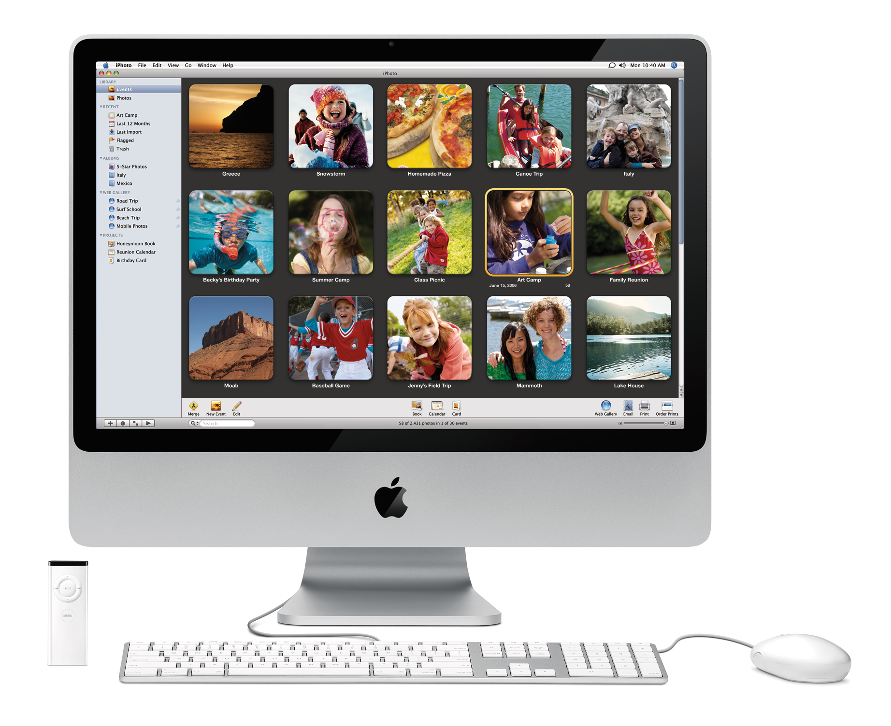
iMac 2007 首次使用了铝合金机身，而不仅仅局限于支架，同时，屏幕玻璃加了黑色装饰边框。

## 加工工艺

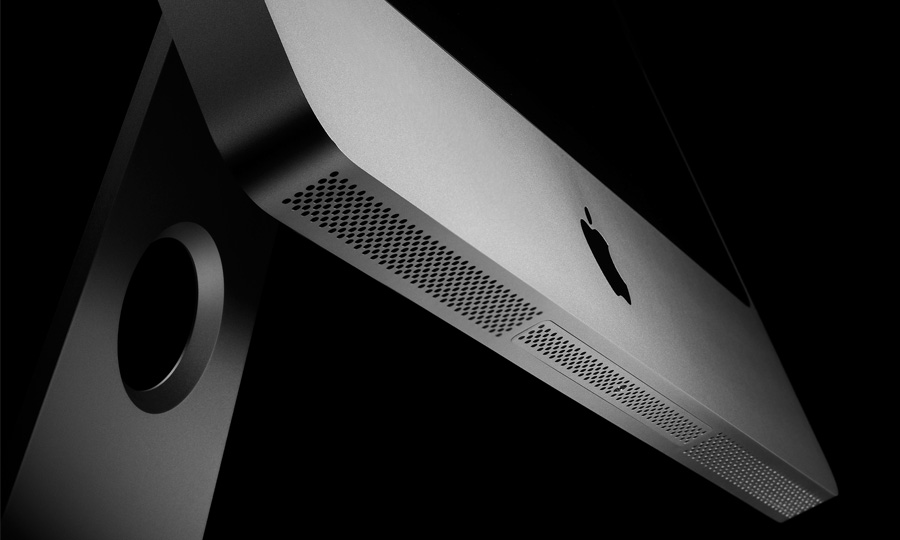

从 Power Mac G5 开始，Apple 慢慢的转变为一家铝制品加工厂，从生产时尚可爱的产品（iMac G3，iBook 1999 等），进化为一家生产“危险品”的公司，“危险品”就是那些铝制品，尤其是现今，比如最近的 iPod Shuffle 3代，到此前的新一代MacBook，第四代 iPod nano，MacBook Air，新款 iMac……，都有非常锋利的边缘，纯真的90度夹角（双倍45度的华丽？），完整、纯粹、坚固、锐丽。尤其是那 MacBook 的 Unibody，从整个铝块中挖掘而出足以让人惊叹，如石雕带给人的整体和坚固感。而在 MacBook 之前的 iMac 一样有这种整体感，可以从上图感受一下，那么 iMac 是否也是从铝块中挖掘而出的呢？虽然在开始我们单凭想象很难从成本和效率的角度去认同 MacBook 的 Unibody 的可行性，但这么大的 iMac 而且相比 MacBook C壳空旷的内部如果也是这种加工工艺，那么即使在现在也是无法想象的。那么 iMac 的这一道亮利的风景线是如何加工而来的呢？iMac 是用整张铝板加工而成，而金属冲压都有一个自然（或人工）的圆角过度，何来这双倍45度的华丽。

在 USPTO （美国专利商标局）看到与这有关的一个Apple 申请中的专利，叫做 HOUSING COMPONENTS FOR ELECTRONIC DEVICES AND METHODS FOR CONSTRUCTING THE SAME ，刚好可以解释，铝板经过一次深冲压，然后锻压，然后加工出90度，结果就是让人感觉如同整个铝块中挖掘而出一样。见下图：

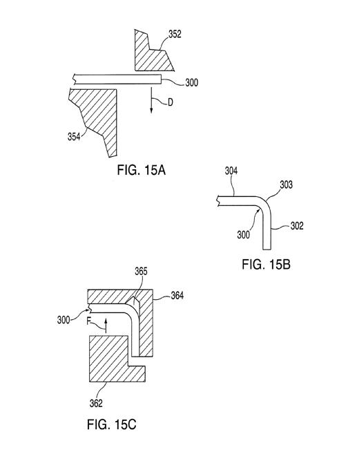
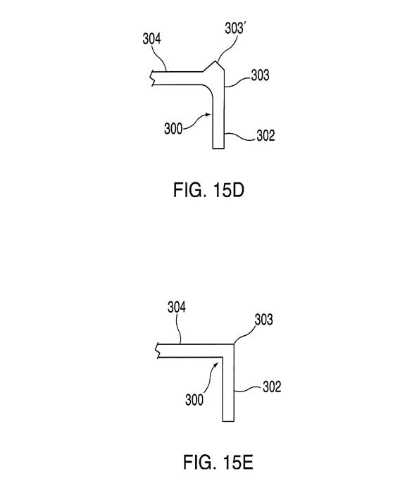

城市笔记本在介绍斯卡帕的维罗纳人民银行时，曾提到斯卡帕对90度切角的处理，预先在交界处挖去一个圆孔，就可避免切过头或者切不好看。这也是一种常见的方法，尤其是在机械加工中，学过制图的都知道有一个“退刀槽”，而 iMac 这道锋利的边线的形成工艺也可以看作是同样的思维。

## 图库
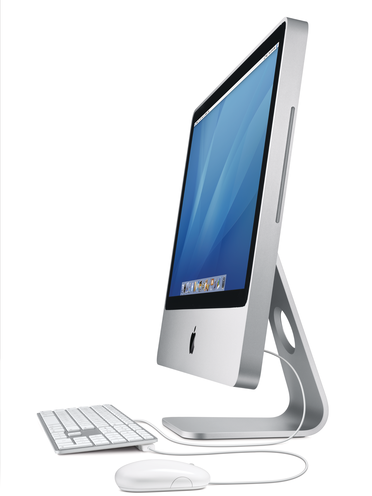

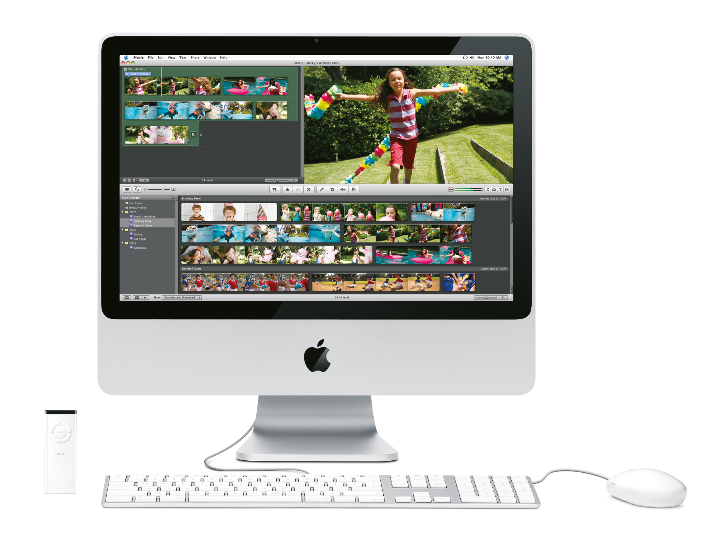

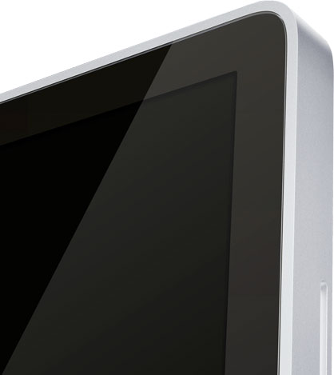
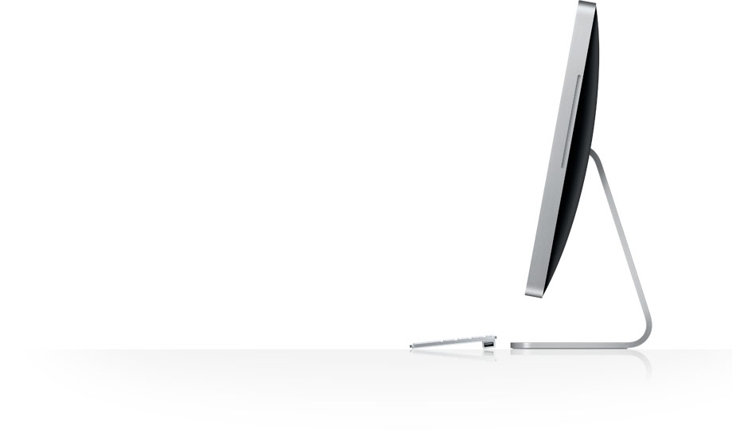

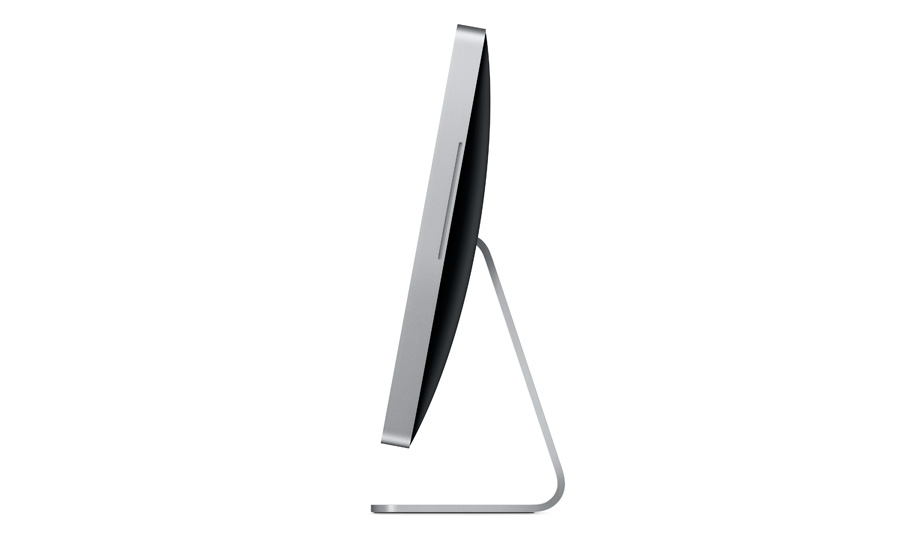
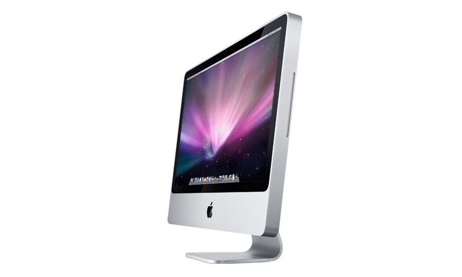
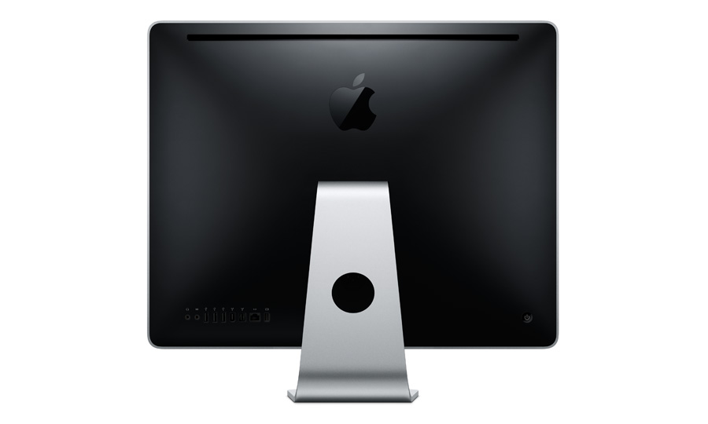
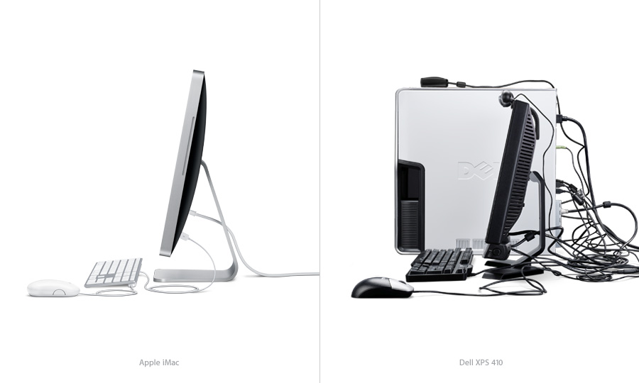
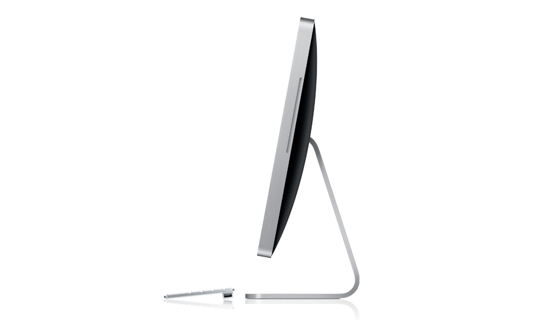
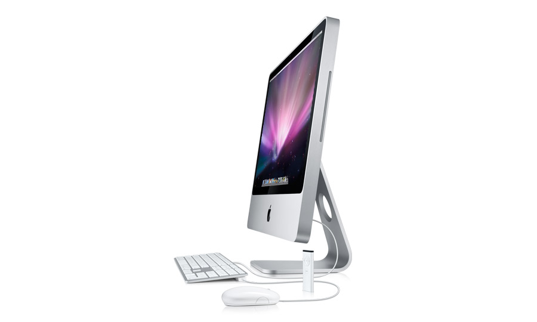
