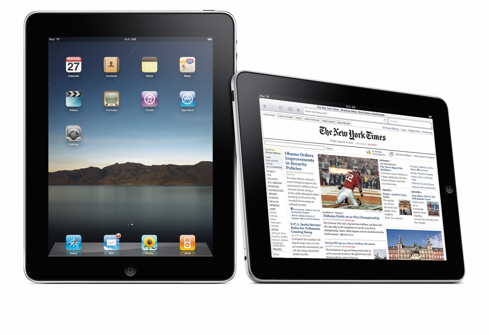

就在乔纳森的团队秘密致力于iPad的进展时，史蒂夫·乔布斯却告诉媒体，苹果无意开发任何平板电脑。“只有那些已经有了PC机或者其他电子设备的富家子弟才会考虑买一台平板电脑。”他公然宣称。不过，这不过是他给外界施放的烟幕弹而已。“史蒂夫从来没放弃过对平板电脑的研发。”菲尔·席勒说。事实上，乔纳森的设计团队在开发iPhone的同时，也从未间断过对平板电脑的设计开发。乔布斯只是在等待一个合适的时机，让平板电脑上市。

上网本的出现是苹果加快iPad上市速度的诱因之一。上网本出现于2007年，与传统笔记本电脑相比，它体型较小、价格相对便宜，而且功率也更低。它们一上市就迅速吞噬了笔记本电脑的销售份额--到了2009年，上网本已经占到整个笔记本市场份额的20%。然而，苹果从没认真考虑过将上网本当作研发产品之一。“上网本没有什么特别之处,”史蒂夫·乔布斯说,“只不过是种廉价的笔记本电脑而已。”2尽管如此，上网本还是不止一次成为苹果常务会议的讨论议题。

2008年，乔纳森在一次高层常务会议上提出，尚在实验中的平板电脑可以成为苹果应对上网本的利器。他指出，平板电脑基本上是一种没有键盘的廉价笔记本电脑。这个想法吸引了乔布斯，因此他批准乔纳森将这个技术原型转化成实际产品。

关键在于，移动技术在iPhone推出后的短短几年之内已经有了大幅度的提高。因此在当时看来,2004年开发的“035 号模型”的样机显得又大又笨重不过，鉴于有了新型的屏幕和电池技术，所有人都明白平板电脑可以更轻薄没有更早放行iPad的原因之一就在于，一些配件--如屏幕和电池等部件的技术---还不够成熟。“技术水平还达不到。”一位前苹果主管说。

首先，乔纳森定做了20个不同大小及屏幕长宽比例不同的原型机，依次将其摆放在工作室的一个展台上，供自己和乔布斯把玩。“我们就是这样确定了屏幕尺寸。”乔纳森说。3之前他们用同样的方法，确定下了Mac mini和其他产品的尺寸。

“几乎对于所有的产品，史蒂夫和乔纳森都喜欢这么干。”工作组的一位前工程师说道,“他们首先做出一系列大小不一的原型机，然后从中挑选出最喜欢的一款。”

然而，回忆似乎存在偏差，事情往往是这样的。根据当时一位苹果主管的说法，屏幕尺寸还受到一个更简单部件的重大影响--标准纸张。“平板电脑正好和一页纸大小相同,”他解释道,“这个尺寸一般被公认为是比较合理的页面尺寸，因此我们觉得这个大小正合适。它针对的是教育系统、学校和电子阅读方式。”另外，硬件也是一个需要考虑的因素，因为iPad的内部装置是基于iPodtouch，而不是iBook。就效果而言，iPad在早期被视为放大版的触屏iPod。

乔纳森的最终目标是做一个无须任何产品说明的完全直观的设备。它应该是个“惊人、简约且漂亮的设备，一个人们真正需要、容易上手的产品。斯特林格说，“你拿起来就能用……就像……无须讲解。”
也就是说，要实现这种惊人的“简约”，可能需要投入大量的时间与创造力。

## 制作机器

和之前为iPhone设定研究方向时一样，乔纳森的设计团队探索了两个不同的iPad设计方向。

第一个版本是基于Extrudo理念设计的，其基础是一种和iPodmini类似的铝材盒子，只不过比后者更大一些，也更扁平。这一版本的设计倡导者是克里斯托斯·斯特林格，他曾经是Extrudo版iPhone的设计者。和之前设计iPhone手机时一样，斯特林格试图用一片挤压成型的铝片作为iPad的材料另外还配备用于接收 Wi-Fi和收音机信号的塑料外壳。然而，和设计iPhone不同，iPad完全不用考虑边角是否锋利的问题，因为没人会把平板电脑按在自己脸上讲话。

乔纳森的工业设计团队尝试了一种“画框”模型，这种模型做出来比iPad的一些原型机要大，这些模型有支架作为支撑(后来，在苹果与微软及其他平板电脑制造商的竞争中，这种支架同样成为突出特色)。乔纳森的团队并未继续完善这个想法。但是，支架的创意之后出现在iPad2的磁性保护套中，该保护套折叠后可形成一个支架。

设计师们发现，斯特林格的Extrudo版iPad和同一版本的iPhone遇到了同样的瓶颈--边框的存在让屏幕的效果打了折扣。正如乔纳森所说:“我们考虑怎样解决这个问题，从而不让过多的功能和按键对显示屏的效果造成损害。”4乔纳森坚持产品的“无边际泳池”设想，因为他深知，屏幕是重中之重，绝对不能有任何东西抢了它的风头。

与此同时，理查德·豪沃斯将“三明治iPhone”的制作经验带到了这次的原型机设计中，设计出了几个“三明治”版本的iPad。早期的“三明治iPad模型有点类似于加长版的“035号模型”，它与2006年发布的塑料材质的苹果MacBook属于同一个设计系列，也是由亮白色塑料制成，形状四四方方的，看起来相当笨重。两者的大部分设计都出自豪沃斯之手，因此它们明显是来源于同一设计范畴。尽管如此，乔纳森的团队仍旧专注于如何呈现屏幕，并将边框设计得更加简单、更不起眼。

随着设计工作的不断推进，新的产品模型变得更薄，边缘也更尖锐。部分模型使用铝制后壳，但是乔纳森的团队更倾向于转向三明治式设计。然而有个问题一直困扰着乔布斯:不知是什么原因,iPad看起来好像不够休闲随性乔纳森指出了问题的关键所在。iPad需要一个提示，即释放某种信号让人们感觉它操作起来很方便，还可以被单手拿起。像往常一样，乔纳森希望邀请用户去触摸设备，将设备拿起来握在手里，从而获得触觉体验

照这样推理的话，下一步就是给iPad加一个把手。于是，乔纳森的团队开始探索这种方式，以期待它更加方便。随后的一个样机就呈现出这种效果:带着一对夸张的塑料把手，看起来像个丑陋无比的快餐托盘。后来，大家终于意识到，把手根本解决不了任何问题，因此乔纳森的团队换了一种方法试图给iPad加一个锥形板，让板在屏幕后有一个渐变的坡度，这样手指可以在后壳上有一个移动的间隙。

乔纳森的团队一边致力于iPad的设计工作，同时又兼顾着第二代iPhone的设计。2008年，这部新款手机以iPhone3G的名义被推向市场，以强调它与最新的3G手机网络的兼容性。第二代iPhone摒弃了旧版本的铝制背板而代之以硬质聚碳酸酯塑料材质。不出所料，这两个同期研发的产品有很多的共同之处:iPad同样也使用了聚碳酸酯塑料后盖，颜色也是黑白两色，并用了不锈钢的框架将屏幕与背板完美地结合在了一起。

然而，当所有设计师终于在设计方案上达成一致时，生产上的问题却让乔纳森不得不临时变更设计。

iPhone 3G的塑料背板看似简单，然而实际制造的难度很大。乔纳森的团队本来打算为iPad配置相同的外壳(由聚碳酸酯与ABS塑料组成的高强度混合物做成)，然而事实证明，将这种材料加工成大尺寸的外壳难度更大，因为如果这种材料被做成大尺寸，它们从模具中出来后就会收缩变形。为了防止外壳在边缘处收缩，只能将它的模具做大，等收缩之后再用机器切割到所需尺寸

即使在成型之后，外壳仍需进行抛光以清除分割线，然后喷漆，再次进行机器切割，以防止油漆围绕切割口收缩。这样一来，加工流程就复杂了很多，需要附加很多额外的操作步骤。切割口要反复喷漆并再次切割，然后才能安装按键、扬声器格栅和背面的Apple标志。塑料材质的使用使整个生产过程问题重重。“你必须安排好所有的这些加工工序。如果你在喷漆前就切割了，涂料里的化学品就会让塑料的表面张力变小，然后它会冲破槽体蔓延到已经切割完毕的其他区域,”萨茨格说，“如果换成铝材，加工处理就简单多了。”

于是，乔纳森的团队重新回到绘图板前，给iPad设计了一个铝制背板对铝制外壳的设计，大家已经轻车熟路，公司也已经有了完整的生产线。新的铝制背板不像乔纳森之前设想的锥状，而且设计者们为了赋子iPad一定的硬度，不得不在机身上增加一层薄薄的侧壁。然而，尽管强度达到了，机身却比原计划的塑料版本更厚，也更笨重。

这些工作完成之后，乔纳森的团队为这台设备的极简主义风格感到异常兴奋。“我们尝试了各种各样的方法,”克里斯托弗·斯特林格回忆说，“但是到最后，我们意识到还是要让产品回归本质，而不是抄袭自己以前的创意我们想要一个独特的产品……毫不突兀、卓尔不群。”
与其他产品相比，他们创造的iPad别具一格。正如斯特林格所描述的那样，“它是个从未有过的全新产品”。
