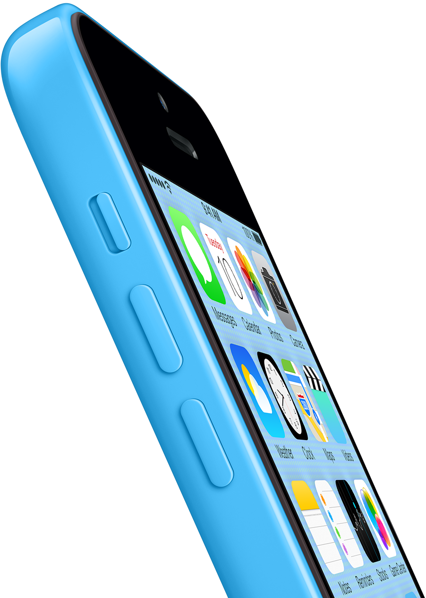

## 视频

<video src="./iphone5c-designed-together-cc-us-20131011_848x480.mp4" controls="controls"></video>

<video src="./iphone5c-feature-cc-us-20131003_848x480.mp4" controls="controls"></video>

<video src="./iphone5c-plastic-perfected-cc-us-20131011_1920x1080h.mp4" controls="controls"></video>

## 图库

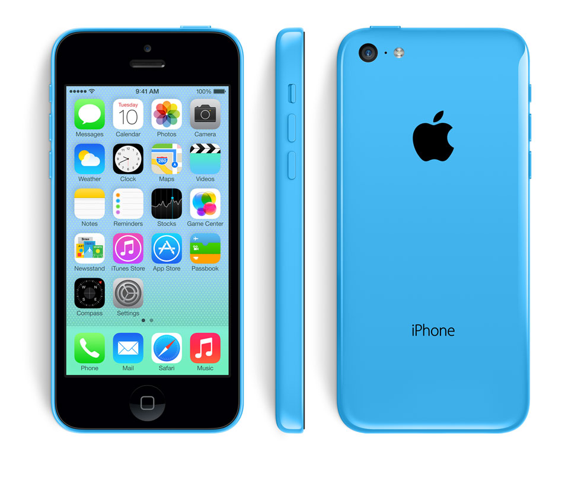

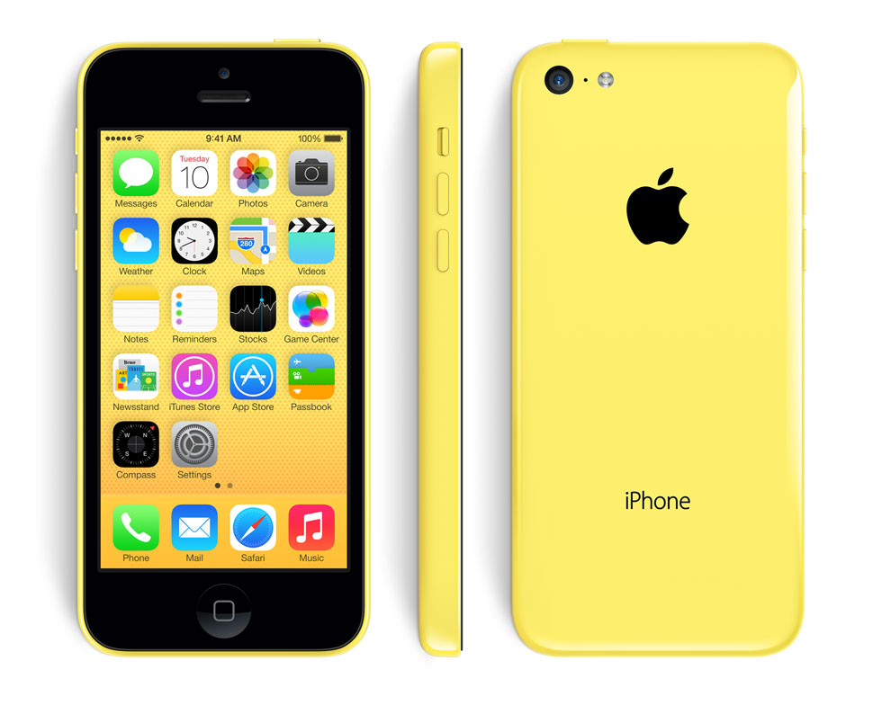

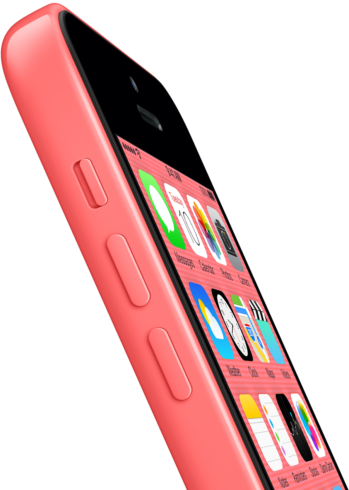

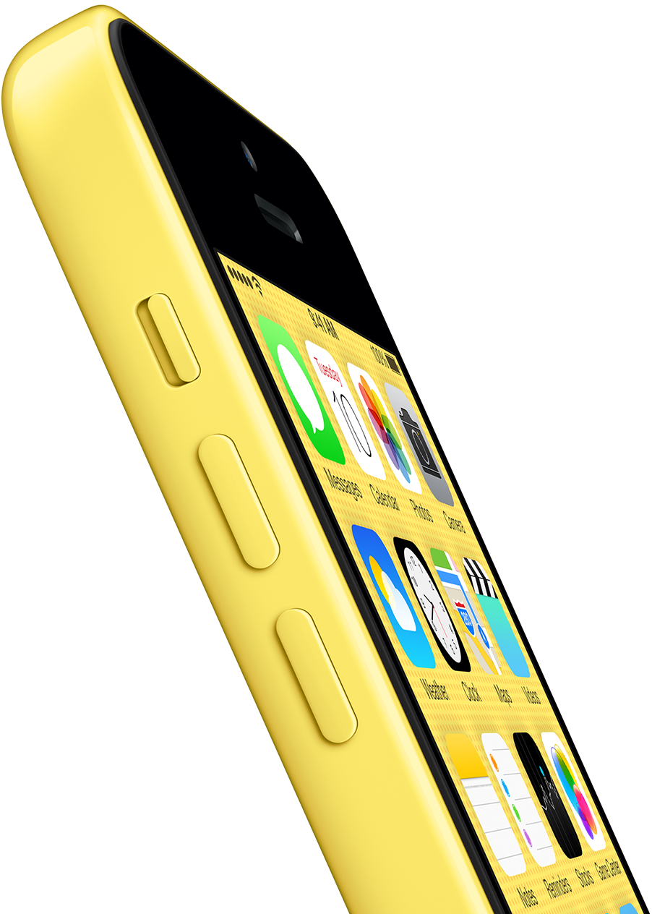

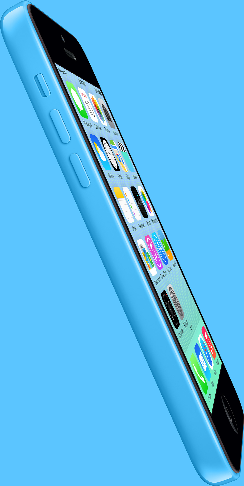

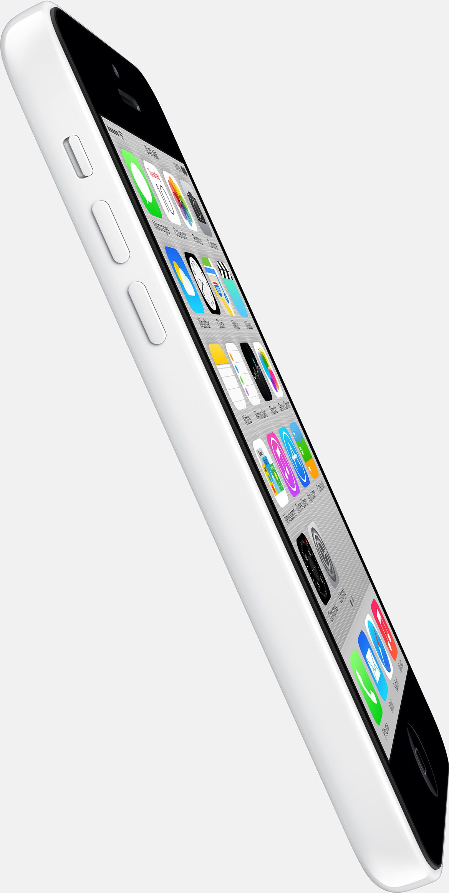
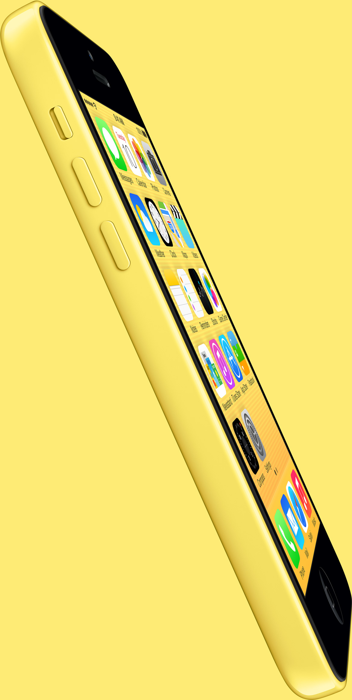

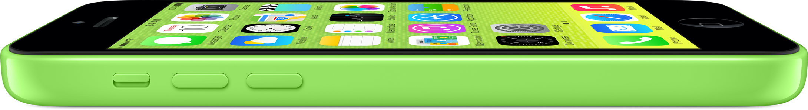
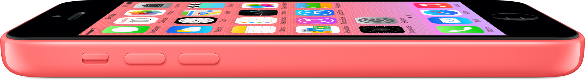

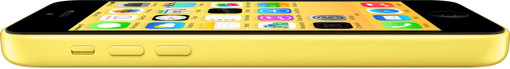

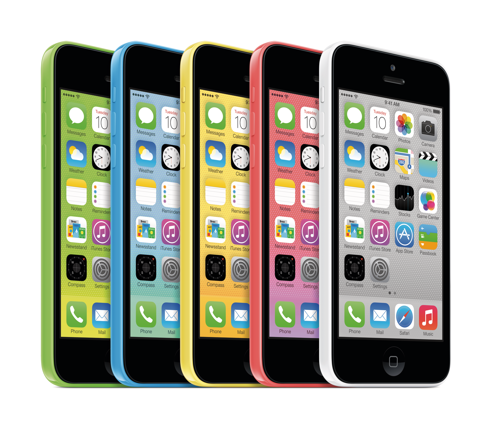

## 保护套

保护套设计广受批评，被认为看起来像洞洞鞋。有些批评者指责它看起来像 马克纽森设计的一双Zvezdochka跑鞋

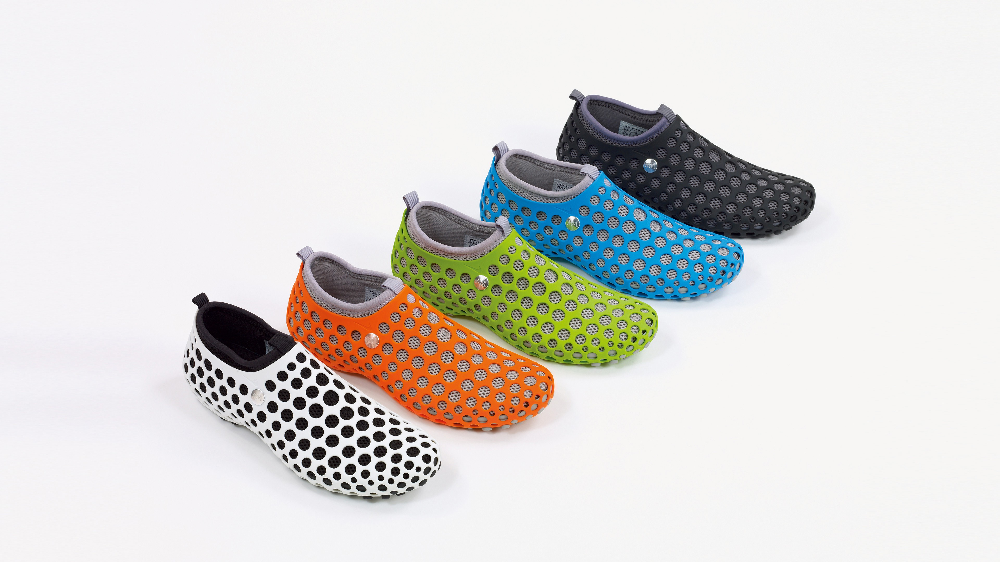

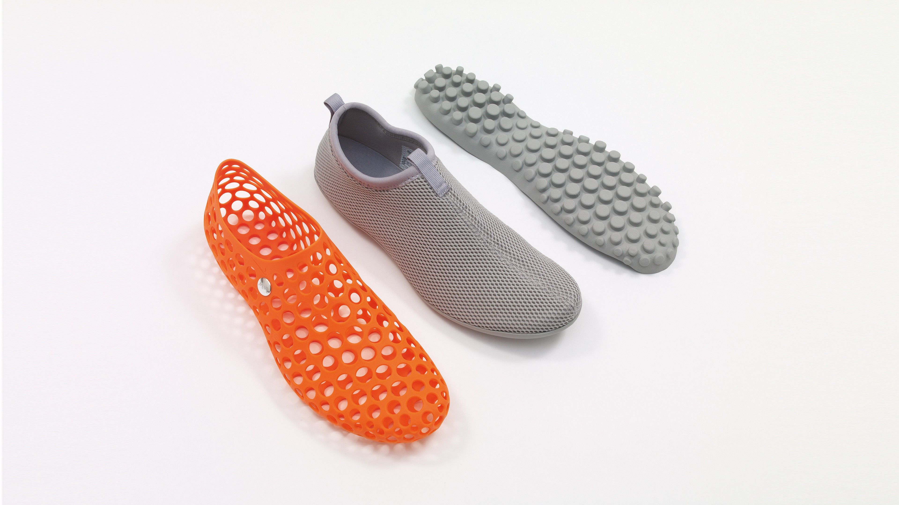

https://marc-newson.com/zvezdochka-sneaker/

Zvezdochka 的设计灵感源自早期太空时代，是具有里程碑意义的工程学成果。这款鞋完全以计算机为模型，这在当时还是一种新奇事物，采用模块化设计；鞋身由四个互锁、可互换的部件构成：外笼、互锁外底、内套和内垫。这些部件可以多种组合佩戴，可以一起佩戴，也可以单独佩戴，适合各种功能和环境。

透气的穿孔笼子构成了互锁部件的基础。内套像第二层皮肤一样贴合脚部，采用柔韧耐用的材料制成，可覆盖脚部并帮助保护脚部免受恶劣天气的影响。内部袜子衬里在脚跟处配有 Nike Zoom Air 装置，以增加缓冲效果，互锁外底与穿孔笼子扣合在一起，形成鞋子的基础。Zvezdochka 于 2014 年重新发布，共有五种原始配色，以纪念其 10 周年。

Zvezdochka 的名字取自 1961 年随 Sputnik 10 号发射进入轨道的俄罗斯太空狗。

另一些批评者指责上方盖住了苹果logo，而下方则半遮挡了iPhone字样。

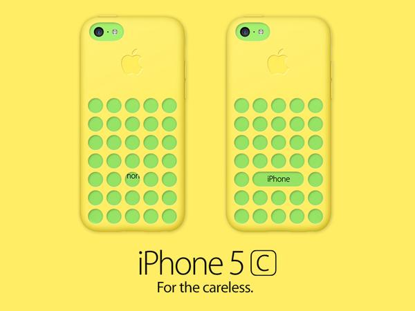

反驳者则认为，纰漏这个词说得好像 Apple 的设计师只花了半天时间就设计了这个外壳，而且只是在电脑上设计的，然后就分发出去制作了，没想到装上去一看，操，忘了还有一个标志了。

评论是很容易的是，这个评论不是指个人喜好表达喜欢还是不喜欢，而是对作品作出评价，评价暗含着是对制作者的赞善或质疑。同上我们可以花上不到一分钟时间就完成对一个新出产品和作品的评价，这里面绝大多数，会将这个一分钟不到形成的认识坚持到很长时间。那么问题来了，当你用一分钟能发现的问题，而制作者花了几个月甚至更长的时间在琢磨这个作品的时候，你觉得他会没有考虑到吗？没有考虑到也是可能的，但放到通常情况来说，制作者不是那么低智商以及不小心，它会有很多这样的“一分钟下评论”的时间，（见苹果三星庭审中苹果描述设计经过的对话。）即使是制作者不那么认真，工作的流程有时间的保证。更不用说 Apple 了。

所以，不会是纰漏。

上面所展示的设计修改图，并不是很难想到的，手法就和一些 iOS 7 icon 再设计一样，使用一些现成的设计手法在样式上进行一些修正（tweak），以满足自己形成的“习惯美”。这两个对比，恰好能说明设计不是关于外表修饰，设计也不是关于遵循“习惯美”，设计是关于 how it works，works 当然是关于逻辑，设计的逻辑并不等同于数理的逻辑，关于遵循一些准则等。例如：如果是圆孔的重复，为什么要去打破一个重复，为了能看到 iPhone 字样，为什么要看到，那么 iPhone 5s 的皮革外套也要挖个孔，因为部分被看到就需要全部被看到，这样会让人们觉得不整齐，为什么要整齐，Apple 在 iPhone 5c 外套的几个通孔达到了高精度（声音通空），那是因为有通空的需要，而为什么要为显示 iPhone 而挖空，干脆用其他形状的镂空形式，等等。外套有外套自己的存在逻辑，比如可以不挖空，直接做成镀膜。圆孔的均衡排列能够形成自成一体的逻辑，而要看全 iPhone 字样在这是否干扰了这种逻辑，当然。其实，用一分钟作出评论之后，再花上几分钟去思考制作者是否真脑残了，对其理解就会前进一大步。"Progress is a beautiful thing."

为什么在调整外壳 Logo 时候没发现呢。甚至可以试试更多的圆孔看看效果，或许是巧合，但对于强调要露出 iPhone 字样的“乔布斯时代苹果式的细节”的话，也是当前最适合，或许是最后的 6 个孔的最合适？那 6 个孔是不是有点多？有没有还是 5 个孔？

更进一步的地，为什么不用其他形式的镂空，而露出完整或者更美的 iPhone，这是另外的问题，而不是关于“纰漏”了。

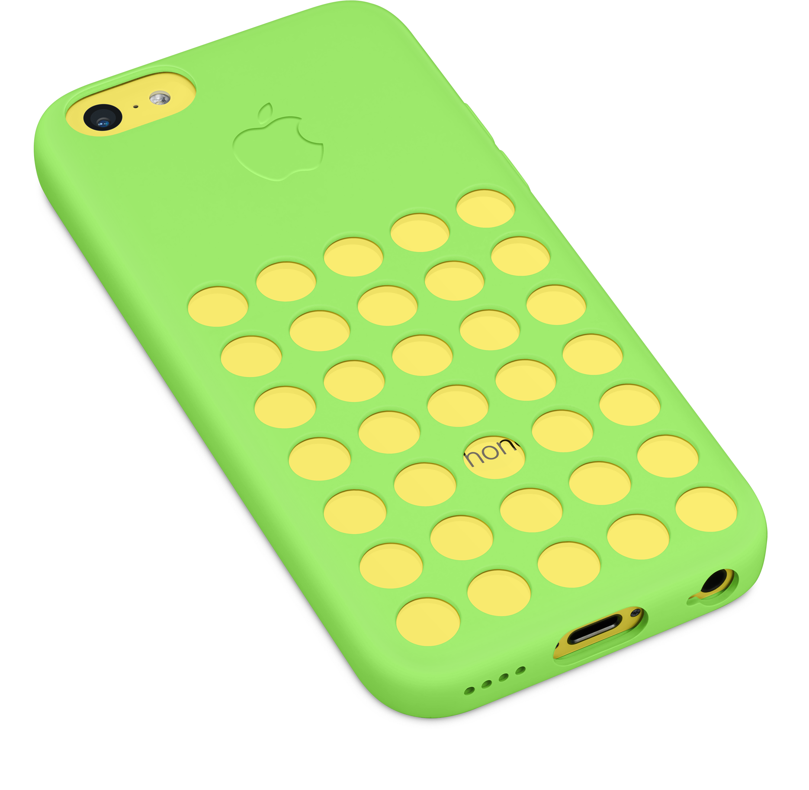
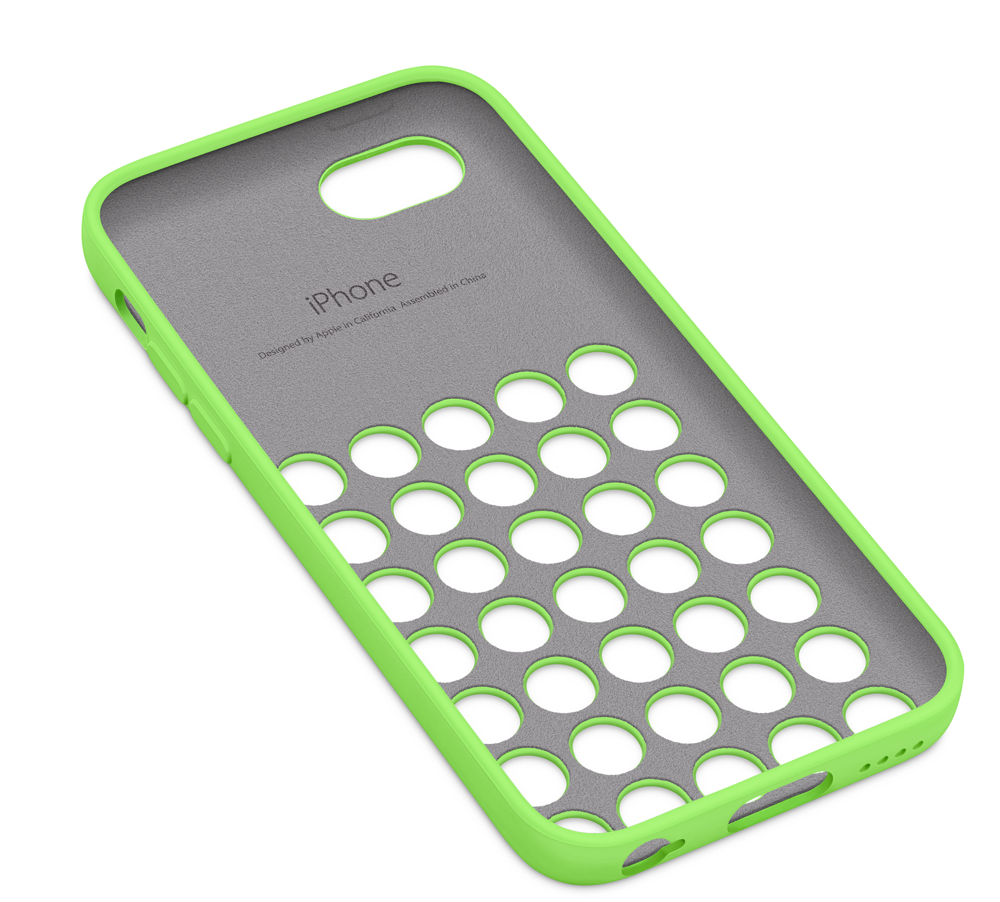
