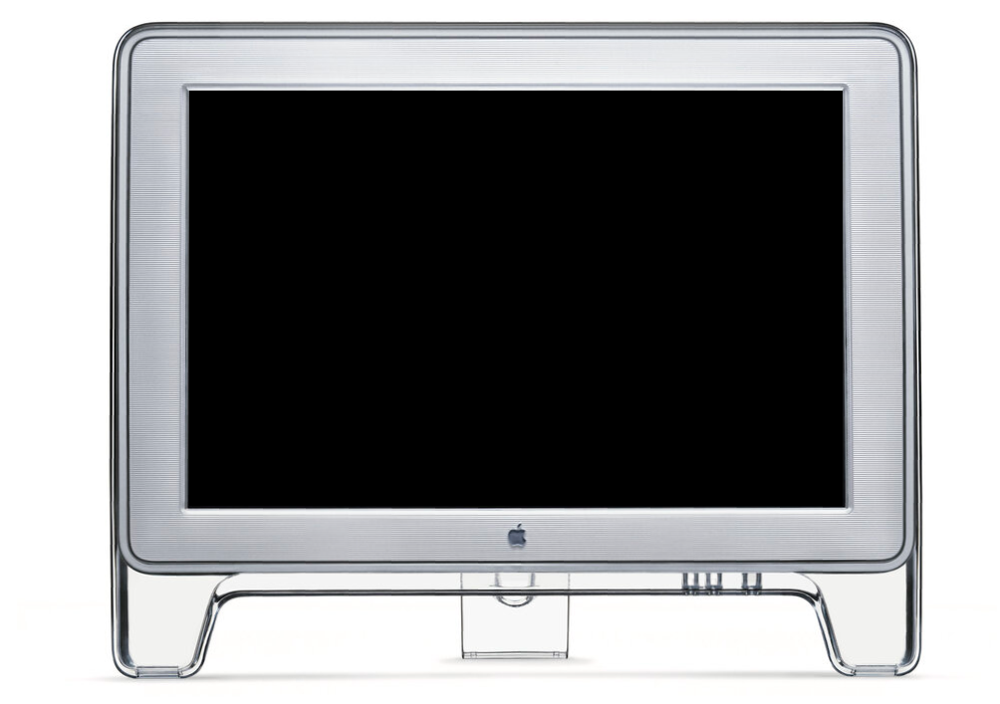
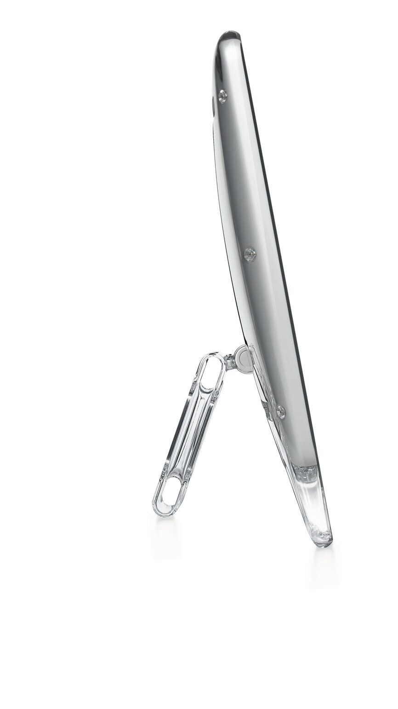

## 产品定义与设计主题

In contrast to traditional molding practices, a variable-thickness, transparent polycarbonate was molded in a mirror-polished 420HH hardened stainless steel tool. This clear enclosure suspends a steel module that houses the 16:9 aspect ratio LCD.

