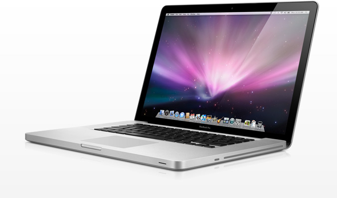

## 制造方式的彻底革新

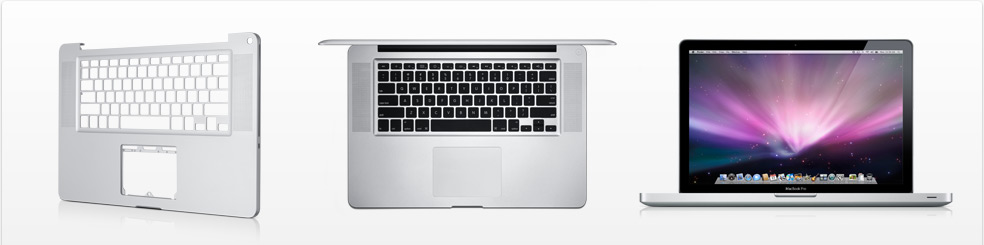

要打造真正与众不同的产品，您需要以真正与众不同的方式工作。Apple 设计师和工程师在产品开发的每个阶段都齐心协力。这种合作关系使创新成为可能。新款 MacBook Pro 正是如此打造的。凭借其突破性的一体式外壳、行业首创的功能和环保设计，它彻底改变了笔记本电脑的制造方式。

到目前为止，所有笔记本电脑的设计都是一样的。通过组装多个部件来创建一个外壳。但是，一旦将所有必要的部件都包括进去，尺寸、重量、复杂性和故障机会就会增加。解决这样的问题需要的不仅仅是渐进式的改变。它需要突破。为了打造新款 MacBook Pro，设计和工程团队想出了一种用一个部件替换多个部件的方法。这个部件被称为一体式机身——由一整块铝雕刻而成的无缝外壳。

### 铝

为了打造新款 MacBook Pro，Apple 的设计和工程团队并非只是从头开始。他们还研究了元素周期表。新款 MacBook Pro 采用铝材精心打造，既轻薄又耐用。

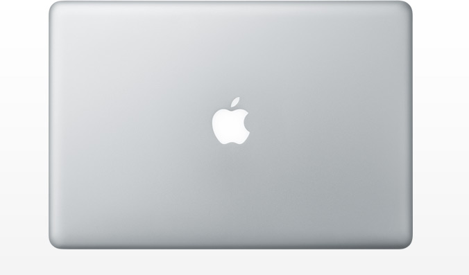

### 一体式外壳

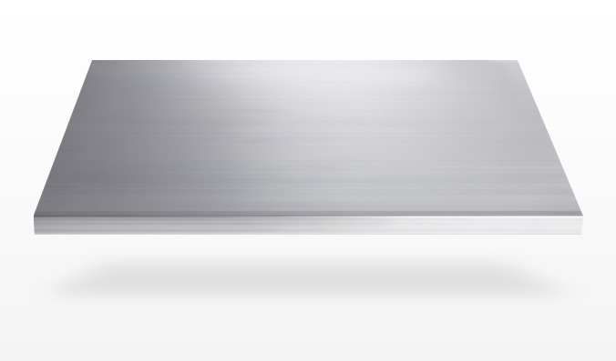
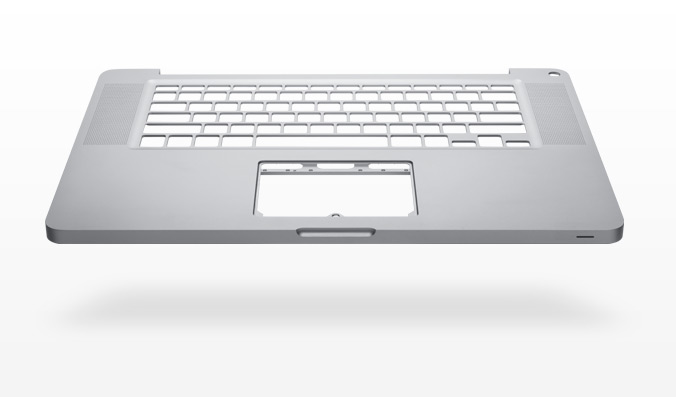
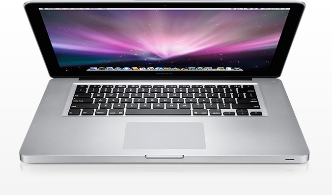

当然，只制造一个部件本身就带来了一系列挑战。当你将多个部件紧固在一起时，公差不必完美无缺。你有回旋余地，无论是字面上还是比喻上。但是，当一个部件负责多项功能时，制造该部件时必须绝对精确，精确到微米。每一次。数百万次。只有一种方法可以达到这种精度：使用计算机数控机床（CNC）将整块铝铣成一体式机身——航空航天工业使用这种机床来制造关键任务航天器部件。

每台 MacBook Pro 都以一整块铝块作为起点。每一块铝块都经过精密加工，形成基本的一体式机身设计。再加工一遍，一体式机身成型。再加工一遍，集成键盘便出现了。MacBook Pro 一体式机身需要在 CNC 机床上进行多次铣削操作才能打造出来。

当你拿起新款 MacBook Pro 时，你会立即注意到它的不同之处。整个机身更薄更轻。它看起来精致而精致。而且感觉坚固耐用——非常适合放在公文包或背包内（或外）。

### 轻薄。光滑。无缝。

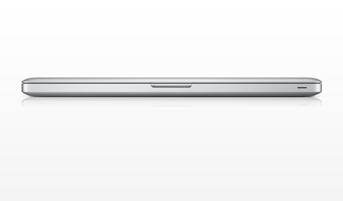
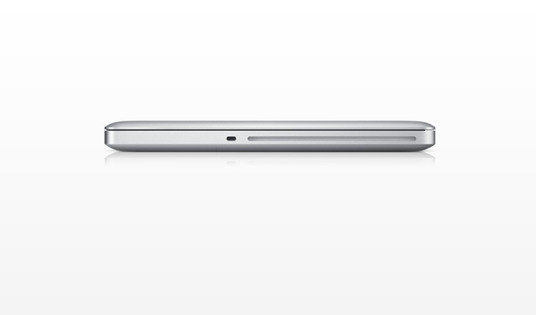

由于新款 MacBook Pro 采用整块铝材加工而成，因此每条曲线和轮廓都十分流畅。顶壳完全无缝。而且非常薄。

### 轻松访问

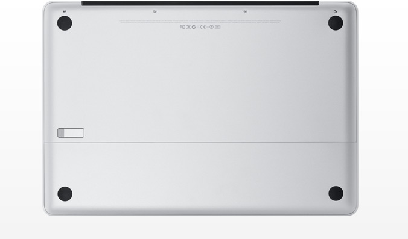
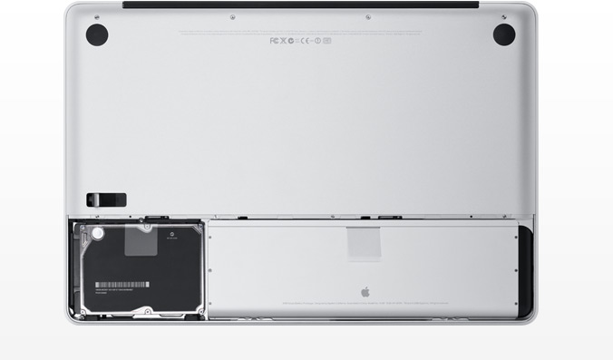
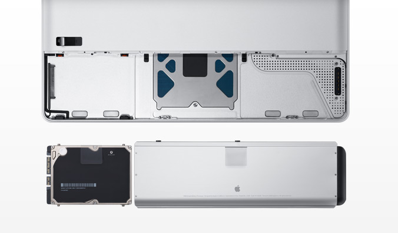

要取用电池和硬盘，只需按下取用门杆即可。如果您使用 Kensington 锁固定新 MacBook Pro，取用门杆也会锁定，从而保护硬盘和电池。

### 拇指勺

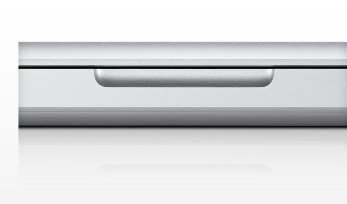

它是可以打开显示屏的凹槽。如果凹槽太深，则需要对显示屏施加太大的压力才能打开它。如果凹槽太浅，则很难打开显示屏。这似乎无关紧要，但如果拇指勺设计得当，它就会在糟糕的体验和良好的体验之间产生差异。拇指勺的挑战在于打造一个使用起来仍然舒适的、加工精良的拇指勺。苹果的设计师们设计了数百个版本的拇指勺——甚至在电子显微镜下检查它们——以求完美。

### 睡眠指示灯

指示灯只有在指示某物时才起作用。看看拇指勺的右侧。你什么也看不见。直到你关闭显示屏，MacBook Pro 进入睡眠状态。然后 LED 光从外壳内部出现。如何实现的？在 CNC 加工过程中，机器首先将铝变薄。然后激光钻头会钻出小孔，让 LED 灯穿过。这些孔非常小，以至于当灯关闭时，铝看起来天衣无缝。

### 电池指示灯

新款 MacBook Pro 将电池指示灯移至机身侧面，让电池状态一目了然。这排八个 LED 灯会根据不同的电池状态而变化：例如，来回扫描表示电池是否安装正确。或者，当电池需要更换时，闪烁五次。

## 造型

上图我们看到的是 MacBook 的一个细节特写，这张图片也在前面“曲线进化历程（3）”中使用，我们并不另外引用图片，一个原因是这些 MacBook 的新照片都照得一样漂亮，如果你不以此为然，可以用 MacBook 用搜索引擎或者各类相片分享网站搜索看一下，为什么照得一样漂亮呢，因为 MacBook 很上镜，其实就是说 MacBook 漂亮吗，你或许不认同这种说法，但是你一样可以往下看，我们没说比谁漂亮，假如你讨厌一个人（或巨大一群人）说一个东西漂亮，我想你早就应该停住不看了。

我们从上面这张照片能感受到什么，一个缓慢过度的曲面，而最显眼的就是高光带，所谓高光通俗说就是最亮的地方（或者白色的），这条高光带一面过渡很缓和，从亮到暗，而另一面在最亮的地方陡然截止，另外一面就是阴暗面，形成亮丽的分割线。上面说到的无论你是从搜索引擎还是照片分享网站去搜索 MacBook 的照片，都觉得漂亮，其中一个最主要的特征就是这条高光带，其实这也说明人们看到实物也是差不多。可以尝试用 Google 搜索，不是在特殊条件下的照片，基本上有如上描述高光带过渡。

简要介绍一下高光，我们都知道我们眼睛能够感知一切物体，是因为光的作用，即光的反射（不发光物体），不同的反射情况让我们获得不同的感知，比如镜面还是磨砂面，是平面还是弧面，也包括不同颜色不同材质等等所有视觉可感知信息。光的反射有一个基本的定理，即反射光线入射光线和法线在同一平面内,反射光线和入射光线分居法线两侧并且反射角等于入射角，无论是镜面还是漫反射都是这样。当我们眼睛位于反射线上的时候，我们看到的是强光，在漫反射中法线是朝四面八方的，我们看到高光就是因为这一区域的更多的光线反射路线是到达眼睛的，高光带渐变就是反射到眼睛的光的数量的渐变，所以高光是决定于物体的法线分布和光源、眼睛的位置。而物体表面法线的分布是由表面的材质以及形状决定的，从宏观上来说，形状是高光形状特征的主要决定因素，比如同一形状不同材质的高光表现类似，其实这也是我们眼睛能够感知形状的原因，同时也说明高光带在识别形状中起的重要作用。

我们先看一下，旧版 MacBook 照片：

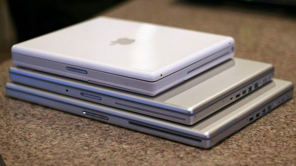

照片来自这里。规则的圆角过度，对比一下新版 MacBook 的高光表现，差别非常大，旧版的高光带较新版的聚集，过渡区域狭窄，比较复杂，比如高亮的角，不够丰富，即没有缓慢过渡也没有新版一边陡然切断的感觉。高光表现的就是曲面。

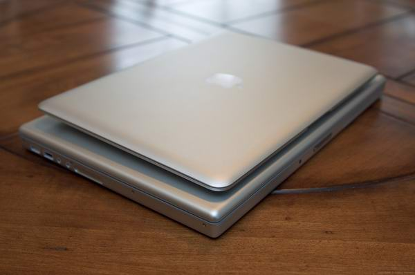

也是用在前文的一张图片。
富，即没有缓慢过渡也没有新版一边陡然切断的感觉。高光表现的就是曲面。

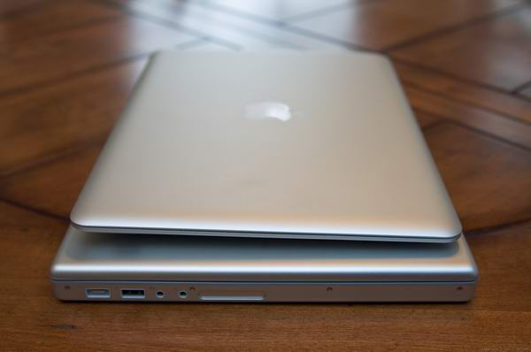

和上图一个系列，照片来自这里。
下面是一个示意图：

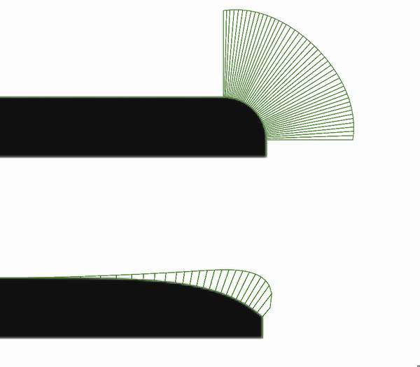

两种曲面界面的曲率变化鸡冠示意图，系列直线也表示曲线上的法线分布（疏密没有比较关系）。注：这些法线分布是一个实际物体比如 MacBook 这个壳子上法线分布的宏观反应，实际物体的法线都是根据不同材质朝向四面八方的。

按照我们上面说的，高光形成的原因，我们可以对照一下这个示意图，规则圆弧过度（老MacBook）在圆弧处的法线分布构成了90度夹角，所以只要你眼睛看的见这段圆弧，总是能看到广告，按照反射角等于入射角可以模拟各个方向的平行光，而且法线方向变化很快，所以高光比较集中。而下面新版 MacBook 自由曲面过渡法线方向变化缓和，也就出现高光带的缓和变化，而且法线在右边端点变化出现了不连续，即最右端点的法线和竖直的法线是一个锐角，并且在这个断点的另一边（竖直部分）法线一律水平，所以在一般光源和一般视角情况中，高光带在此断裂，而曲线的法线方向是不一致的，在通常情况下，总能在此处看到高光，这也就是为什么大家拍出来的照片中都能看到这条美丽的高光带。

而在我们不是以物理的视角来看的时候，高光带和形状之间的关系就陷入“蛋生鸡，鸡生蛋”的问题了，那么我们有必要这样去认识曲面吗？讨论这些法线分布，不就是一个形状吗？这个问题，放在一位普通消费者而非专业设计师，就是他有必要主动去关注那条高光吗？

不是有必要，但是看看那些消费者拍的 MacBook 的照片，他们为这个结果着迷，或许有的人并不会用“高光”这个词来称呼。那么设计师也一样，不必去分析什么法线之后详细的原理，但是要认识曲面，有意识的去设计曲面，而不是想当然，这儿有个转角，就加个R吧。

在边框的四个圆角上，新版比老版的要大，试想一样如果调换（不考虑加工工艺），在视觉效果上表现又是怎样？通常我们在软件中可以很好的模拟实际产品的视觉效果，但在设计时比如草图阶段，是否真的在意产品最后的高光效果之类呢？有些看起来很简单，但是实际并不简单，就比如我们用“简单”“丰富”两个看起来词义相反的词来形容新版 MacBook 一样。

## 设计细节

### LED 背光显示屏

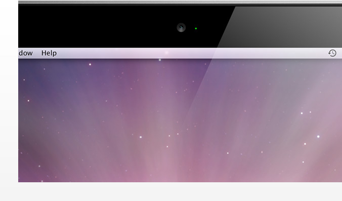

全新 LED 背光显示屏采用无边框玻璃覆盖，瞬间明亮，而且超薄。显示屏后面隐藏着一款全新、尺寸更小的 iSight 摄像头。

### 新款 MacBook Pro 触控板没有按钮，因为它就是按钮。

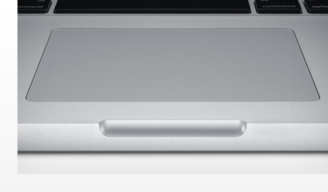

这意味着有更多的空间可以追踪，有更多的空间可以点击——左、右、中以及中间的任何位置——而且零件更少。苹果设计师和工程师花了无数个小时考虑诸如灵敏度（多大的压力会触发点击？）、音频反馈（点击的声音是什么样的？）以及光滑玻璃表面的摩擦力（感觉如何？）。

这还只是硬件方面的问题。Apple 软件工程师在触控板的开发中也发挥了重要作用。他们采用了 Multi-Touch 手势，包括滑动、捏合、旋转和新的四指滑动。最终打造出了有史以来最大、最智能、最符合人体工程学的 MacBook Pro 触控板。这只是设计过程中反复考虑的众多细节之一。

## 图库

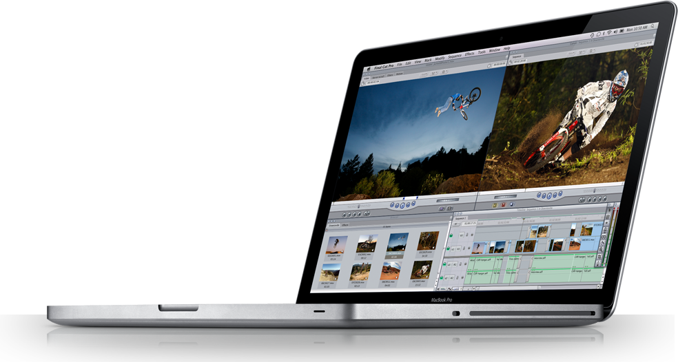
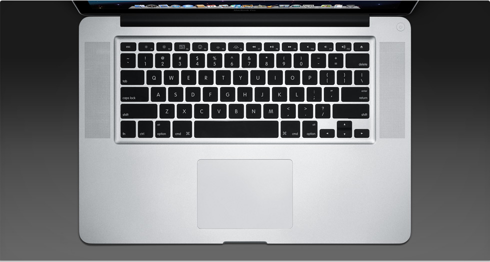
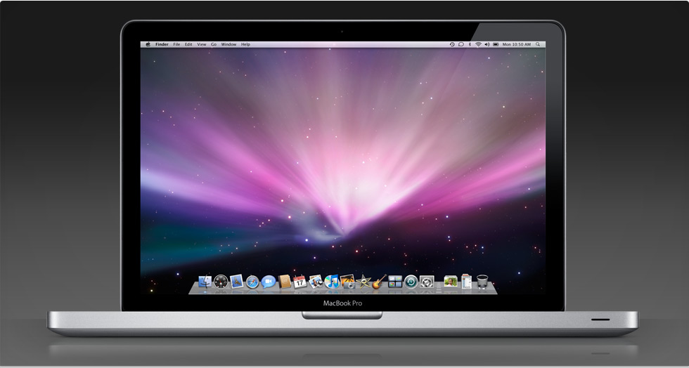
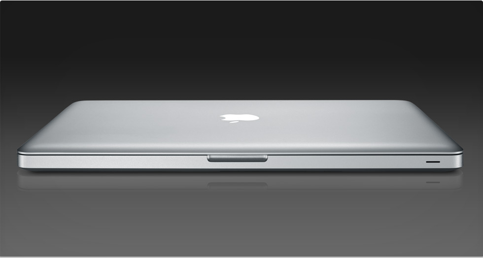
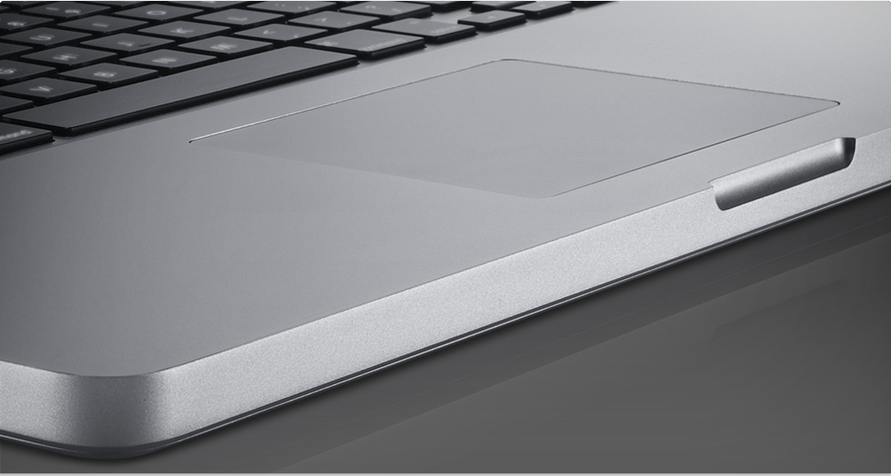
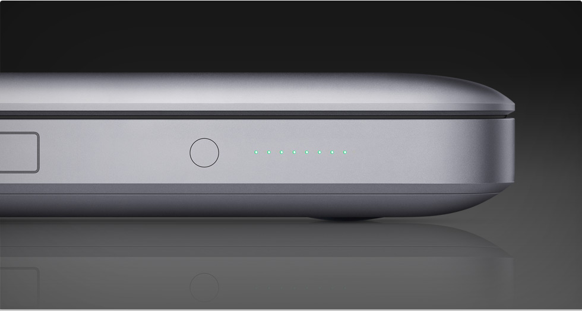
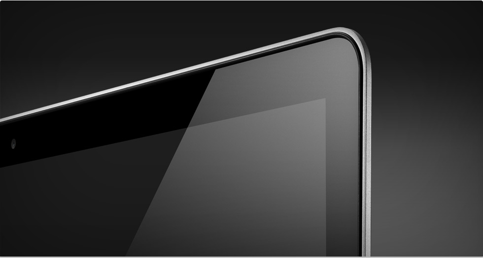

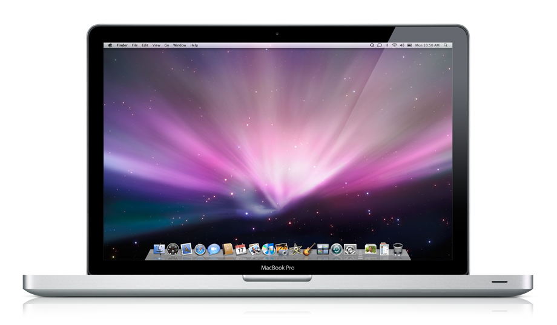
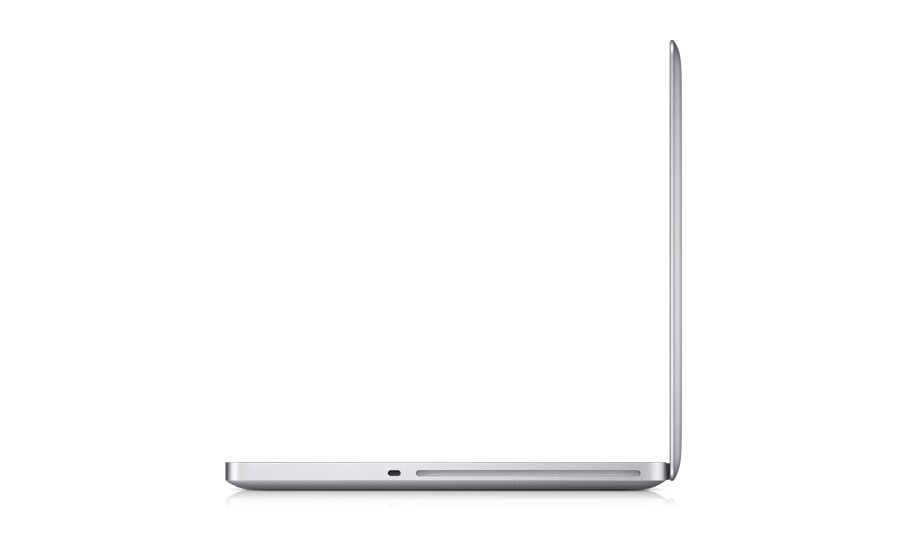
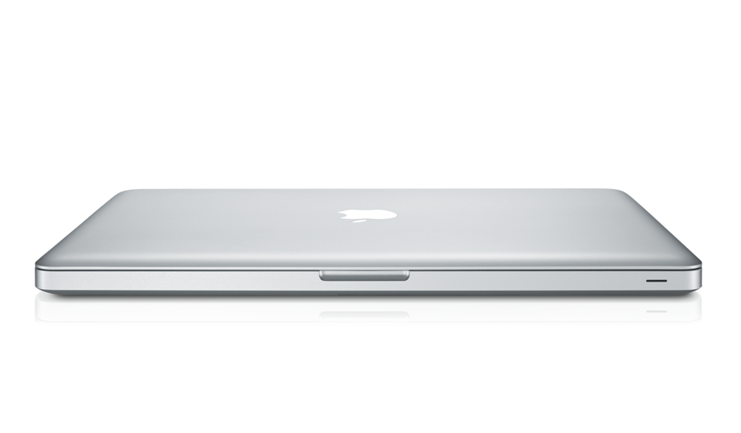
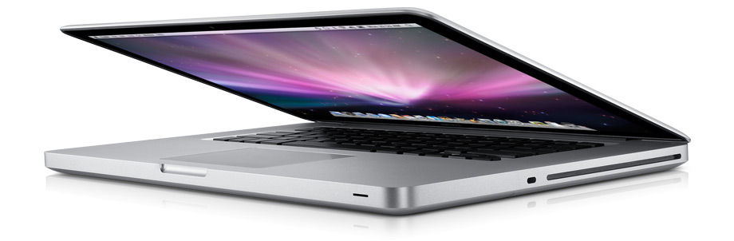

## 环保

新款 MacBook Pro 采用可回收玻璃和铝制成。

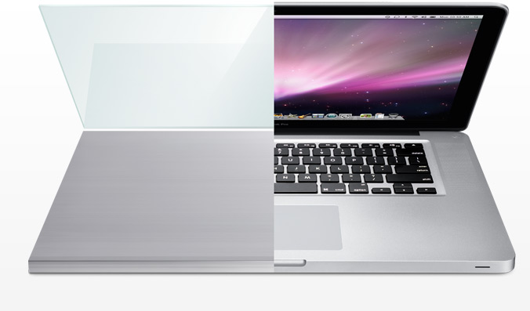

从上到下的集成也使 MacBook Pro 比其他笔记本电脑更环保。完全控制新款 MacBook Pro 的设计、制造和包装方式使 Apple 具有环保优势。以 MacBook Pro 显示屏为例。传统的 CCFL 显示屏使用汞来产生背光，并使用砷来防止玻璃不规则。另一方面，新款 MacBook Pro 上的 LED 背光显示屏既不含汞也不含砷。LED 背光技术还节省能源：这种显示屏所需的电量比 CCFL 显示屏少 30%。

新款 MacBook Pro 不含汞和砷。许多电脑制造商只承诺从其外壳和电路板中消除聚氯乙烯 (PVC) 和溴化阻燃剂 (BFR)。Apple 不仅要消除 PVC 和 BFR，还要消除整个 MacBook Pro 中的所有形式的溴和氯。
