# Mac OS X

## 开发过程

当科德尔·拉茨拉夫在1990年加入苹果公司时，它正处于全盛时期，提供的是非常理想的工作环境。那时，公司拥有的市场占有率比IBM多出26个百分比，有足够的利润提供基本面的研发预算，还有一些额外福利。不会受到太多干涉，有相当大的空间可以发挥创意，让苹果公司设计师的工作更加吸引人。而在研发的组织上，则是分成许多小团队，有7~8个不同的人性化界面小组。

但好景不长，几年后苹果公司似乎已出现颓势当 Windows 的声势越来越壮大，而其他公司努力开发网络时，他们还在操弄着“差不多”的设计手法，跟在一些产品的后面追着跑，包括世界上第一款掌上型电脑Newton、数码相机、打印机与输出系统以及一些没有市场的产品。就在那时候，科德尔转入了系统软件研发，并负责领导Mac OS的人性化界面小组。

他的第一个项目是 Mac OS 8，比起上一个系统 7，这个版本提供更大用户定制化空间，可以让人们依喜好设定界面，而且色彩与图像也精彩多了。Mac OS 8.5 推出时，他又加上了背景主题，让人们可以从一系列预先包装的背景中作挑选，也可以改变桌面壁纸、色彩方案还有某些操作模式。

在 Mac OS 8.5，他的组员还设计了音效来加强界面。在当时，其他尝试整合音效"的设计都宣告失败因为人们只是将声音当做一个动作的附属品，而不是将其视为互动行为的一个组合元素。为此，科德尔找来一家名为 Earwax Productions的音效设计公司，一起研究事件及物品在界面、手势与活动中的应对声音，也就是操作屏幕上那些用户界面元素会发出的声音。他们发现当人们重复听到同样的声音，会感到困扰，于是他们让声音的节奏与持续的时间跟着活动变化，并改变了整组的参数，让它带点随机选取的元素。

在 20 世纪 90 年代中期，苹果公司有一个名为 Copeland 的项目，持续进行好几年。它代表的是 Mac 的新一代操作系统，不过最后大家终于明白，这个计划不可能有瓜熟蒂落的一天，所以苹果公司开始转而向外界购买操作系统。候选的系统之一是NeXTSTEP，还有Be OS以及xWindows的Motif，他们甚至一度将Java操作系统列入考虑；最后，他们选择了NeXTSTEP，因为它推出数年，信誉可靠。这个决定后来演变成并购NeXT，而科德尔与他的组员"则企图将NeXTSTEP纳入 Mac OS系统中。

最初，采取这个策略是因为想保持用户界面不变，他们希望采用从 NeXTSTEP 取得的技术，与 Mac OS 的技术对换，然后保留原来的用户界面，如此一来，就没人知道原来底下还有一个不同的程序代码在跑。但他很快发现这不可行，很难在NeXTSTEP的架构上复制一个Mac人性化界面。对于某些独立的应用程序，比如媒体播放，不需要从根部将界面分割，但对于操作系统来说，却是直通技术核心的运作。科德尔还记得当初面临的两难局面:

> 我们发现了一个最糟的趋势，就是做了 95% 的工程后罢手。但我们似乎就要做出一个跟 Mac OS 非常接近的设计，我们知道这会是问题。另一方面，我们也看到 NeXTSTEP 的技术有许多有趣的特质，可以开发作为加强 Mac OS的用户经验。我找来几位设计师，开始想一些点子，比如利用NeXTSTEP先进的图像系统，在界面上做出半透明与阴影的效果。
> 
> 两个月后，我们召开一场为期两天的会议，与会者包括苹果公司内部几乎所有部门的工程经理，讨论的主题是如何让 NeXTSTEP的整合成功完成，包括所需资源、部门间工作衔接的问题以及制订出MacOSX成功研发和运转的设计。在这两天里，每个组都针对自己参与Mac OSx的部分提出看法，还有他们面对的挑战与需要别的部门协助之处。
> 
> 他们希望我说明新的用户界面研发进度，并操作示范。我是最后一天最后一个上台发言的人，我上台后开始介绍半透明菜单、果冻按键与阴影效果等并说明这部分所需的技术支持，说完后，全场发出诡异的笑声。因为在两天的会议后，我们已经堆起一座山一般的问题要克服，但我却又加了一大堆上去。那场说明进行得不大顺利，我离场时非常沮丧。

当时的苹果公司是非常工程技术导向的，多数产品都是以配合技术可行性为基础，这样极容易开发又可以准时完成；至于那些使用上的容易度或愉悦感，则不是必要的考虑内容。

后来，史蒂夫·乔布斯重掌苹果公司，并施行了一套冷酷的合理化原则与迫切需要的重点规划。“Think Diferent” 的广告也清楚表达出了他们的诉求；在这之前，苹果公司不屑做出与别人不同的东西，但这时则来个思想大转弯，提出：“与众不同是好的!”即使你的产品再好，也不可能满足所有人，只能说那是为世上最优秀的人们所设计的。对此，科德尔感到无来由地紧张:

> 几个星期后，接到史蒂夫·乔布斯办公室打来的电话，说:“史蒂夫想要与你谈谈，他听说是你主导人性化界面小组，有事跟你讨论。”
> 
> 我想，“喔，太好了!”此时，史蒂夫正一一评估苹果公司近来的计划，而我的项目中断了，组员也一个个离开。我去见史蒂夫时，带了几个设计同行。
> 
> 我翌们坐在他的会议室中，他一进来，随即说了句：“是你们几个设计 Mac OS 的?”我回答：“是的。“我必须说，你们真是一群业余水平的人。”接下来的20分钟，他不断数落Mac人性化界面的缺点，以及它愚蠢的设计方法。
> 
> 史蒂夫尚未看到我们的新作品，所以我们开始向他说明我们目前所做的，并努力将话题导人更有建设性的内容。我们讨论什么是现阶段人性化界面的不足，而我们可以弥补；会议进行到一半，我想着：“如果他要开除我们，就不会花时间跟我们谈这个，我猜我们的工作不会有问题。”
> 
> 我们为了这个会议做了相当好的准备，并列出一串我们想要进一步实现的想法。会议结束时，史蒂夫说:“你们何不做做这些事，几个星期后我们再来看看成果如何。”
> 
> 接下来的几个星期，我们夜以继日地工作，制作原型、将设计点子具体化。我们花了一整个下午将成果展示给史蒂夫，他对这一切感到惊愕，从那时开始，我们要在 Mac OS X上放一个新的人性化界面的计划，不曾再出现反抗声浪。

苹果公司里包括实体产品与软件的设计师，都感受到在史蒂夫·乔布斯麾下工作的成就感，虽然他有点不按常理出牌、挑战性十足，但他的领导风格鼓励了大家表现出最好的一面。尤其他集中火力发展设计，他注意观察苹果公司产品的消费者，积极发展符合需求的产品，而且将产品发展步骤改为设计、开发与产品批量生产

> 我们先做出设计，主要是针对我们认为人们会想要、需要的，还有他们与计算机的互动；确认方向无误后，转向技术面的发展。许多时候，我们提出了人们肯定会喜欢的设计，但却不知道该怎么将它具体化，于是我设定了设计目标，并与工程师一起努力实现它。本来有些我们以为不可能做到的，或是要拖很长时间的，后来却实现了。这真的感觉很棒，因为我们展现出了设计面的创意与专才，然后促使工程师们同样发挥了创意与革新力，让事情完成。

史蒂夫·乔布斯选择倾向消费者市场的经营方法并且协助科德尔决定如何简化那些设计。不过苹果公司以往拥有非常特别的支持族群，是属于研发者与专业用户，他们对于 Mac OSX 的诉求非常不以为然，也给予它许多批评与抵制。不过当交互设计师面对来自企业高层的压力，要他们支持科德尔与他的组员积极抢攻那些没有太多计算机使用经验的消费者族群市场时，他们只有配合。

MacOS 8.5 拥有超过7种的方式可管理窗口，但 Mac OS X 却大大简化了这部分，并以精致的阴影效果取代原本厚重的外观。在1997年，若以美学观点来看待当时的操作界面，无论是 Mac OS 8.5、Windows 95 或 NeXTSTEP，外形都是棱角分明的。在控制器与窗口上，所以东西都是直线的、有着类3D效果的阴影。在交互性上，许多界面元素都被凸显出来，以厚厚的窗口边框、大大的斜切按键与大图标创造出的使用经验，似乎这些元素与控制器的重要性，已经盖过了你真正要计算机做的，比如浏览网络上的内容，或是创造内容，像是撰写稿子或电子邮件。

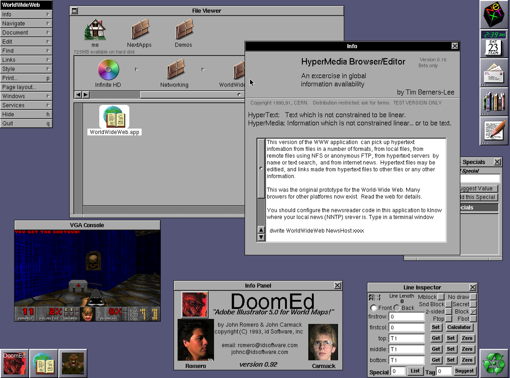
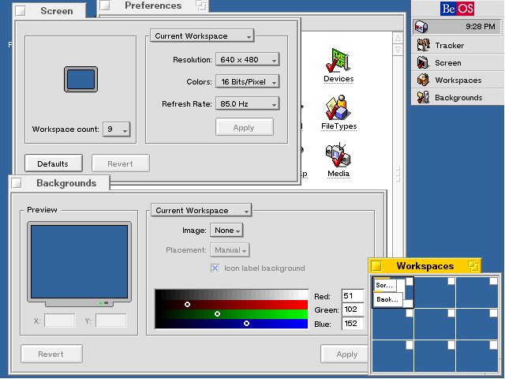
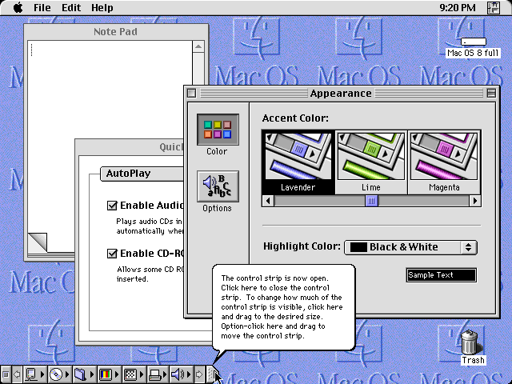
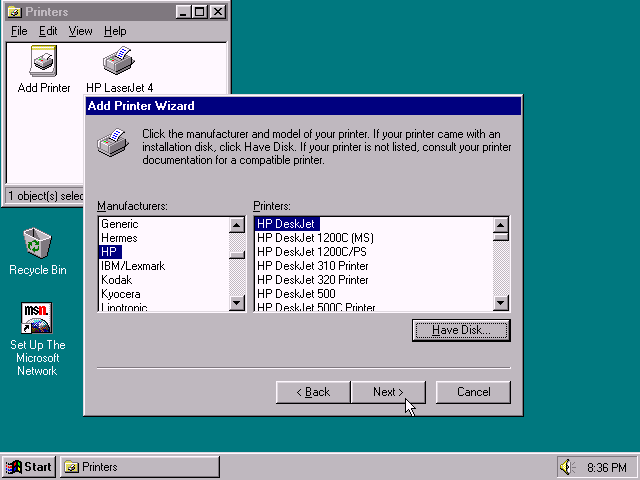

## 视觉设计——代号 Aqua

科德尔发现了一个大玩创意的好时机。他决定以明亮、有趣、多彩而且很有水感的造型取代原本产品的方正呆板模样，他自问:什么是与计算机界面完全不同的东西?他得到的答案是：像糖果或是酒之类的。这个想法激发出视觉感官上的创意。于是，设计师们开始收集杂志上的酒类广告，上面有装着醇美液体与冰块的玻璃杯，闪耀着无比光辉。在这段时期，苹果公司创造出最初版的[iMac 1998](https://apple-design-wiki.github.io/posts/iMac%201998) ，而半透明则是此系列的设计特色之一，他们也尝试要设计一个可以配合工业设计的界面：

> 我们并不是刻意要在半透明的效果上打转，而是希望通过它来丰富感官。以窗口为例，当窗口移到下层时，它会变成半透明状；越往下层移动，越是雾化。这种半透明效果不仅让界面融入工业设计概念，而且更能表现出 Mac OSX图像的特色，在窗口的层叠顺序上也提供了极佳的导引作用。
>
>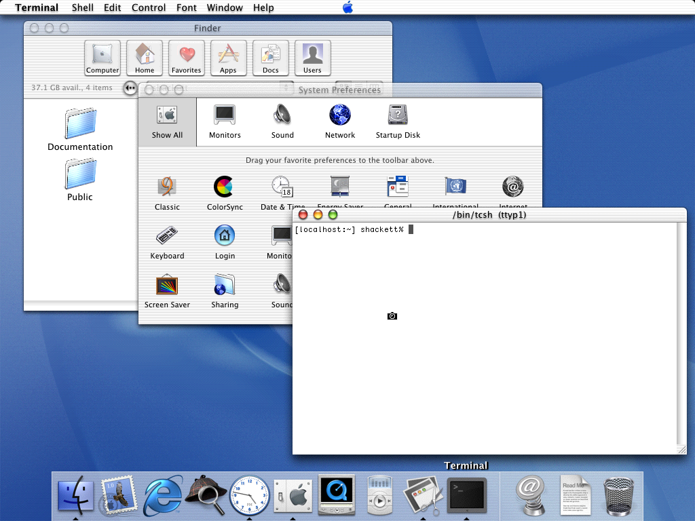

Mac OS X 将这个从桌面与窗口隐喻发展出来的图像用户界面带入一个新纪元。虽然我们仍然称呼这些东西为窗口、桌面与文件夹，但是设计的影响力已经深植、潜移默化地改造一切。科德尔相信，设计的最初动力就是来自于用户的需求与渴望:

> 没有什么事是不能做改变的。我认为计算机界面必须更贴近用户与他们的工作需求，人们使用计算机不是为了想要操作里面的系统，他们不介意需要下载自己喜欢的系统，也不介意自己挑选想要的滚动条；他们使用计算机是为了要创作出某些东西，要跟别人沟通，要表现出自己的特质，用它来写小说、记账或是做一些有趣的事。但他们并不想花太多精神来处理计算机的问题，因为它只是个工具。
> 
> 作为交互设计师，我们应该记住设计的重点不在于产品，而是人们到底想要什么，了解他们的需求才能创作出成功的设计。

### 标题栏

默认的 Aqua 窗口和“拉丝金属”窗口。Aqua 窗口通常具有金属或灰色的标题栏，左侧有三个按钮（用于关闭、最小化和缩放或进入全屏模式）。从视觉上看，这些按钮过去放在顶部，但后来看起来“凹陷”在窗口中。与 Windows 相比（——无论是 Windows Classic 还是 Windows XP 时代的 Luna 外观），Aqua 白色窗口的左、右、下方没有外边框。

拉丝金属窗口具有厚框架，带有金属纹理或深灰色背景，以及凹陷的按钮和内框。它们具有可在框架的每个点拖动的附加属性，而不仅仅是标题栏和工具栏。 Apple 建议在模拟真实设备（如iTunes）或用于与此类设备交互（如iSync）的应用程序中使用拉丝金属窗口，但苹果事实上并不遵循自己的指导方针或应用不一致（Safari 和 Finder 也使用了这种设计）。

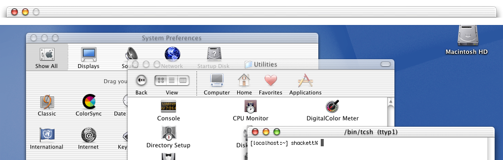

### 工具栏

工具栏与窗口框架具有相同的背景或采用细条纹。这里的细条纹与 [AppleCinemaDisplay 1999](https://apple-design-wiki.github.io/posts/AppleCinemaDisplay%201999)  [iMac 1998](https://apple-design-wiki.github.io/posts/iMac%201998) 等机身的工业设计的细条纹相互呼应，从而创造了软硬件一体的设计。

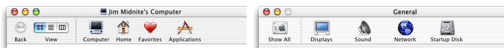

### 菜单背景

菜单背景为半透明的白色，也带有细条纹。高亮显示为蓝色。

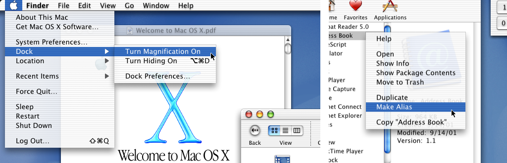

### 文本框

文本框是白底黑字，带有凹陷效果边框。除了常规的方形文本框外，还提供圆角搜索文本框。对于更广泛的文本要求，还有一个多行文本字段。提供组合文本框和下拉菜单，用户除了可以从菜单中选择外，还可以键入值。还有一个组合文本框和选择器控件，用户可以键入日期和时间，或使用方向按钮进行编辑。

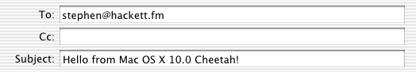

## 按钮

胶囊形的按钮有两种：白色和蓝色。蓝色按钮是默认操作，有深浅两种蓝色交替闪烁

## 动画

- 当相应应用程序启动时， Dock图标会上下弹跳。

- 当后台应用程序需要用户的注意时，Dock 图标也会按照不同的节奏上下弹跳。

- 当打开或关闭桌面上的文件夹时，相应的 Finder 窗口会从文件夹图标中出现或消失，而不是凭空出现。此效果在Classic Mac OS Finder 中以 ZoomRects 的形式出现，但在早期的 Mac OS X 开发人员版本中已消失。

- 仪表板小部件似乎飞到了屏幕上。仪表板小部件出现“涟漪”效果，就像被扔到池塘表面一样。移除时，小部件会被吸入关闭按钮，就像被吸入真空一样。此效果可应用于最小化到Dock 的窗口。

- 当单击时，堆栈的内容将会从图标后面弹出。

- 在 Mac OS X Public Beta 中，拖到桌面上的停靠项目会消失，就像“掉落”在桌面上一样。这种行为在 Mac OS X 10.0 中发生了改变；从此版本开始，拖出停靠的项目会以卡通般的烟雾形式“消失”，Apple 后来在各个地方使用了这种效果（例如 Safari 的书签栏和 iPhoto 的标签删除）。Apple 的Newton OS中使用了类似的效果。在 OS X 10.10 Yosemite 中，这种效果不再存在；项目只是消失了，但是当启动设备（例如外部硬盘）与计算机断开连接时，仍然可以在基于 Intel 的 Mac 计算机的启动选择器上看到它。

- 当使用快速用户切换时，Apple 的“立方体”效果用于在桌面和/或登录窗口之间转移。

### Dock 的放大效果

我们一直努力要从上一个Mac OS版本的操作模式中，提炼出更纯熟的做法。我们知道人们希望有一个简单的方法可以执行程序与文件，需要好的方法管理窗口并将它们缩小化，让他们可以很快再找到它。在上一个Mac OS版本中有许多不同设定可满足他们的需求，但那似乎零零散散的，而我们希望找到一个集中、一致的做法，让他们更容易操作。而“停驻”( Dock)似乎是解决问题的好方法。

> 我们面对的最大难题就在于屏幕空间有限。当你不断加东西上去，终会占掉所有空间。为此，我们特别设计了一个动画程序，当东西一直加上去，它就会展开来，不过东西越加越多，还是会超出屏幕边界这时如果不拿掉一些，就无法再放别的进来。

> 我们并不想限制人们只能放多少东西进来，于是只能将它们一直缩小到不能再缩为止，如此一来，你就可以随心所欲地加东西进来。不过图示越来越小，就越难辨识，为了解决这个问题，我们又做了一项设计，就是让光标区域内的图标自动变大；光标滑动时，图标也会一个个变大。

Steve Jobs 收到一位年轻人的 Email 要应聘图形界面设计师（1998 年），应聘者很紧张，所以面试不成功，这位沮丧的设计师坐在大厅等 Steve Jobs 出来，问他是否可以看一下他的一些创意和设计，用 Adobe Director 作的 Demo，就是在屏幕下方一个可动态适应的 Dock 栏，而且有一个随着鼠标移动的放大效果，Steve Jobs 当场就雇佣他了，这位设计师就是 Bas Ording，不只是设计了很多 Mac OS 的富有特色的交互设计，还包括促成 iPhone 诞生的列表滚动和回弹效果，以及很多 iOS 上的出色交互设计。由此也可以看到 Dock 图标放大这个设计从诞生到仍在使用的今天已经有 20 年了。

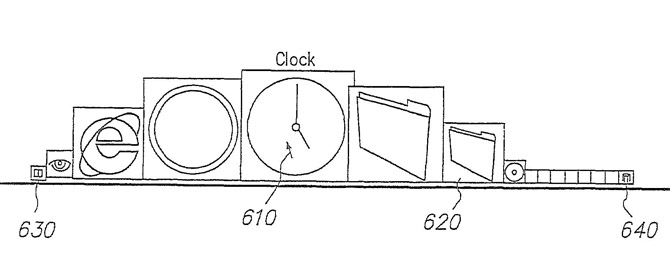

对于需要在 Dock 栏放置多个图标的用户，以及考虑到十多年前的屏幕大小和显示精度，Dock 栏的放大效果是非常有效的一个视觉增强功能。对于像放大效果这样的交互设计，并非单纯源自于功能的需求，它也不像技术革新那样具有重大意义，或许人们会称之为增强了审美效果，用现在的语言来说是带来了丰富的体验，随着时代的发展，它的重要性将被越来越多的人认识到。

“随着鼠标的移动图标动态地变化”这只是一个 Idea，或者是一个创新的解决方案，还不能成为设计，要成为设计，就得考虑它具体是怎样变化。鼠标移到哪个图标，这个图标就按设定值放大，然后两边的图标以小一级的放大倍数来放大，离鼠标位置越远放大的倍数越小？

但问题是如果按上面描述的方式来实现这个放大的效果，它将是非常机械的，线性的或者是接近线性的，而 Apple 的交互设计，从 Mac OS X 到现在的 iPhone X 最大的特征就是反线性，一个机械的动态效果将会是适得其反的。Bas Ording 在这个设计中引入了几个参数和函数，为了达到更加连续和顺畅的动态效果。

首先是在鼠标两侧递减的放大倍数是连续的，而不是一级一级的，如果你把鼠标放在某一图标的中间，那么左侧和右侧的图标放大倍数是一样的，如果鼠标是放在图标某一侧而非中心的位置，那么在这个图标两侧，里鼠标越近的图标放大倍数越大。然后引入两个可变动的参数，即最大放大的倍数是靠放大后的高度（H）来决定，放大影响的范围是靠鼠标两侧的宽度（W）来决定。

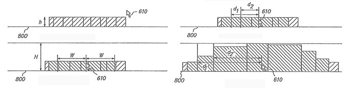

在这个设计（[专利 US7434177](https://patents.google.com/patent/US7434177) 所示）中，图标的设计是宽度可以不等，即有宽窄之分，所以图标的宽度和位置靠两边离鼠标的距离 d1 和 d2 来确定。当原始高度 h 和放大后的高度 H，以及影响范围的宽度 W 确认之后，那么放大后的在宽度上的增量 S 就可以确认，本设计使用的函数：S=((H−h)÷2)÷sine(π×(h÷2)÷(W×2))，两段各增加 S，也就是放大后的宽度是 2W+2S，S 与高度增长量（H−h）成线性正比关系，但是与影响宽度 W 是非线性的正比关系，而是引入了一个正弦函数，以原始高度 h 和影响宽度 W 指比形成的正弦函数，带来了一个非线性增大的结果，原始高度 h 越大，S 就相对越小，因为原始图标够大需要的放大倍数不需要太大。

同样放大后的图标两侧距离鼠标的距离的增加量也是通过正弦函数来与得到结果：d1′=S×sine(π÷2×d1÷W) 和 d2′=S×sine(π÷2×d2÷W)，d1′ 和 d2′ 在上图（引用自 US7434177 专利图）标示有误，通过公式来看 d1′ 和 d2′ 是增量，即放大后图标两侧离鼠标的距离为 d1+d1′ 和 d2+d2’，d1′ 和 d2′ 指来自于对一侧宽度总增量 S 的分配，通过以放大前的与鼠标距离 d1（或 d2） 与影响宽度 W 的比值作为正弦函数的因子，正弦函数值的范围就是从 0 到 1，离鼠标越近，也就是 d1（或 d2）值越小，正弦函数的特征就是因子数值越小变化率越大（在 0 到 π/2 之间），也就是离鼠标越近，增大的倍数越大。

最终增大的比例因子为：1+(d2′−d1′)÷(d2−d1)。

所以这一设计的要点有两项，一是以图标离开鼠标的距离来确定放大倍数，也就是鼠标作任何大小的移动，Dock 栏都有变动，如果鼠标在某一个图标内移动不影响旁边图标的大小，这个设计就一下子变得死板了；第二个是通过正弦函数来实现非线性的变化。

如上所示，通过参数和公式来完善设计，并非通过尝试来获得一个满意的结果，可以称之为“Tuning”（调校）。如前所述，Tuning 并非是完全客观和理性的，像这里使用到的参数和公式，并不是必然如此，而是设计师作出的选择，这种效果也可以用其他的参数和公式来实现，只不过在这个设计上 Apple 使用了设定参数的比值来作为正弦函数的因子来达到非线性的变换效果。

### Genie 效果

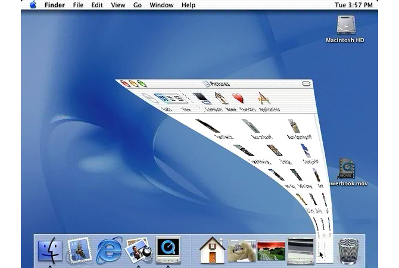

这就是 Steve Jobs 在 Macworld 2000 演示得乐此不彼的 Genie 动画效果，窗口缩小的默认效果是 Genie Effect ，另外还有一个 Scale Effect 供选择，Scale 效果就是单纯的缩小和放大，具有更高的执行效率，而 Genie 效果在缩小和放大之间有窗口有变形，而且变形的速度也是非线性的，动态的变换过程需要一些时间，而且连续的变形会让人感觉显得更慢。现在的 Mac OS 仍提供这两个选项，很多人喜欢 Genie 效果，也有很多人不喜欢。

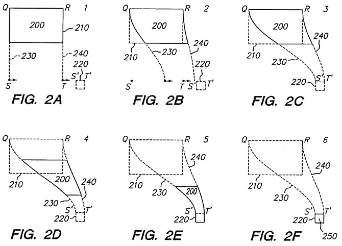

上图是 Genie 效果中窗口轮廓的变化过程，来自专利文档 US7362331。这个设计的一个特点就是变形后窗口的外轮廓，当从 QR 为上边的四边形窗口变形移动到 S’T’ 为上边的四边形窗口（或图标）时，窗口的左右轮廓由直线变成了曲线，而这两条曲线在这为正弦曲线（当然它可以是其他曲线），来自函数 y=A sin(x) ，x 为图面垂直方向的距离，正弦曲线的范围定在 −π/2 和 +π/2 之间，y 为图面水平方向的距离，A 为振幅，从零到 SS’ 和 TT’ 的一半。所以当窗口当前位置确定，以及目标位置确定，左右两条曲线就能确定，窗口就沿着曲线向下缩小和移动。

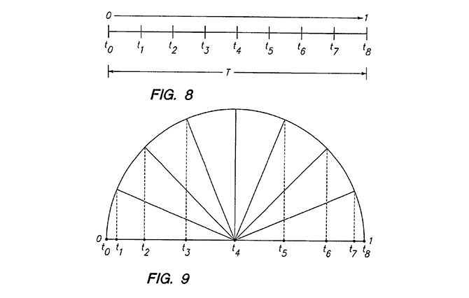

这个设计的另一个特别之处，就是窗口在缩小变化过程中以怎样的速度进行了，它需要是非线性的，如果是匀速地向下移动和变化，那么就会显得很机械，非线性的运动就是在开始和结束的时候是缓慢的，而中间过程是快速的。如此前一图所示，窗口在数值方向上移动的距离是 SQ 线段，如何实现非线性的变化，这个设计引入了一个余弦函数。首先当移动变换的整体时间 T 确定后，可以将 T 划分为几等份，比如 8 等份，用 8 等份来等份分割一个半圆，在每一个分割点向下作垂线来分割直径，得到的分割距离就是从小到大再到小，用此分割线段比来划分 SQ 线段，就可以得到非线性的窗口移动变换过程。

同样，在这可以使用其他的函数或方法来实现非线性的变动，而上述方法聪明、简单、直观，虽然使用到了参数和公式，但参数和公式在这里不是原理和依据，而是一个解决问题的工具，而挑选恰好的参数和公式这种工具，就是设计中的 Tuning。

## 交互设计

### 菜单栏与下拉式菜单

Mac OS X 的菜单栏继承了 Mac OS 的设计，这里补充 Mac OS 菜单栏的设计历史。

当比尔与拉里要为 Lisa设计的用户交互界面有了初步定义，这两人发展出非常好的合作默契，并以类似于当初拉里与蒂姆·莫特一起研发Gypsy时，那种夜以继日的模式工作着；比尔晚上工作，拉里白天工作。晚上，比尔针对用户界面的概念设计出原型，并粗略写了些足以应付测试的程序代码；次日白天，由拉里进行用户测试。当时要找目标测试者非常容易，因为苹果公司多数新进员工都还没用过计算机。拉里在一天结束后，将结果书面呈给比尔，让他知道测试结果与收获然后一起进行头脑风暴，决定下一步如何进行。然后晚上写程序，白天将测试的流程再跑一次。这样的工作状态维持了数周之久，直到产品特性都明确为止。

后来，他们有了比较常态化的分工。因为小组成员增加，有不同的人可以写程序，而一有成果就交给拉里进行测试。拉里针对测试写评估与建议后，再进行小组讨论，弄清发展细节。拉里常被视为拖延进度的人，因为他总是希望可以作出改变，不过他的坚持也让产品的发展落实了容易操作的理念。Lisa共花了3年时间研发从1979年进行到1983年，营销部的人质疑这个该进行6个月的项目怎么会耗时3年，但工程师认为，要研发出一个新的用户界面、一个新的操作系统与5项前所未有的应用程序，3年并不算久。

比尔与拉里在合作初期即构思出要在屏幕上方放个下拉式菜单，类似我们现在看到的那样。不过由于最早参与Lisa研发的人有很多是从惠普(HP)公司过来的，他们对于硬件设计已有想法，像是要用一个点阵式显示器，显示器下方有一个类似惠普机种的矩形按键列，至于快捷键，键盘上有一列非标签式的设计，屏幕上方出现的则是标签式的；按下那些按键，就能在屏幕上看见那些按键的功能说明。它还有一个菜单分级，当你按下按键，所有标签会换成下个层级的。拉里不同意这个做法，因为惠普机种带给用户的唯一贡献，是可以鼠标点选功能，而不是利用快捷键。

在接下来的版本中，他们尝试在每个窗口下方放一列按键，而键盘则没有快捷键，所以你必须要用鼠标点选。拉里向他们抱怨

> 不，人们无法记住所有的菜单分级，所有的功能都必须是显而易见的才行。无论是什么功能，都该在键盘上放个按键或在屏幕上放个菜单，他们才能一下子就找到它!

比尔同意这个说法，但不确定该怎么做。拉里建议，当人们点选窗口下方的某个按键时，就让相应的菜单出现。但问题是，如果窗口很接近屏幕下方，就没有空间再往下拉出菜单。

“何不将它改放到窗口上方?”拉里提议。比尔总是乐于尝试，当然照做。不过接下来他们又面对了窗口太窄的问题，因为菜单层层叠上时，会有许多列的按键，那可能超出屏幕宽度，看起来会很怪，于

是他们决定再把它改放在屏幕上方，不放在窗口上了。他们两人的印象里，那是对方提出的主意，总之意见提出后，他俩不顾其他人的反对，就开始执行下一步。拉里说，就在那个晚上，比尔就将概念转化为设计了。

> 就一个晚上时间，就做出下拉式菜单系统，而且是整个完成!他并不是只将它移到屏幕顶端，他的点子是让人以鼠标扫过上方时，菜单即向下展开，然后就可以用鼠标上下点选。隔天比尔一进公司，就直奔史蒂夫·乔布斯的办公室，先将这设计拿给他看，再给我们所有人看。
> 
> “很棒!”我说，“这就是我们要的，就是要这么清楚。”
> 
> 他为了强化这个设计，让你在菜单里移动鼠标时，还可设定快捷方式。他居然在一晚之间想通了一切，真不知道他是如何办到的。

这个设计的优点是，屏幕永远都会有足够的高度与宽度去显示，无论你正在用哪个窗口。操作时感受界面的变化，可以让人很快学会操作，如下意识般，不用想就知道去哪找。另一个好处是，下拉式菜单在虚拟空间中没有任何空间限制，可以一直延伸下去。当鼠标往上跑时，你需要对准菜单上的水平基准线来点选，但却不用担心直向的位置。

因为比尔总会以宝丽来照片为设计原型留下记录。下图为宝丽来记录的下拉式菜单设计的发展。

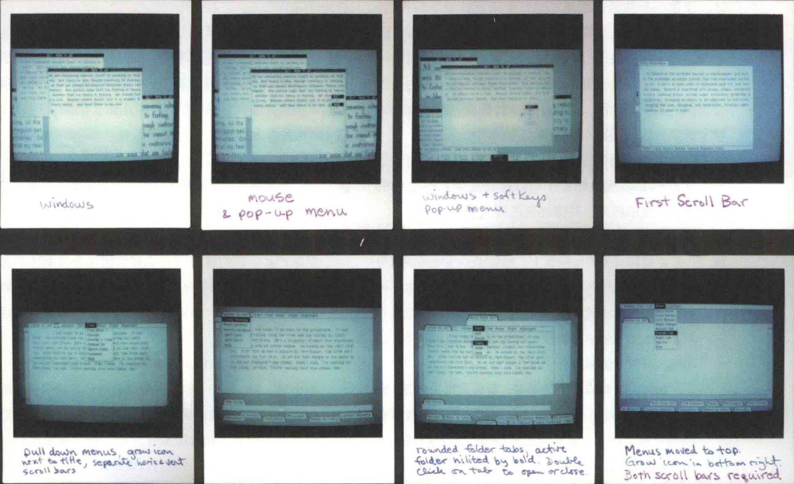

### 应用、窗口和文档

在现代桌面 OS 的 GUI 中，实际上存在着三层面向用户的概念:应用、窗口和文档。每个应用可以打开一或多个窗口，每个窗口可以打开一或多份文档。这听起来十分自然。但在算力极为紧缺的时代，这套抽象的建立并不容易。例如桌面 GUI 必然要允许多个窗口之间的共存与切换，而这就带来了一个难题：打开N个窗口时，应用就需要在技术上被加载 N 次吗?

从技术实现角度说，1984 年 Macintosh 的 128KB 内存，几乎不可能允许将每个窗口建模为单个进程并分配独立的内存，更不要说引入能自动调度前后台进程的抢占式多任务机制了。换句话说，就是它的算力始终只够跑一个前台程序，并且还无法由系统自动切换。除此以外，启动和关闭应用的开销也是昂贵的。

这些技术限制，使得此时的 GUI设计需要将两点准则传达到用户感知上:

- 应用在逻辑上只会开一份，并且只有位于前台的应用才可交互

- 用户应该尽量“停在这个应用里”，规避几余的切换和重新打开

为此，乔帮主手下的 Bil Atkinson 设计出了经典的全局菜单栏。比如下图中 MacPaint 在前台时,这整条菜单栏就是给 MacPaint 用的，传达出强烈的“现在是我在台上”的感觉:

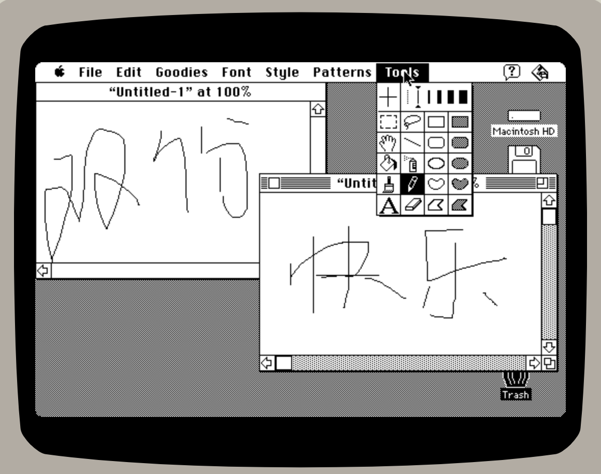

更重要的是，苹果还更进一步地在产品角度定义出了文档的概念：一个应用是用来处理文档(而不是打开窗口)的——既然如此，在暂时关掉一份文档窗口的时候，应用当然不应该完全退出了

我们可以这样理解此时“应用、窗口、文档”的三层抽象:

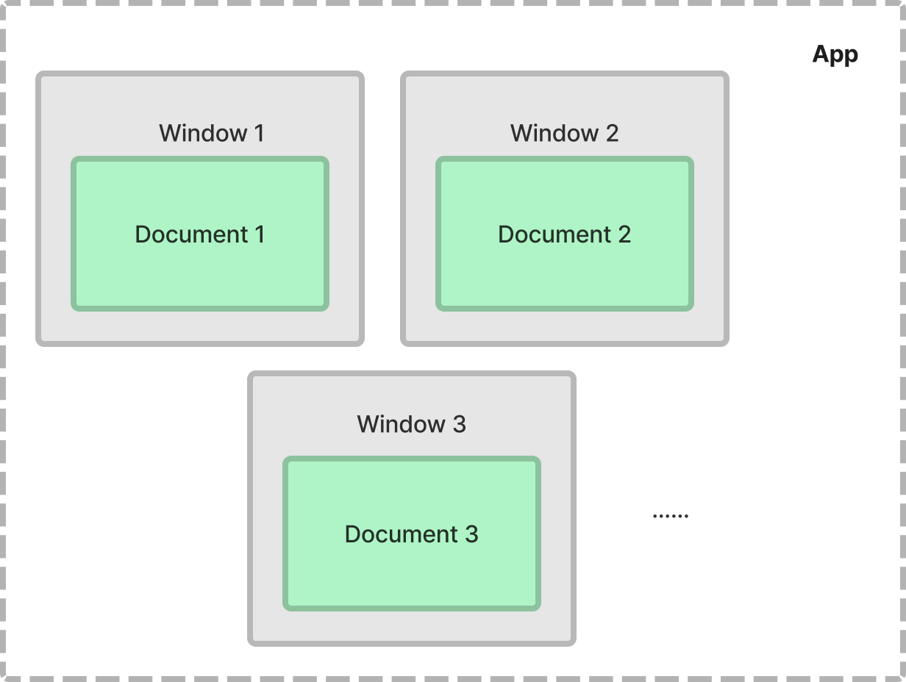

换句话说，所谓的“关闭窗口”只是关闭了应用所打开的一份文档，而不是关闭了整个应用。这也就是 Mac OS(X) 上 W（关闭 Window）和 Q（Quit 应用）背后的基础性设计隐喻了。

这套交互虽然很大程度上有弥补当年多任务能力缺陷的背景，但仍然是非常简洁而自治的。但它也可能令人困惑，比如在上面 MacPaint 的例子中，如果我们关闭了这两个窗口,会发现这时虽然看起来回到了桌面，但实际上并没有(相当于 MacPaint 的进程还停留在前台，你看到的桌面只是假象):

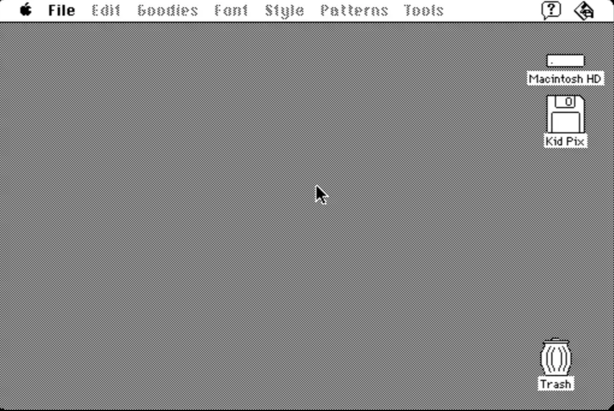

上面我们提到了 Mac OS 中“窗口归属于应用”的说法。这表明应用实例没有被绑定到单个窗口上，多份文档是直接存在于同一个应用名下的。这在 GUI 领域被称为 Multiple Document Interface(MDI)

和使用 80 年代技术的旧版 Mac OS 相比之下，90 年代的后来者 Windows 具备了一项代差级别的技术优势，那就是基于 NT内核的抢占式多任务支持。这使得每个窗口都可以加载为独立的应用实例，并由 OS 自动调度，也就是所谓的”真后台“。这时候要打开 N份文档，直接启动逻辑上的多份应用就行了。这就是所谓的 Single Document Interface(SDl)式 GUI 了。

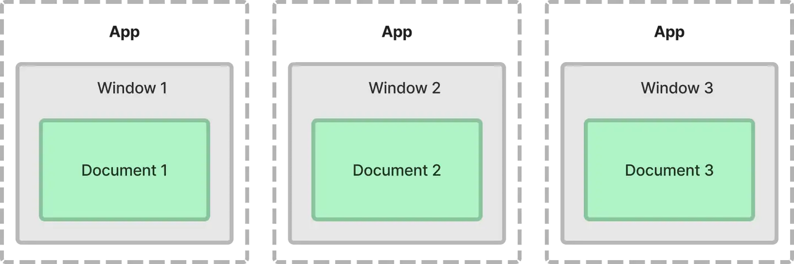

朴素的 SDI 是非常简单粗暴的：一个窗口里既是一份应用，又是一份文档——这时的交互逻辑就从以文档为核心变成了以窗口为核心。比如下图中的任务栏上会有两个 Excel 图标，菜单也有两份，强烈向你暗示这是同个 Excel 应用开了两份:

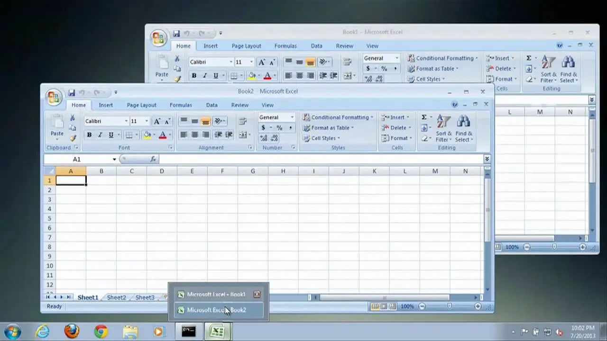

如果基于朴素的 SDI，打开 10 个浏览器页面(文档)就会带来 10 个窗口。再比如对于开发者而言，同时打开几个项目中十几个不同的代码文件(文档)的需求也非常常见。这时如果直接在几十个独立的窗口之间切换，效率显然是很低的。这种工作场景下的窗口分组管理需求，自然地催生出了基于标签的 Tab Document Interface(TDI)式 GUI。

## 直栏检视

当科德尔在执行 Mac OS X 设计时，虽然不想舍弃系统所拥有的任何一种功能或特质，但觉得有必要重新整理，清除掉沉积多年却派不上用场的东西。他想要的，是简单但功能性强的界面。他在 Finder 工具栏上附加了一项“直栏检视”（Column View）功能，可以让用户在单一窗口中进入层级式归档系统浏览，如此一来就能简单快速地找到文件，不需要点开一堆窗口后再一个个关闭。

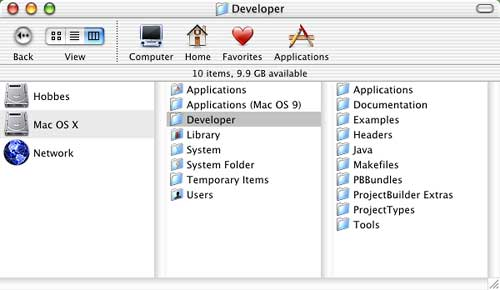

### 时间维度

设计团队所发展出来的操作系统，不仅是屏幕上看到的二维图像，还有以时间为衡量的第三维空间。举例来说，用 Mac 图形界面操作时，让人产生最多抱怨的就是要退出光盘时，必须将它拖到垃圾桶，这让一些新手用户感到困惑，尤其要将重要文件放进垃圾桶，更让人不禁迟疑。但在 Mac OS X，这个垃圾桶图示会随着你当时要做的动作而做出改变；当你点选了一个文件准备退出，垃圾桶就变成了退出的图示；当你点选了一个空白光盘，它就变成了一个刻录的图示。重点就是让屏幕上的图标，与当时要执行的动作有更直接联系。

若你使用上一版的 Mac OS，在点选某个应用程序时，屏幕上全变成该程序的窗口；但在 Mac OS X 这些窗口会依点选顺序一层层叠上。比方说，如果你从 Photoshop 转换到 HTML 编辑器，Photoshop 的窗口就退到下一层而已，不会全部关闭。这些依使用的时间顺顺序排列的窗口，再点它就能再次开启，无论它是叠在哪一层。

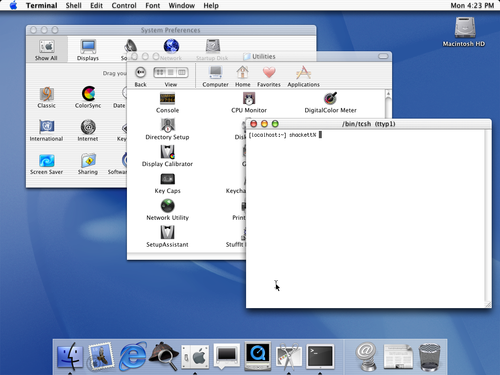

这个时间维度界面的原理，基础来自于几年前开发的苹果公司软件 Advanced Technology Group(ATG):

> 在ATG中，有一个Rosebud项目，就是研究如何应用时间维度，协助用户快速搜寻，因为他们观察到人们常习惯以时间顺序来串联一些事物。比如，人们可能不记得他把文件存在哪里，但却记得两天前曾经做过最后一次修改；或者是在哪一个特别的日子他阅读或是输入了那些数据。

> 我们发现，有很多人的确会以时间来记忆计算机里存储的资料，比如:上一次阅读这篇资料是何时上辅次修改是何时，等等。

> 于是，我们认为时间也是整理计算机数据的好方法，让人们看到时间先后的排列，会比光看到层级式与空间规划更清楚。时间既然是多数人串联事物的方法，何不就将它转化为界面的功能之一？

## 图库

