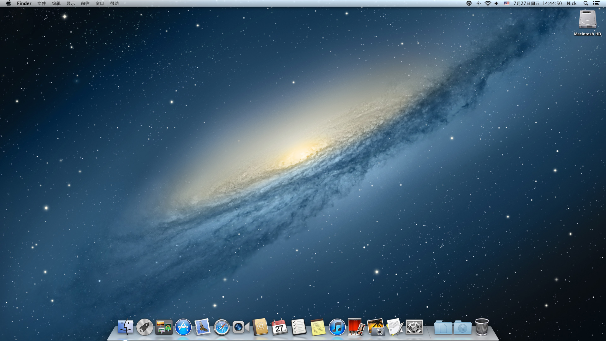

# Mac OS X 10.8

## 壁纸

壁纸来自 NGC 3190，被重新着色。

## Dock

Dock 被加入磨砂质感，厚度增加。像一块漂亮的半透明冰片，或细腻的半透明塑胶或亚克力板。图标倒影增加了移轴模糊。

## 大规模更新的拟物化设计

Mac OS X 10.8 的UI最大的变化，就是从单一的默认拟物样式（灰色渐变标题栏+浅灰色/白色内容背景）引入了大量iOS的丰富多样的拟物样式，对不同应用进行了定制改造，对于它们的来源——同一应用的iOS版本而言，这些iOS应用精心绘制、设计精良；在iOS平台上受到了用户的广泛欢迎；对于任何一个从未使用过电子产品的人，都可以轻松上手，毫无困惑，这是affordence的绝佳范例。反对者认为，他们破坏了产品工业设计一贯追求的简洁宗旨，与产品外观格格不入，这使得硬件和软件割裂为了两个世界。

## 日历

在 10.7 中的装饰缝线被移除，现在外观与 iOS4/5/6 for iPad 遥相呼应。有意思的是，直至 iOS 6 的 iPhone 版本，日历仍然使用默认控件。

但无论是 Mac OS X 10.7/10.8 还是 iOS 3/4/5/6 for iPad 的日历，日历复选列表均使用默认控件。

## 提醒事项

提醒事项现在外观与 iOS 遥相呼应。

### Mac OS X 的提醒事项

### iOS for iPad 的提醒事项

 

### iOS for iPad 的提醒事项

## 备忘录

备忘录现在外观与 iOS 遥相呼应，但只使用了最窄的标题栏。可以选择三栏或双栏或单栏视图。

### Mac OS X 的备忘录

### iOS for iPad 的备忘录

### iOS for iPhone 的备忘录

! [iOS for iPhone 的备忘录，详情页面](./2025_02_01_13_33_IMG_0004.png 'iOS for iPhone 的备忘录，详情页面')

## 通知中心

与iOS一样，通知中心在桌面的下层。与iOS桌面文件夹/iOS 激活背景/Mac OS X 登录背景/Mission Control一样使用草砂纸背景。

! [iOS 6 的通知中心](./vanhecke_notifications_fig01.png 'iOS 6 的通知中心')

## 游戏中心与通讯录

游戏中心和通讯录与 10.7 版本保持不变，最终形成了一个让人感觉像进入了游戏世界般的结果。

## 不同类型的窗口汇总

这些各具特色的窗口看起来眼花缭乱，与玻璃和铝制外壳组成的 Mac 工业设计格格不入，但是确实维持了与 iOS 的一致性。有意思的是，在iPhone上，这些拟物设计看起来并没有这么突兀。

! [不同类型的窗口汇总](./Frame 56.png '不同类型的窗口汇总')

## 图库

