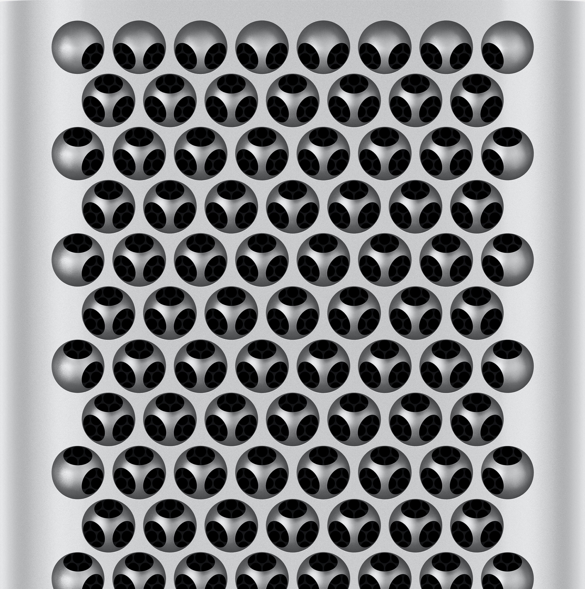
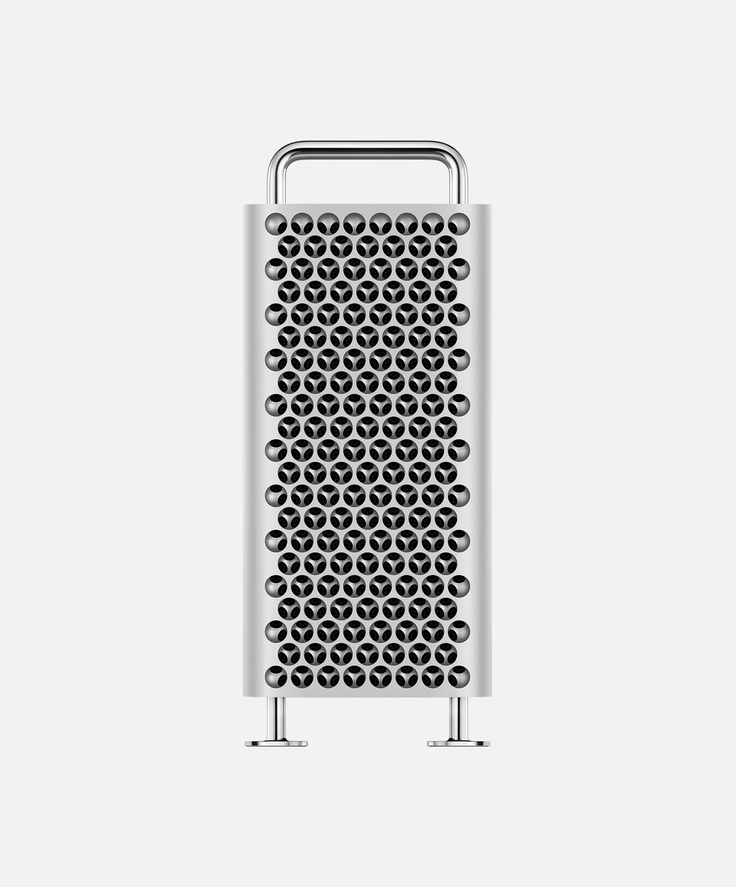
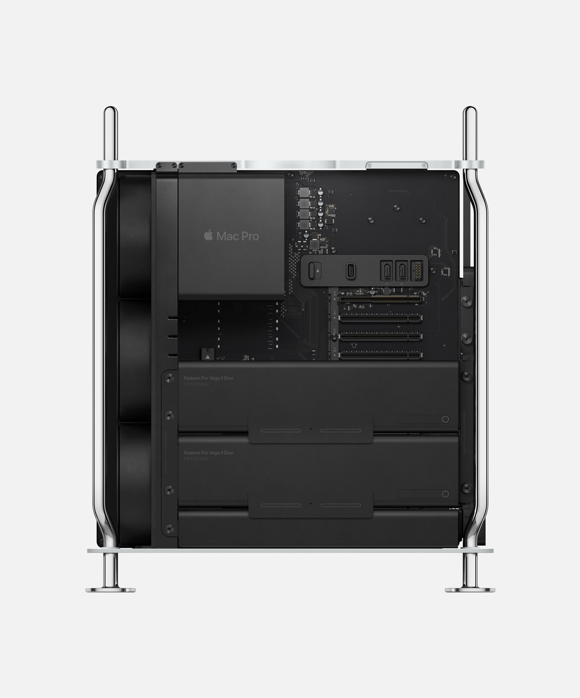
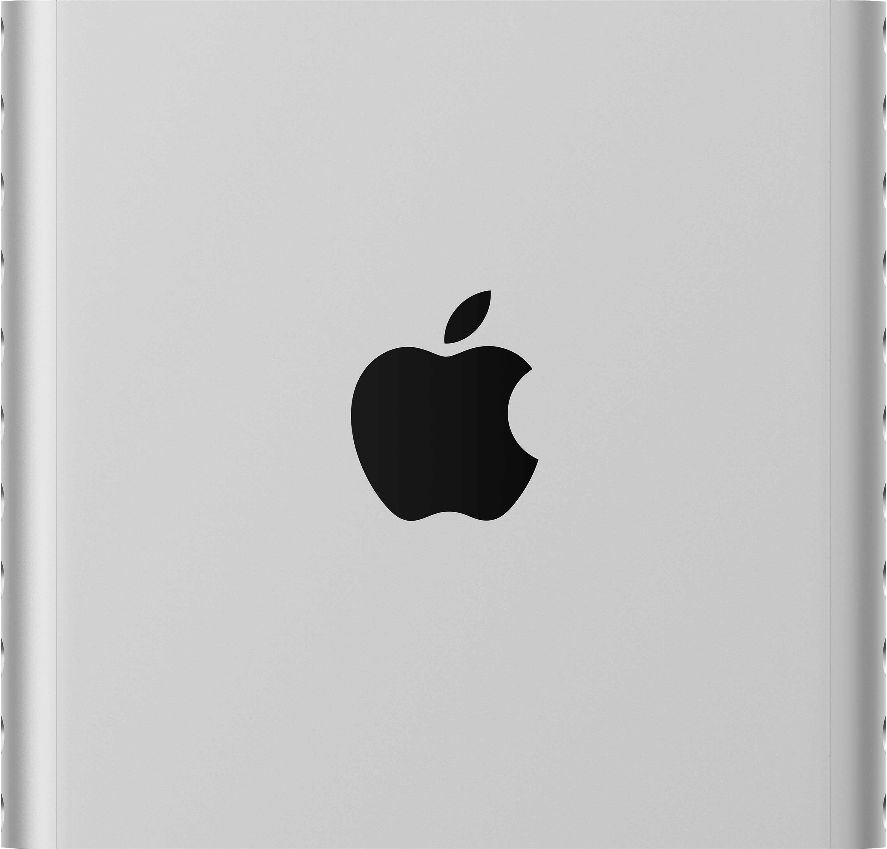
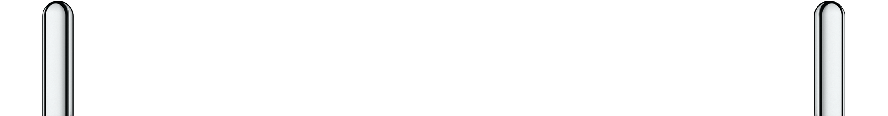
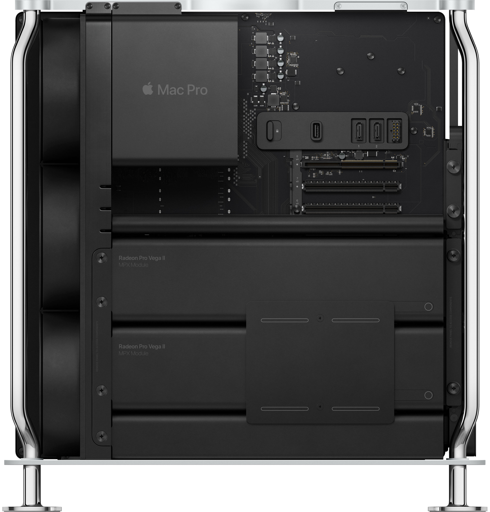

# Mac Pro, 2019

苹果高管周一（2017.12.11）坦言，圆形设计实际上让公司陷入了困境。虽然这种独特的设计确实引人注目，但它对机器产生的热量有严格的限制，还要求公司在两个性能一般的图形芯片上分配繁重的图形工作量。

但事实证明，对于许多任务来说，专业人士确实需要一个高性能的图形芯片。

“随着时间的推移，这种架构变得不再灵活，无法带我们实现目标，”苹果高级副总裁克雷格·费德里吉 (Craig Federighi) 在与 Axios 和其他几家新闻媒体的圆桌会议上表示。“我们想做一些大胆而与众不同的事情。回想起来，它并不适合我们试图接触的某些人。”（https://www.axios.com/2017/12/15/why-the-mac-pro-proved-so-hard-to-upgrade-1513301364）

两年前，当苹果高级副总裁菲尔·席勒 (Phil Schiller) 和 Mac 团队领导人透露他们计划放弃现有的 Mac Pro，转而采用全新设计时，我是少数记者之一，但这种设计至少还需要一年的时间才能完成。

周一（2019.6.4），同样的记者和苹果领导人齐聚 WWDC，讨论新款 Mac Pro 并了解后续故事。

以下是几个关键要点：

1.当我们两年前见面时，新款 Mac Pro 已经是一款具有目标和时间表的产品，尽管它的设计发生了一些变化，并且开发时间也比 Apple 预期的要长一些。

2.新款电脑正面的那些切口— — 有些人认为非常酷，而另一些人则认为它看起来像一个奶酪磨碎机 — — 是通过从 Mac Pro 的铝制底盘上加工出球体制成的。

它们功能齐全，能够提供比前置格栅通常所能提供的更多的空气流量。在新款 Mac Pro 进入产品线之前，这个设计就已经在苹果的设计实验室里酝酿了一段时间。（https://www.axios.com/2019/06/04/apple-mac-pro-unveiling）“这种设计思路已经在苹果内部的实验室里存在了很长一段时间，甚至比我们规划新 Mac Pro 还要早。”https://www.ifanr.com/1291118

<video src=".\large_2x (1).mp4" autoplay loop muted ></video>
 

是一款旨在让各类专业人士突破极限的系统。

  

## 形式追随功能

Mac Pro 的每一个方面都以追求性能为设计理念。铝制外壳采用不锈钢空间框架构建，可掀开，可 360 度接触每个组件和大量配置。从此一切皆有可能。

<video src=".\large_2x (3).mp4" autoplay loop muted ></video>
 
 
 

## 刨丝器的来源

艾维出去打电话了，安德烈描述了自己的日常工作：他通常在早上五六点到达，然后经常设计几何形状复杂的物体，让机械师进行铣削。他称这是一种爱好，但正如阿卡纳所解释的那样，“我们会开会讨论扬声器孔图案或其他东西，然后乔纳森会说，‘巴特，你能把你的图案盒拿出来吗？’”

安德烈同意从他的办公桌上拿一个他一直用作杯垫的东西。它由坚硬的白色 ABS 塑料制成——乐高积木的材料，也是每年数千个苹果工作室模型的材料——它是一个圆盘，上面均匀分布着孔。或者，正如安德烈所说的那样，“从一侧的材料中减去六边形的负形图案，然后从另一侧的材料中减去相同的图案。但它是偏移的，因此两个减法之间的交集形成了有趣的形状。”他把它擦在衬衫上，去除咖啡渍，然后把它递给我。

这段记载与高管的话相呼应“在新款 Mac Pro 进入产品线之前，这个设计就已经在苹果的设计实验室里酝酿了一段时间。”

## 优化噪音

产品设计高级总监 Chris Ligtenberg——他的名字出现在该公司数十项专利上，但他对空气流动特别感兴趣。（他也是一名飞行员。“我驾驶的是比奇涡轮富豪 B36TC，”他说。在此之前，他有一架派珀直尾长矛 PA32R-300）。

Ligtenberg 的团队设计了 Pro 的风扇系统——前面有三个轴流风扇，后面有一个鼓风机。由于大多数现成的风扇噪音太大，因此 Apple 自行设计了风扇。

他说：“几年前，我们开始重新分配叶片，它们仍然是动态平衡的，但它们的 BPF（叶片通过频率） 实际上是随机的。所以你不会听到往往会非常烦人的谐波。”

噪音是现代机械设计的一个重要因素。在这种情况下：“这个解决方案几乎完全借鉴了汽车轮胎，”Ligtenberg 说。“这背后有一些数学原理，但你可以用这种技术产生宽带噪音而不是总噪音。”

声音响亮但音调悦耳的声音比声音安静但令人不快的声音更容易让人接受。Apple 硬件工程副总裁兼 Pro 和 Pro Display 开发负责人 John Ternus 表示：“在某个 SPL（声压级）下，某些声音听起来非常好，但实际上在较低 SPL 下，某些声音会让人感到烦躁，听起来非常糟糕。我们希望获得真正出色的结果，要么你听不到，要么即使能听到，也只是一种悦耳的声音。我们进行了大量分析，以确定如何优化。”

噪音风扇的一个优点是：它们可以处理过滤系统引起的阻抗（阻力），一些计算机使用过滤系统来防止碎屑进入重要组件。Pro 和 Pro Display 没有这种过滤器。“我们不需要它，”Ternus 说。

## 散热与刨丝器

Ligtenberg 说：“我们设计了可以处理一定量材料的几何结构，并且我们通过测试来保证系统的使用寿命。”

拆除外壳？这可能会产生非常多的灰尘并造成问题。

理想情况下，任何使用 Mac Pro 的人都不会意识到风扇的存在。但铝制外壳让人无法忽视，这些精密的凹痕网格覆盖了 Mac Pro 外部的正面和背面以及 Pro Display XDR 的背面。这种图案是被动冷却的绝妙例子。这就是你把一个热部件（比如摩托车发动机的燃烧室）连接上金属突起来吸收热量然后散发热量的地方。金属暴露在周围空气中的表面积越大越好。下次你走过摩托车时，寻找沿着气缸外部堆叠的薄金属翅片。

对于 Mac Pro 来说，普通的扁平散热片无法发挥作用。Mac Pro 必须同时在横向（水平）和纵向（垂直）模式下工作。

Ligtenberg 说：“空气很容易滞留在通道中，一种常见的被动解决方案是使用带翅片的外壳和散热器。但这是不可能的。”

将其旋转 90 度会影响通过这些翅片的气流。然而，半球形孔无论朝哪个方向，其工作原理都是一样的。“我们希望无论朝哪个方向，气流都能自由通过通道，”Ternus 说道。

对于 Mac Pro，与之前的 Power Mac G5 相比，新的机箱设计可帮助新款 Pro 获得“大约多 20% 的气流”。

将这些孔做得深，回到了第一条原则：表面积越大，散热效果越好。“（这种图案）给了我们很大的表面积，这非常有益，”Ternus 说。Pro Display 有专门用于特定组件的风扇，但钻孔金属孔才是让巨大的 LED 面板保持足够低的温度，从而运行如此明亮的原因。（https://www.popularmechanics.com/technology/gadgets/a30170910/apple-mac-pro/）

## 视频

## 图库
