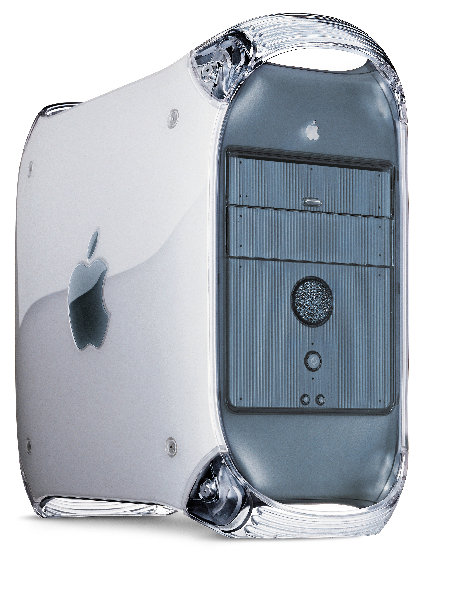
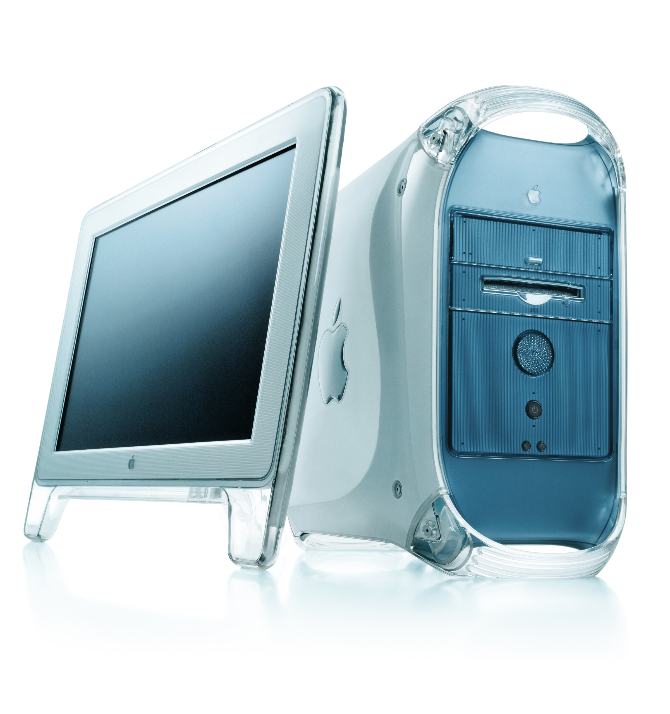
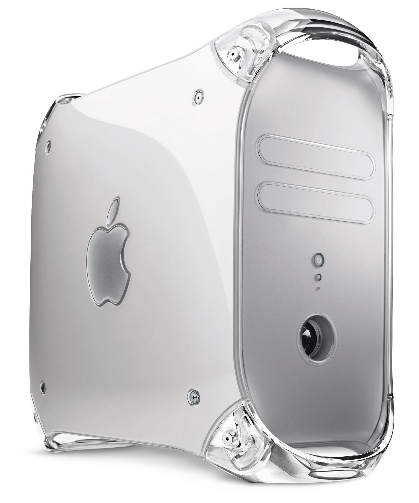
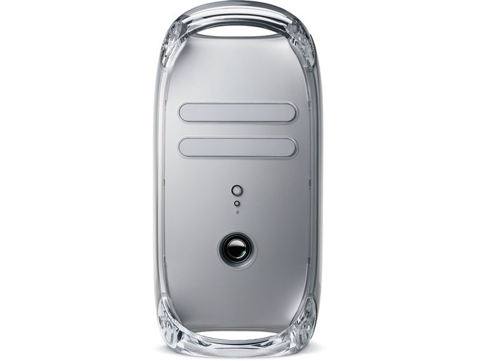
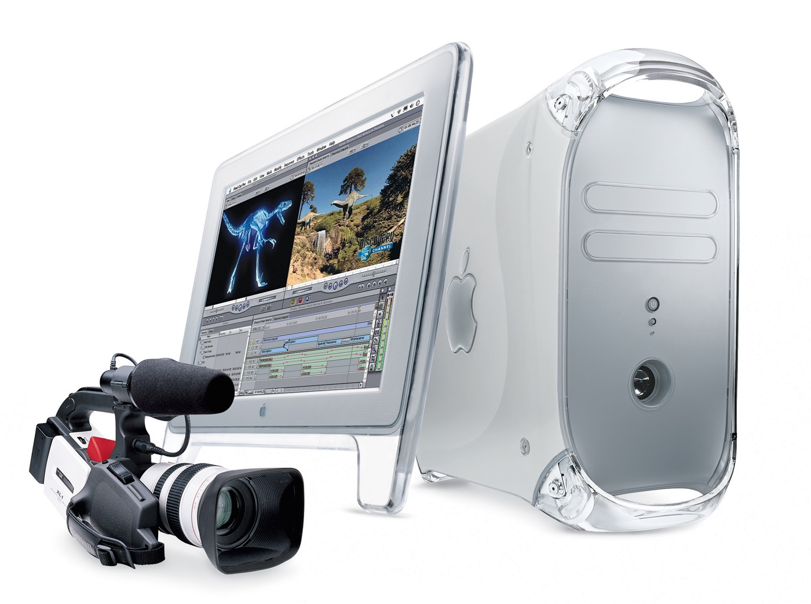
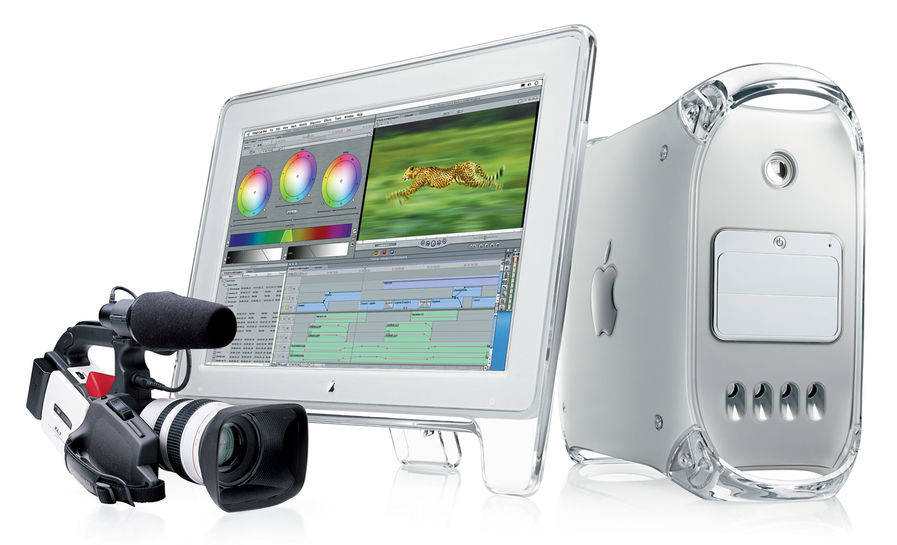

从设计的角度看，它的继承者显得更为有趣。PowerMacG4tower是在PowerPC G4芯片的基础上产生的。苹果称Power Mac G4“不仅是史上最快的麦金塔机”，还是“史上最快的个人计算机”。"其灰色的机身也代表了苹果机进入了向全铝材质过渡的一个阶段。后期，苹果的专业机生产线都开始采用全铝材质。

最初，PowerMacG4tower沿用蓝白机的外形，但将配色改为感觉较沉稳的石墨色，继而又改用了具有炫彩金属质感的“水银”外壳。萨茨格还清楚地记得制作水银机身这一段工作往事，他说，正是这件事给他上了重要的一课，使他加深了对“新”苹果的理解。

在这款机器即将送去生产线的最后一刻，各种各样的硬件特征以及机身的颜色出现了问题。因为时间紧张，机身正面的接口和其他部分的颜色出现了错配。乔布斯对此当然不满意。萨茨格有些迟疑，他对乔布斯说来不及修正了。他回忆说:“乔布斯简单地说道，'你不觉得为了你自己也为了我，你应该做到更好吗?’我的回答是肯定的，然后，我们就回去重做了一遍，这

2002 年 8 月 13 日，苹果推出了另一代 Power Mac G4，正式名称为“Mirrored Drive Doors”（MDD） ，它采用了新的Xserve DDR 主板架构和新的机箱设计。

