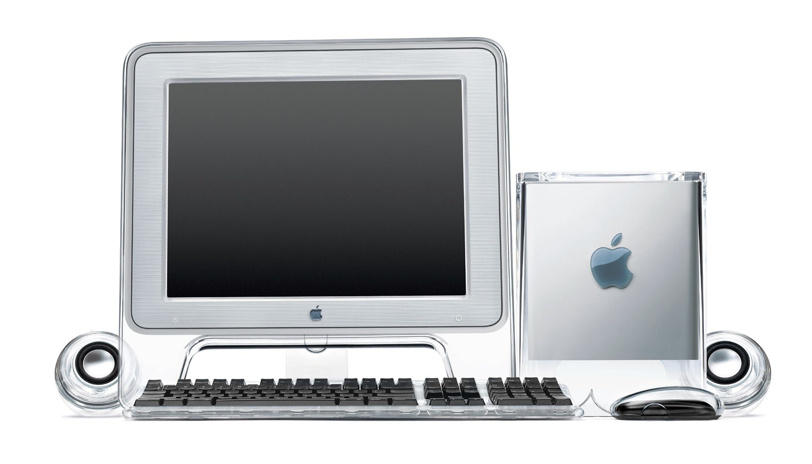

The entire computer is suspended within a clear acrylic enclosure to enable a quiet, convection—cooled architecture. Hot air exhausts from the chimney on the top surface.

A deployable handle provides access to the removable core. Cables pass through an opening in the acrylic to connect to the underside of the computer.

