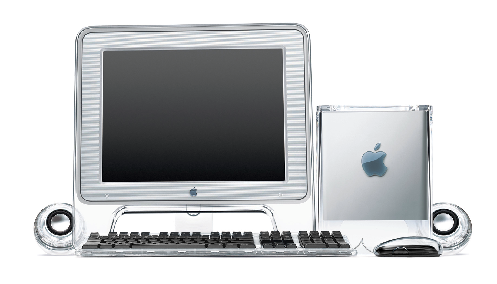
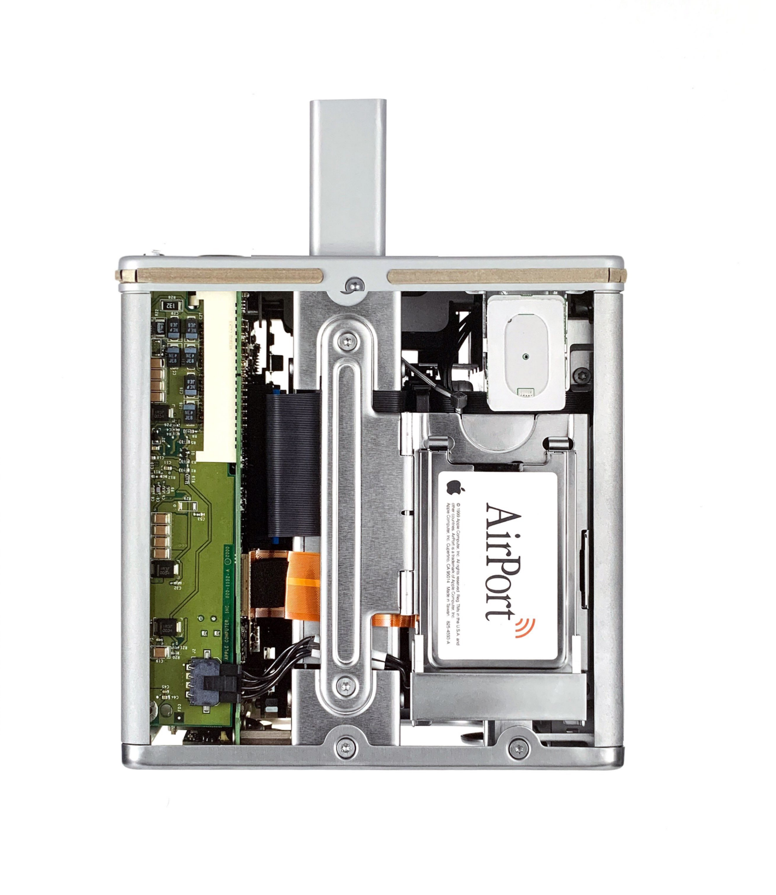

# Power Mac G4 Cube G4，2000

The entire computer is suspended within a clear acrylic enclosure to enable a quiet, convection—cooled architecture. Hot air exhausts from the chimney on the top surface.

A deployable handle provides access to the removable core. Cables pass through an opening in the acrylic to connect to the underside of the computer.

到 2000年的时候，乔纳森已经完成了四大创作，他和他的团队尝试着把最具挑战的产品带到市场:Power Mac Cube。

Cube是最后的计算机产品的一大亮点，尝试着把台式电脑的主机塞进一个更小的外壳中。乔纳森认为把大量的部件放进塔式设计是一种懒惰的行为:为什么要给消费者一个大又丑陋的塔式设计呢，难道就是为了方便设计师和工程师的工作?通过把未经加工的塑料铸件和先进的微型化技术结合起来，他们致力于制造出新的设备。与苹果的很多其他产品一样，Cube力求精简，省去一切不需要的部分。它代表着在微缩技术、创新型思维和制造中的重櫻大突破。

Cube其实就是由水晶般透明的塑料制成的矩形外壳，就连底部也是透明的，这带给人一种悬在半空中的感觉。顶部有一个纵向的DVD光驱，像土司面包片一样的DVD可以自动弹出，还有人把Cube比作舒洁牌面巾纸盒。这种类比给乔纳森和设计师们带了极大的快乐，他们竟然把设计工作室里面空的Cube当纸巾架来用。

Cube通过空气对流进行散热，取代了以往有噪音的排风扇。空气从底部的风口进入，冷却内部的芯片，再从顶部的排风口散出。整个运行过程很安静。但同时造成了糟糕的散热表现，导致机器运行缓慢。

像 Power Mac G4的塔式设计一样，关键的一点就是要方便用户使用。为了能够接触到内部结构，G4的核心部分很容易就能从底部拉出来。从底部自动弹出的把手，能让内核全部露出来，把手的设计很是漂亮。如果要开启Cube，只需要按一下印在透明外壳上的触摸感应开关就行。开关好像悬浮着的，与电脑主机分离，你看不到它是怎样运行的，这一切就像被施了魔法般。这是早期的电容式触控技术的应用，这项技术最终也成就了iPhone。用户们对此很着迷。

## 材料问题

它遭受了“杜恩思比利”时刻:透明的外壳出现龟裂，这吸引了媒体的大量关注。一些机器的透明塑料外壳上出现了一些细小的裂缝，位于顶部的DVD槽和两颗螺丝孔周围尤其严重。相对来说，这还是比较小的外观缺陷，却让消费者受不了了。“这是外观问题中最严重的问题,”Ars Technica网站在它的评论中这样写道,“没有严重到值得修正的问题，却激怒了那些对产品外观极其在乎的人，也是这群人，被Cube这样的系统深深吸引着”。25

## 机械加工

萨茨格解释说说:基本上我们不接受塑料制品的标准模具，我们更愿意自己加工。Cube上的螺丝孔和排风孔都是经过精确加工的”

MacBook和iPad这样的产品都是铝板加工而成的，它们就是机械加工方法的最好证明。Cube是早期进行机械加工和批量生产的实际证明;从大环境来说，机械加工方法从根本上改变了产品批量生产的手段。

## 后续影响

机器在市场上表现很差，不过由于在制造技术和微型化处理上取得了重大突破，在企业内部还是有相当多的崇拜者。

“长期以来，苹果的工程团队就经常对设计师们说，'你们不行’”萨茨格说，“但是设计团队敢于挑战各种材料--塑料、金属，每一种材料。尽管Cube卖的不好，甚至变成了一种“重形式，轻功能”的象征，但是，这款设计从分说明了乔纳森·艾夫和他的设计团队的权力正在扩大，影响力正在增强。