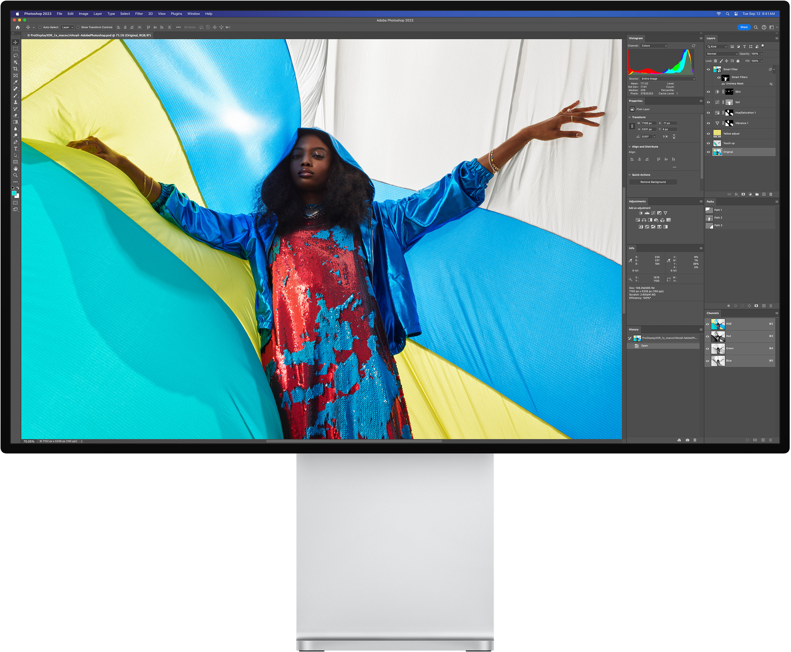
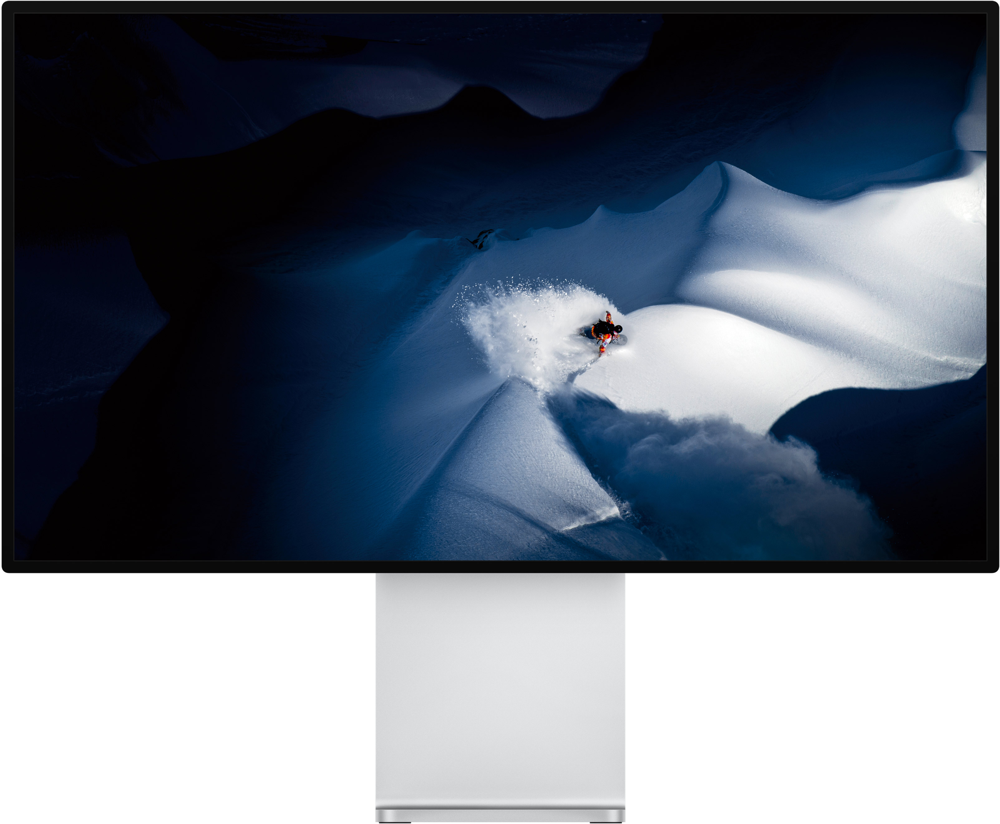
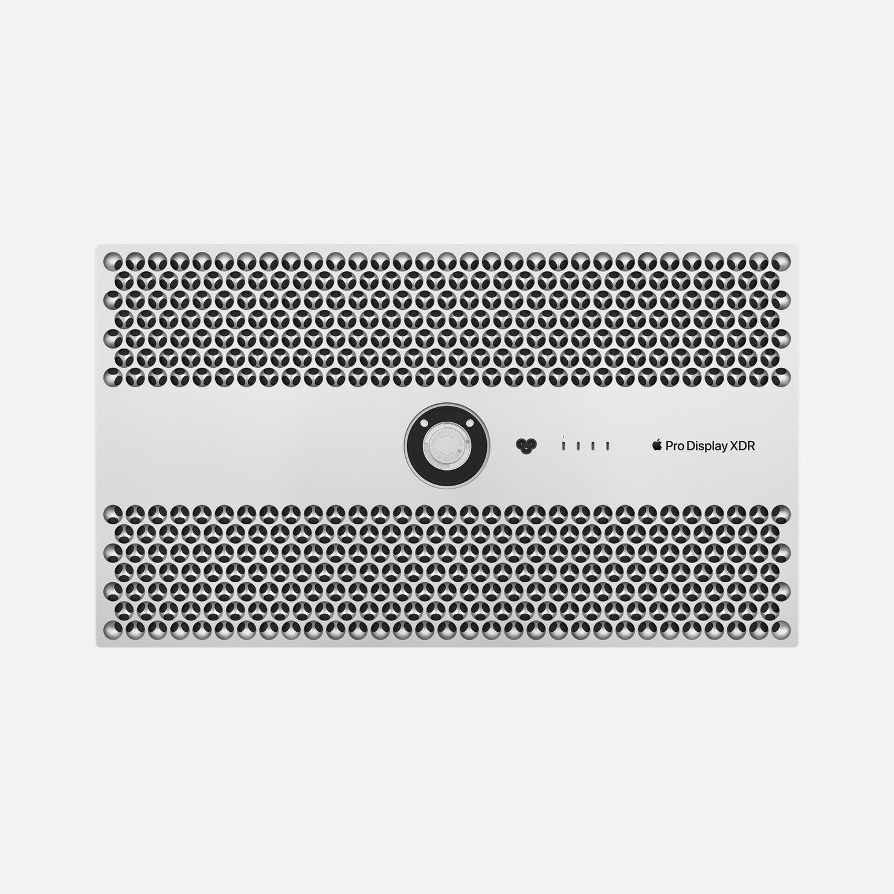
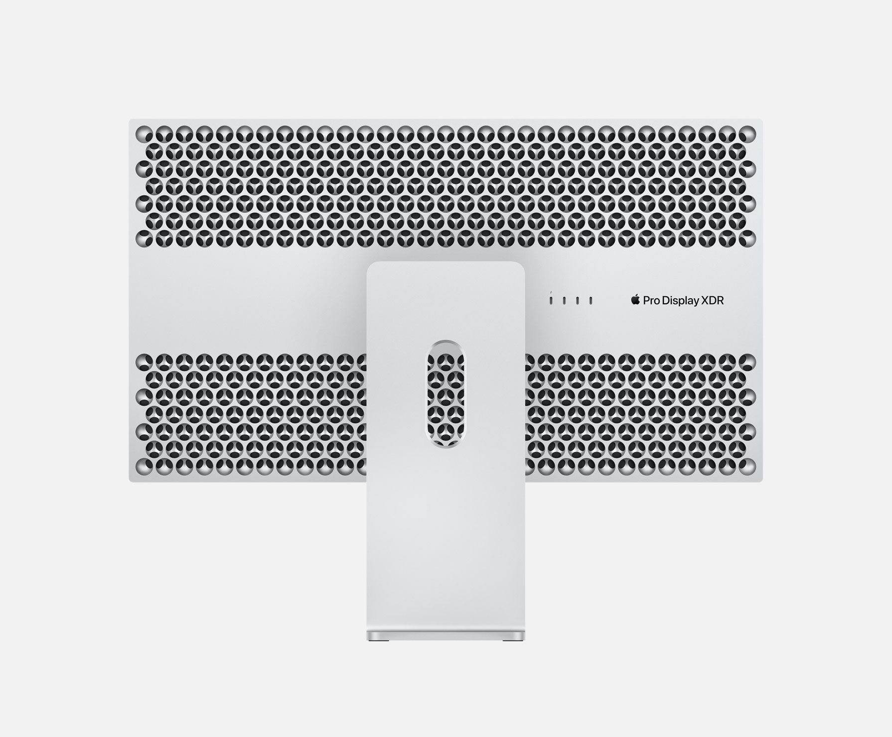
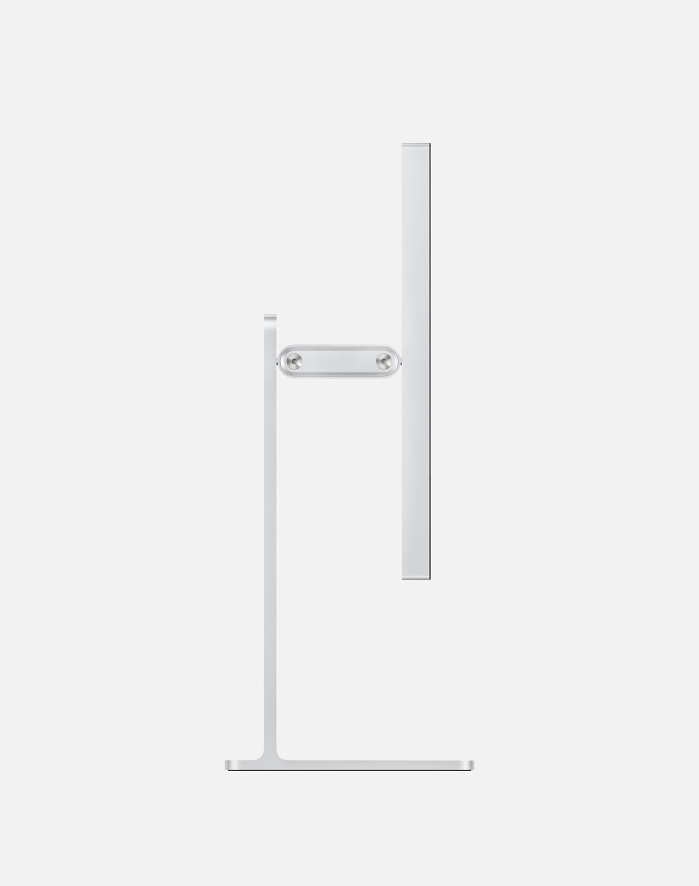
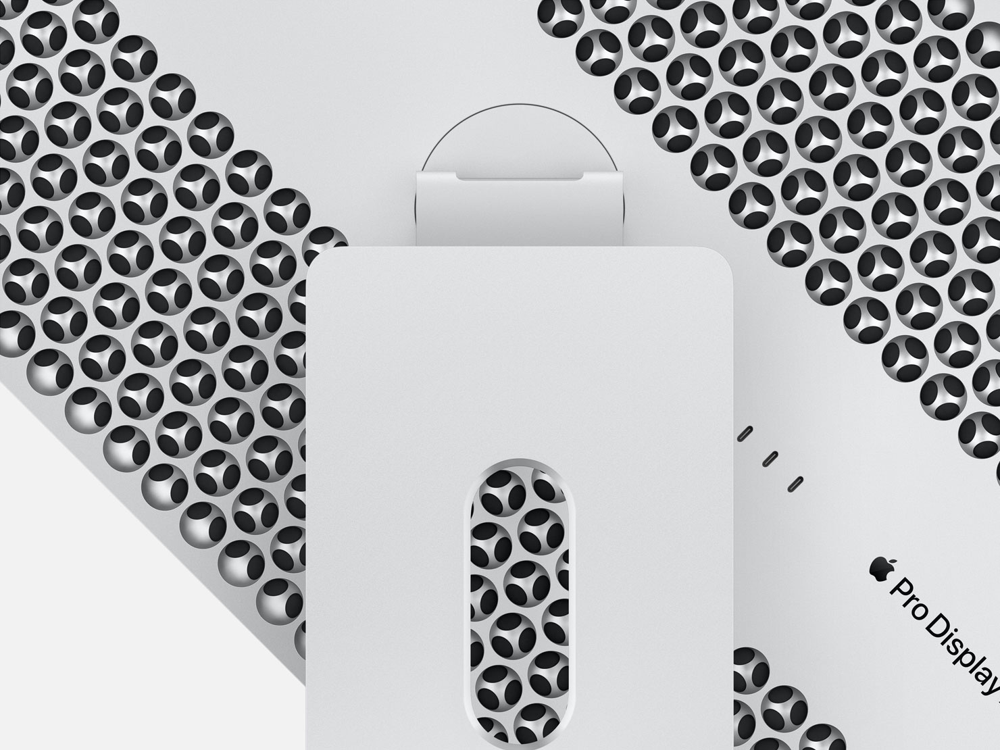
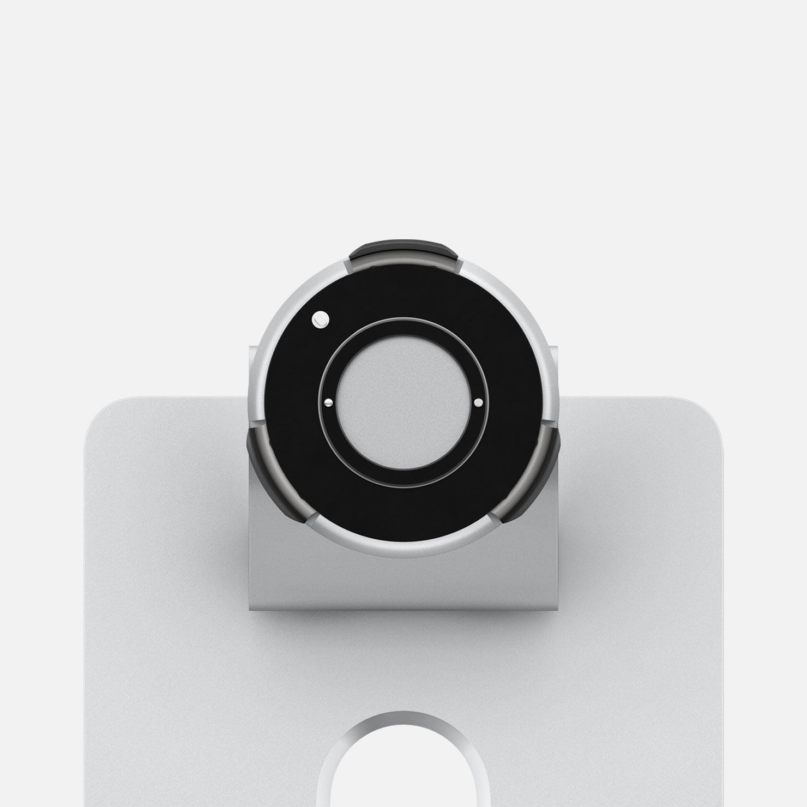
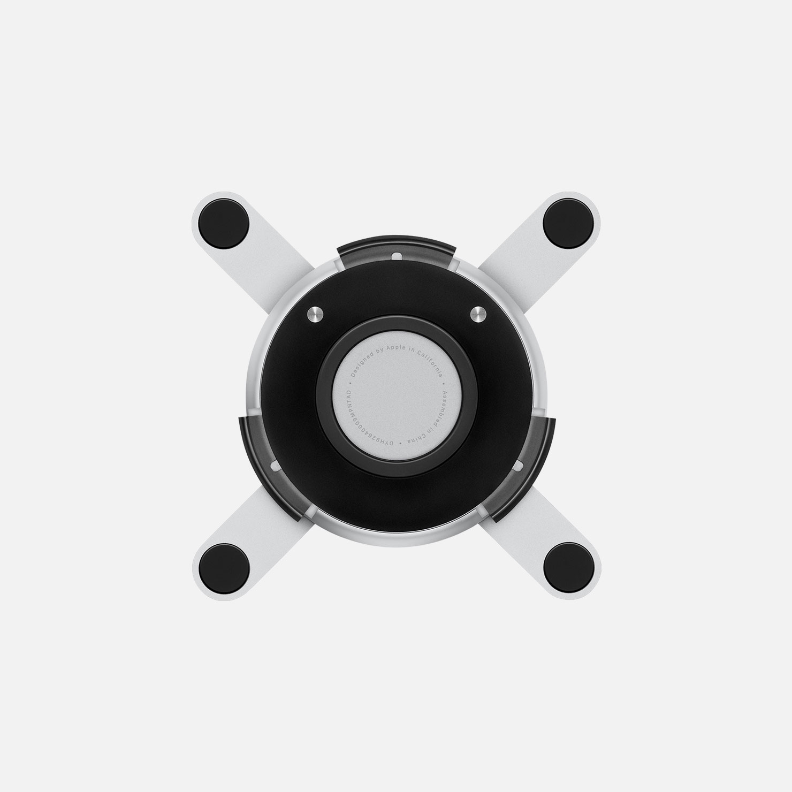
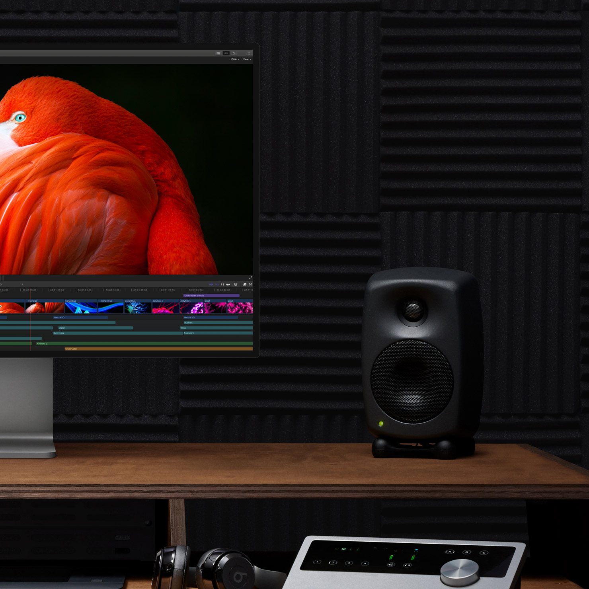
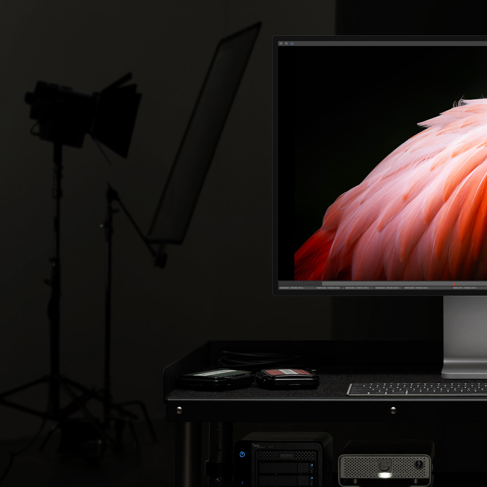

# Pro Display XDR, 2019

## 视频

## 图库

<video controls src="./large-1.mp4" Controls="controls" ></video> 
<video controls src="./large_2x-1.mp4" Controls="controls" ></video>
<video controls src="./large_2x (4).mp4"  Controls="controls"></video>