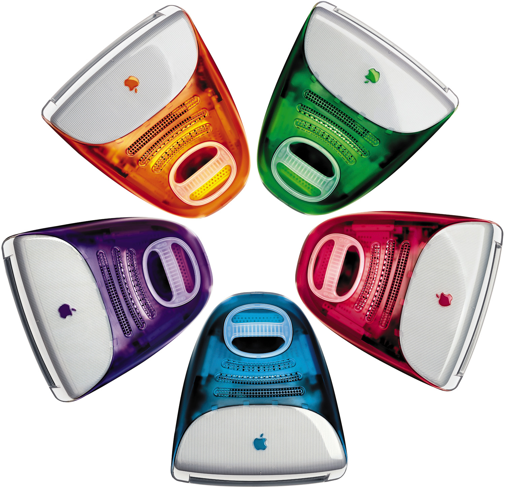
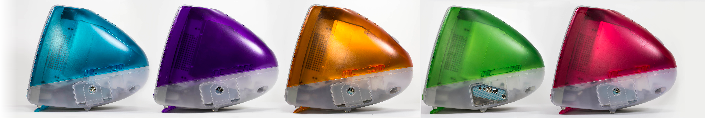

#

The level of translucency in the housing was achieved by mixing light-diffusing particles as part of the polymer composition, rather than by the traditional method of applying texture to the tool.

A fanless, convection-cooled architecture unifies the top vents with the handle in a single injection-molded, polished-crystal polycarbonate part.

A simple ball-and—socket joint adjusts the screen angle between 0 and 4 degrees.

Light—diffusing particles within the resin act as opacifiers, defining the soft translucency of the Snow iMac housing.

The Flower Power graphic was fused directly into the polycarbonate shell during the molding process.

## 五种颜色

虽然史蒂夫·乔布斯喜爱iMac苹果一体机，但是这款产品刚一投入市场，他对产品配色的看法就变了。以他典型的二元化评判方式来看，他觉得自己讨厌邦迪蓝。“我喜欢这款产品，但是我们选错了颜色。”他这么告诉设计团队，“颜色不够鲜亮，欠缺活力。

道格·萨茨格是设计团队中产品配色和材料方面的负责人，乔纳森要求他着手研究新的配色方案。萨茨格只有两周时间拿出新方案。他在苹果的工业园区找到了一个空置房间，按当初团队为iMac选择邦迪蓝的方法，在那儿放置了几十种不同颜色的塑料制品，其中包括厨房餐具、透明保温瓶、色彩亮丽的塑料碟子。他把这些物品按颜色排列:蓝色的放在一张桌子上，红色的放在另一张桌子上。等一切准备就绪，萨茨格和与他合作的独立承包商将试样展示给乔纳森和史蒂夫审阅，

但这次进展并不顺意。

史蒂夫走进那个房间，说房间里的东西太多了。”萨茨格回忆说，“他看着我说，'你表现得太差劲了。”后来，萨茨格可以对这段记忆一笑而过但在当时，这并不好笑。乔布斯绝对不是能把人逗乐的人。

乔布斯心烦意乱，因为配色选择范围太广泛。萨茨格说:“我们给他提供的信息太多，但没把注意力集中在如何将色彩运用于iMac。所以，他盯着我说，'我什么时候能看到适合出现在iMac这种产品上的一款颜色?

“我请求他再给三周时间。乔纳森给我使眼色，好像在说，'什么?你疯了吗?’”

这项任务让人望而生畏。在有限的时间里，萨茨格拼命工作，要给乔布斯做出多种全新配色模型

萨茨格说:“我们遇到的一个大麻烦，就是如何将不透明的颜色转变成透明的，如果你心中有黄色的既定概念，就不太容易将它变成有透明度的黄色。我们试过给试管注满水，加入食用色素和其他染色剂，最后得到15种不同颜色，然后再拿到制造商那儿去试制相同的颜色。如果一家制造商做不出来，我们再去找其他制造商。我们和乔布斯一起完成的这项工作。

设计师们着手研制机壳及所有零件，包括光驱插口、扬声器外壳、电脑后盖板和底座。中国的一家工厂很快生产出了 15 台颜色各异的iMac一体机模型。

萨茨格挑选了一些饱满厚重的颜色:深蓝色、“琥珀啤酒色”、“蓝胶色以及“绿叶色”。令人吃惊的是，他居然赶上了截止日期，刚好三周，一天不差。

“上帝啊!”乔布斯一走进摆满了炫彩iMac的房间就发出了这句感慨

乔布斯查看了所有的样机,”萨茨格回忆说，“他挑出黄色的那款，拿起来搁到房间的角落，然后转过头来说，'看起来跟尿似的。我不喜欢黄色。”

他挑选了自己喜欢的几种颜色，随后又转向我们说，'我真的很喜欢这些色彩，它们让我想起了救生者牌水果硬糖(LifeSavers)。但还是少了一些--年轻女性钟爱的颜色。我想看到粉色。什么时候能看到一款粉色的电脑?’所以我们又去试制，10天后调制出了5种不同的粉色，史蒂夫批准了其中一种--草莓粉。”

乔布斯看到新颜色时非常激动，并马上召集其他高管到设计工作室。“我们要使用所有这些颜色！”他兴奋地对他们说。在众人离开之后，艾弗惊讶地看着自己的团队。“在其他公司，作这样的决定要花上好几个月，”艾弗回忆道，“史蒂夫只用了半个小时。”

乔布斯的决策意味着工厂必须生产5种机壳，零售商需要5种产品编号用于存货。这些潜在的物流问题都没有被探讨过。公司决策完全由设计主导:史蒂夫·乔布斯想要产品换上新颜色，物流问题可以稍后解决。
