# iMac G4 2002

半球形底座采用透明聚碳酸酯制成，背面涂成白色，然后涂上哑光硬涂层。冷锻 5052-H32 旋压铝底座可访问内存和 AirPort 无线网卡。

平衡的显示屏颈部穿过通风系统的中心，并使用弹簧和滑轮来抵消重力的影响，使显示屏感觉轻盈。

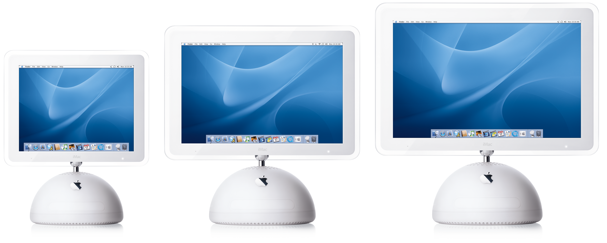

## 图库

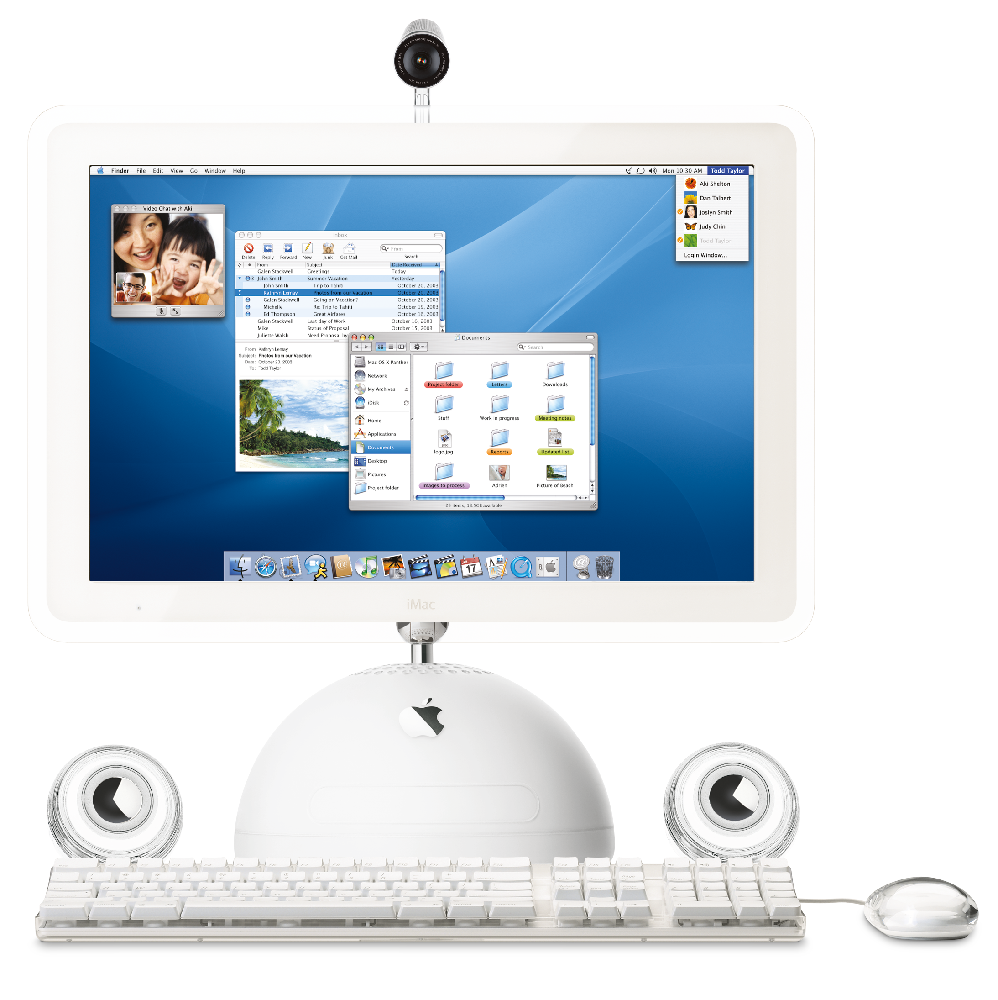
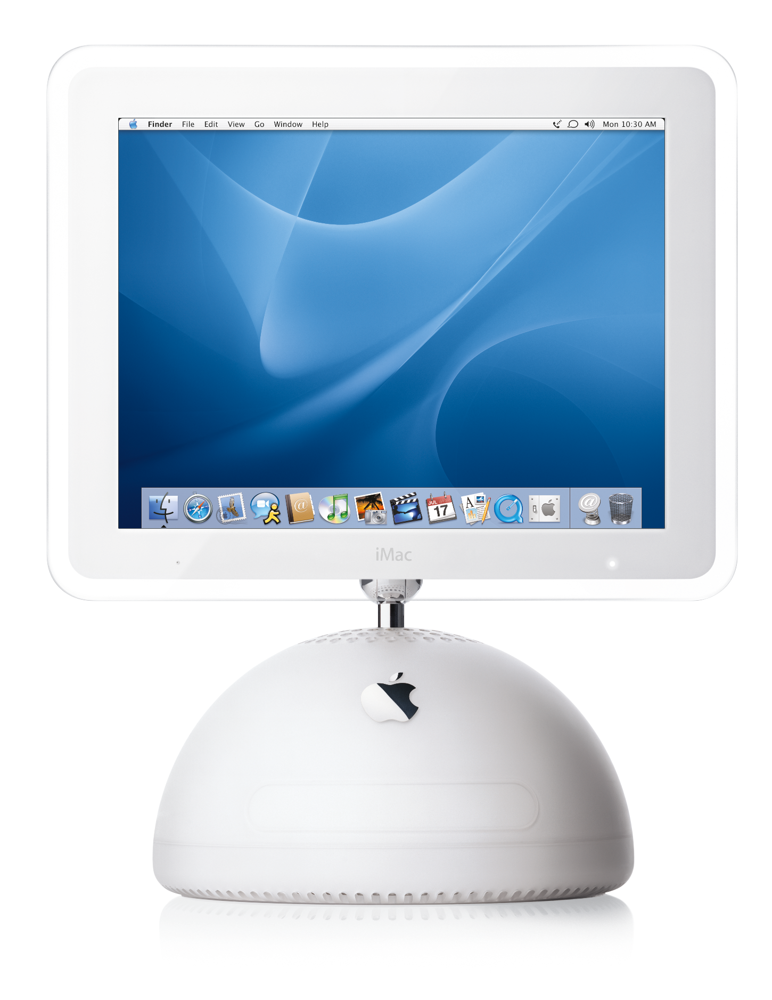
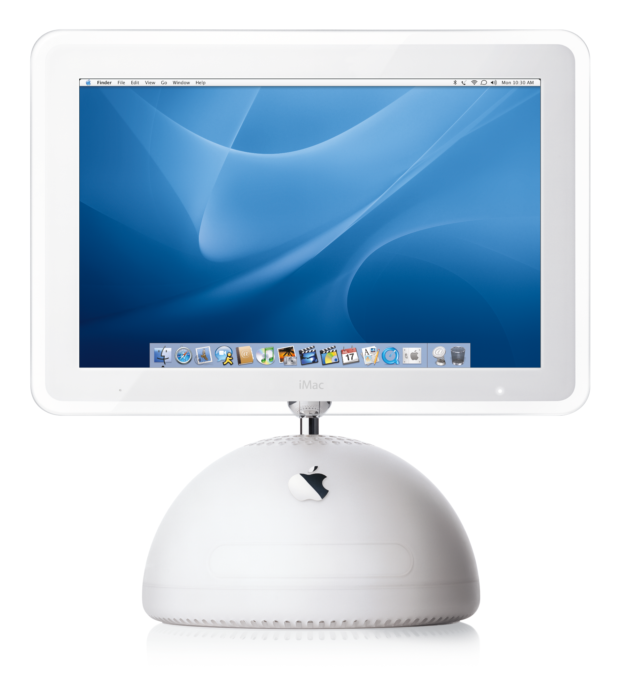
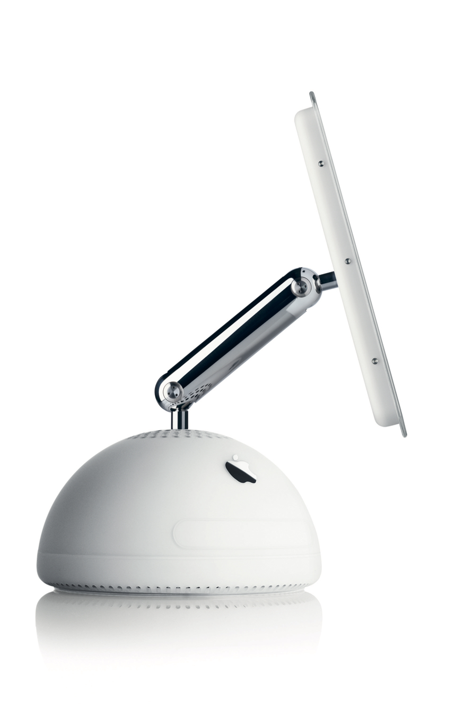
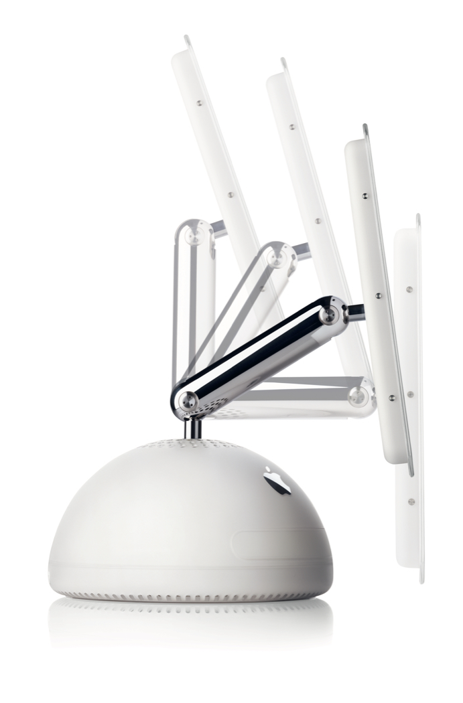
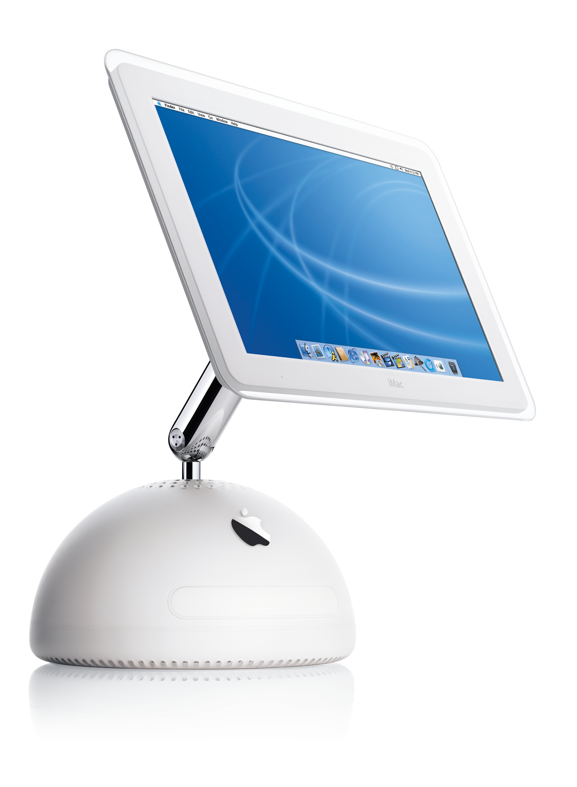
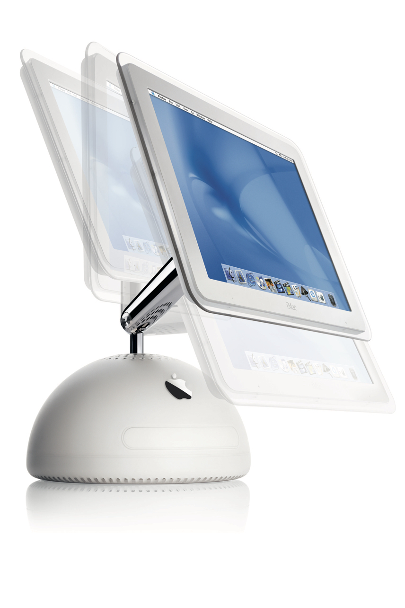
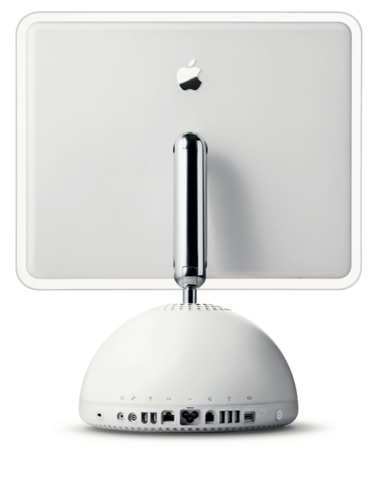
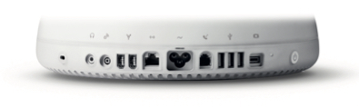
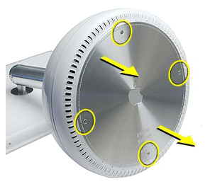

## 视频

<video src="./iMac_G4_Attract_Loop.mp4" controls="controls"></video>
