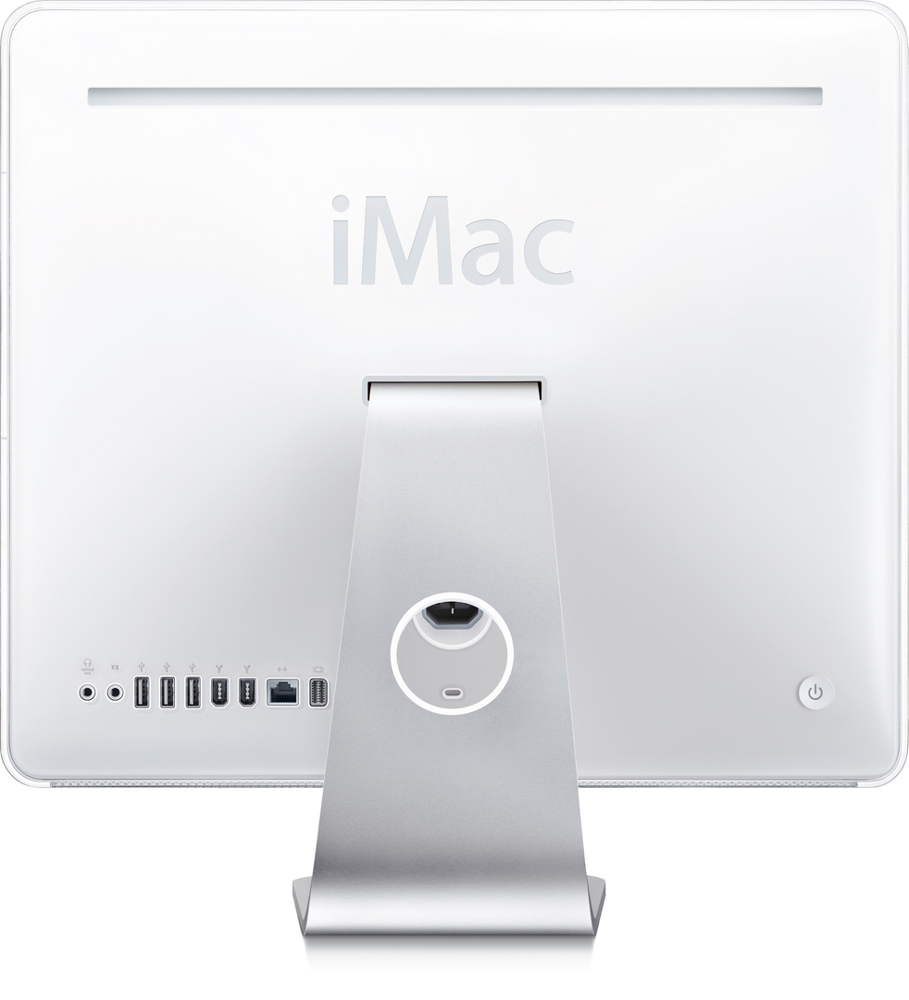
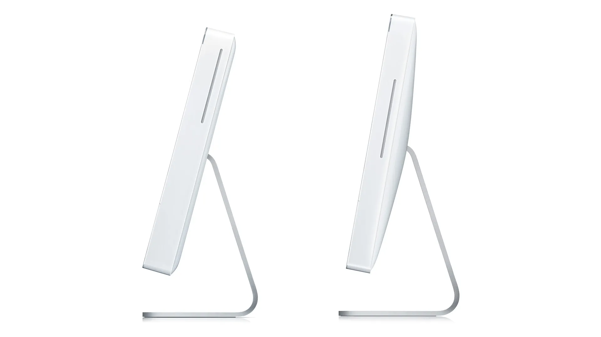
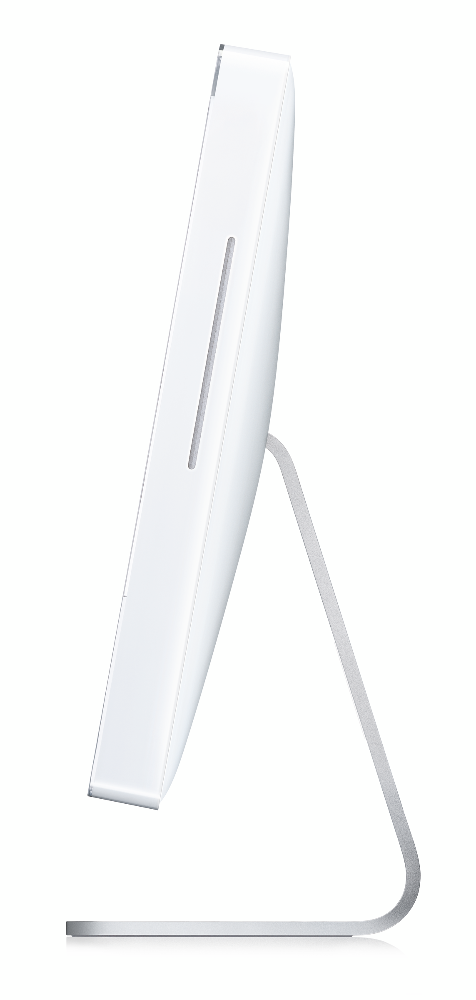
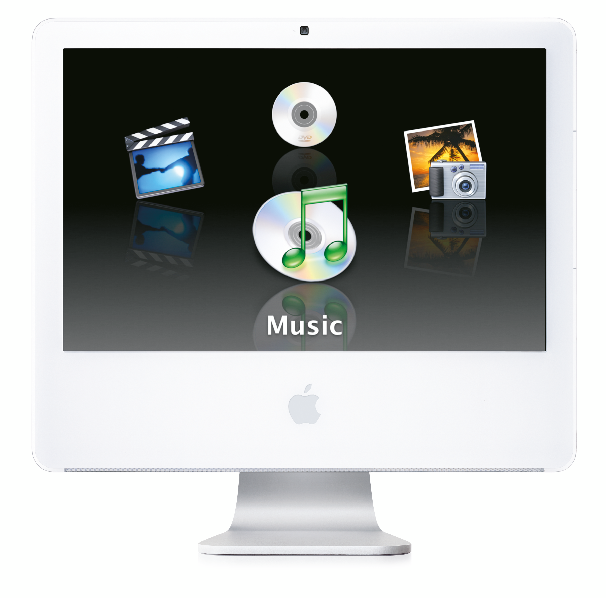
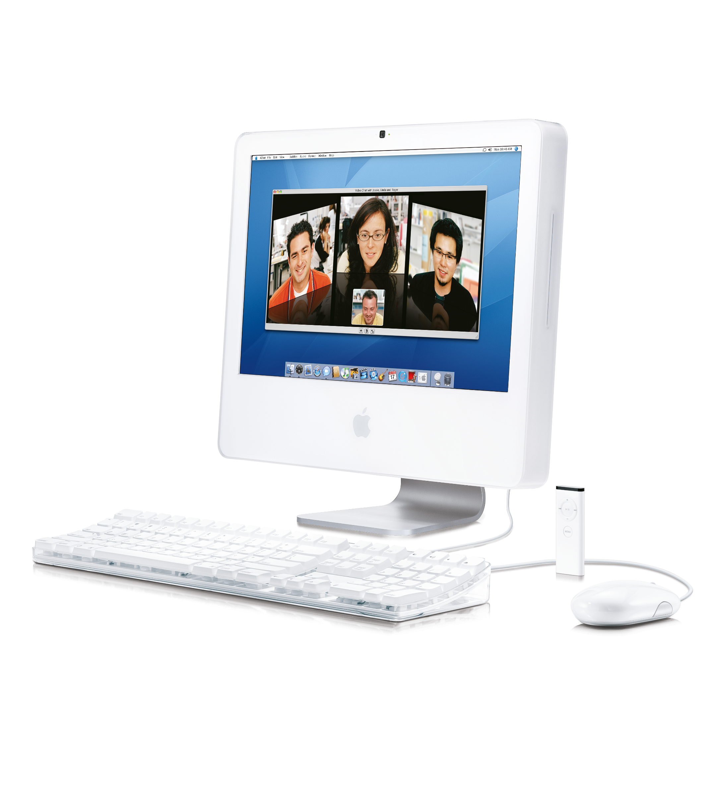
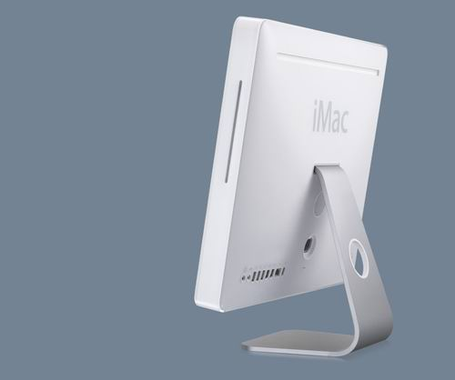

## 造型

iMac G5 2005 与 2004 最大的不同就是背面造型从几乎平直的面改为了类似蛋壳面的曲面，这一改变也为 2008 款的曲面奠定了基础。

隐藏在后面板后面的铰链允许倾斜 -5 到 25 度。文字是从面板内部加工和背面喷漆的，顶部有清晰的喷漆。

阳极氧化 5052 铝上的穿孔提供通风，并充当立体声扬声器格栅。混合 ABS 和合成橡胶支脚通过抑制计算机本身的共振频率来提供抗震稳定性。

边框和后盖均由双色注塑件制成 - 透明聚碳酸酯外部，白色不透明 PC/ABS 内部。

iMac 边框工具的核心侧显示了流道系统和顶出块。

## 图库

