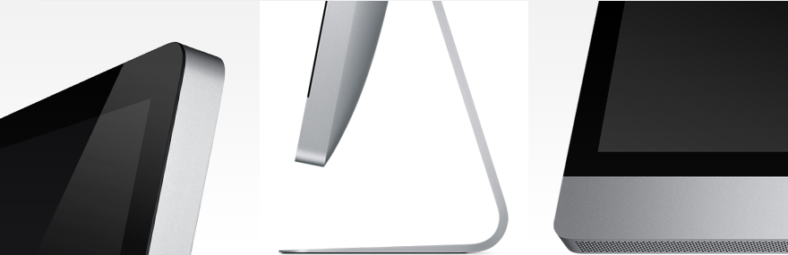

# iMac, 2009

在 2009 年 3 月份，Apple 对 2007 款的 iMac 作了一个小改款的设计，淘汰了一个 FireWire 400 接口，增加了一个 USB 接口，另外一个改变就是这个，而这一处的设计到 10 月份发布新款 iMac 时 Apple 对它作了介绍：“又一次战胜杂乱的胜利，精致处理的渐薄的铝合金底座几乎在桌面消失掉了。”

同时，背面首次完全使用铝合金外壳。

玻璃延展到机身边缘，位于铝合金之前，而不是像2007版铝合金环绕一圈玻璃。

## 图库

