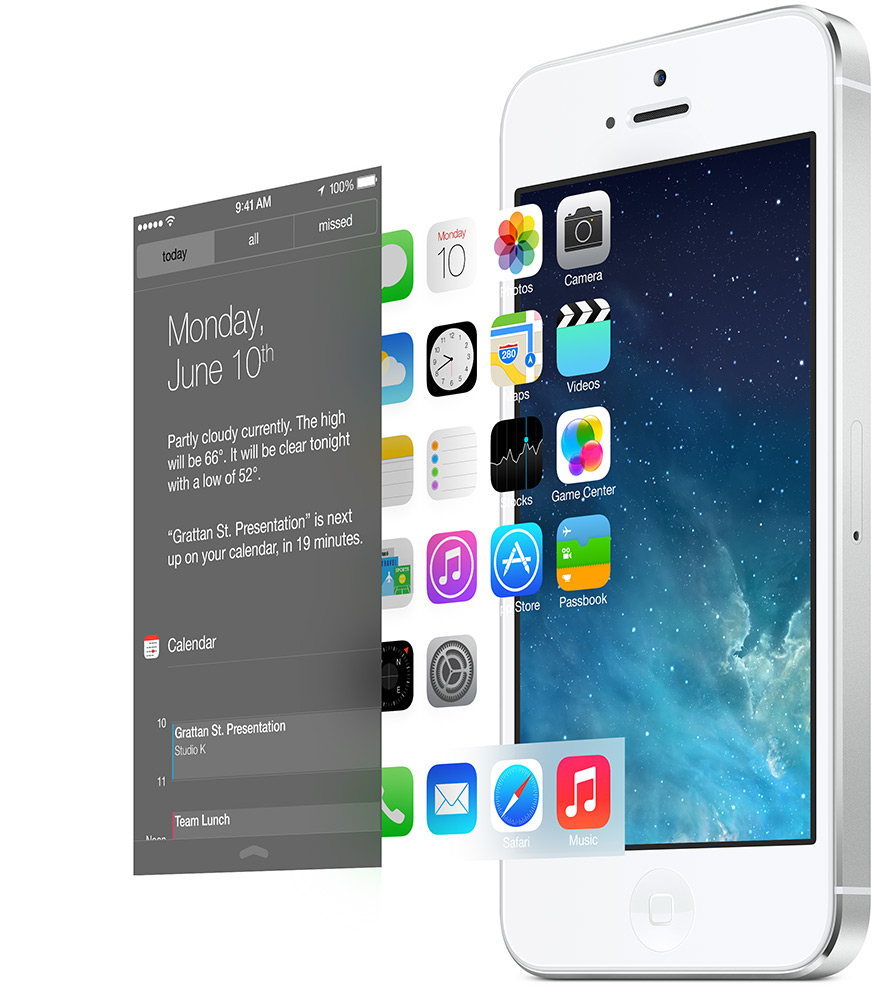

# iOS7 2013

## 概述

iOS 7 进行了彻底的重新设计，与拟物设计进行了彻底的告别。Steve Jobs 在世期间，iOS 的界面设计团队由 Scott Forstall 管理（时任 iOS 软件高级副总裁 ），乔布斯逝世后，由于苹果地图受到了用户的批评，CEO Cook 要求 Scott Forstall 向用户道歉，被 Scott 拒绝，这或许成为 Scott 离职的最后一根稻草。彭博社称 Scott 拒绝参加由 Jonathan Ive （时任工业设计高级副总裁）主持的设计会议。为了进一步说明这一点，该报道称两位很少共处一室。 Scott 离职后，Jony Ive 统一管理苹果的操作系统人机界面设计团队和工业设计团队（iOS 与 OS X 开发则统一由 Craig Federighi 负责，此前 Craig Federighi 任 OS X 软件高级副总裁 ）。

## 理念

### 当某物被设计得运转良好时，它往往看起来也很美观。

我们设计的任何产品都不是为了美观。这是从错误的角度把握机遇。相反，当我们重新审视 iOS 时，我们的目标是创造一种更简单、更实用、更愉快的体验——同时建立在人们喜欢 iOS 的元素之上。最终，重新设计它的工作方式促使我们重新设计它的外观。因为好的设计是服务于体验的设计。

### 简单实际上相当复杂

简约常被等同于极简主义。然而，真正的简约远不止是消除杂乱或去除装饰。它关乎在恰当的地点、恰当的时间提供恰当的事物。它关乎在复杂中带来秩序。它关乎打造始终“恰到好处”的东西。当你第一次拿起某样东西时，就已经知道如何做你想做的事，这就是简约。

### iOS 7 是纯粹简约的体现

它采用了一种全新的结构，应用于整个系统，使整个体验更加清晰明了。界面设计刻意追求简洁，去除了显眼的装饰元素。不必要的工具栏和按钮也被移除。在剔除那些不增加价值的设计元素后，用户的注意力突然更加集中于最重要的内容上：你的内容。

### 实用性放在首位

用过才知道好用。我们不会简单地因为技术上可行而添加功能。只有当功能真正有用时，我们才会添加。而且，我们会以合理的方式添加这些功能。iOS 7 中的新控制中心就是一个很好的例子。它可以让你一键访问你经常想做的事情。

在 iOS 7 中，我们采用了数百万用户已经喜爱的功能，并对其进行了改进，使其更加轻松实用。因此，您需要做的日常事务就是您想要做的日常事务。而且 iOS 7 让您可以立即熟悉工作方式，因此无需重新学习所有内容。例如，您的主屏幕仍然是您的主屏幕。只是现在，它更好地利用了您的 Retina 显示屏以及显示屏下方的空间。但您使用它的方式完全相同。

### 技术永远不应妨碍人性

当产品设计合理时——你无需适应技术，因为它已经围绕你设计时——你就会与它建立联系。对你来说，它已不仅仅是一台设备。交互是动态的。动画如电影般生动。在许多意想不到却又完美自然的方式中，体验变得生动活泼。例如，打开天气 app，你就会立刻明白。冰雹从文字上弹起，雾气从文字前飘过。风暴云随着一道闪电出现在眼前。突然间，查看天气就像在看窗外一样。

<video src=".\design_weather.m4a" autoplay loop muted ></video>

## 层次感。

iOS 7 充分利用 iPhone、iPad 和 iPod touch 中的技术，进一步推动 iOS 体验。不同的功能层有助于创造深度并建立层次和秩序。半透明效果的使用提供了上下文和位置感。动画和动作的新方法让最简单的任务也变得更有吸引力。

## 细节

### 细节决定成败

功能性和令人愉悦之间存在着鸿沟。在不引人注意和令人愉快难忘之间。细节可以弥补这一差距。细节是创造愉悦的小东西。其效果有时不易察觉，但却始终存在，并带来始终如一的体验。而这正是 Apple 傲视群雄的原因之一。

### 一切都经过深思熟虑，并贯穿始终。

在 iOS 7 中，每一个细节都需要同样严谨的设计。比如将排版细化到像素。围绕新的网格系统重新绘制每一个图标。坚持使用精确的调色板。重新制作音频提示，使其更加独特和悦耳。就其本身而言，这些细节可能并不是你有意识地要求或期望的。但它们共同作用，使各个元素之间的关系更加和谐。整体体验会更好、更令人愉悦。

<video src=".\icondraw.mp4" autoplay loop muted ></video>