# iOS7 2013

## 概述

iOS 7 进行了彻底的重新设计，与拟物设计进行了彻底的告别。用白色与高斯模糊效果，形成了与白色前面板的 iPhone 5S 软硬件浑然一体的设计。深色模式的推出从而与黑色前面板的 iPhone 融合则要等到 2019 年推出的 iOS 13。iOS 更新了主屏幕应用图标的圆角设计，使其与 iPhone/iPad 的圆角统一。iOS 7 全新的多彩配色与 iPhone 5C 的配色方案同步研发，从而形成软硬件相互呼应的配色方案。

## 历史

Steve Jobs 在世期间，iOS 的界面设计团队由 Scott Forstall 管理（时任 iOS 软件高级副总裁 ），乔布斯逝世后，由于苹果地图受到了用户的批评，CEO Cook 要求 Scott Forstall 向用户道歉，被 Scott 拒绝，这或许成为 Scott 离职的最后一根稻草。彭博社称 Scott 拒绝参加由 Jonathan Ive （时任工业设计高级副总裁）主持的设计会议。为了进一步说明这一点，该报道称两位很少共处一室。 Scott 离职后，Jony Ive 统一管理苹果的操作系统人机界面设计团队和工业设计团队（iOS 与 OS X 开发则统一由 Craig Federighi 负责，此前 Craig Federighi 任 OS X 软件高级副总裁 ）。

## 理念

### 真正的简约

当某物被设计得运转良好时，它往往看起来也很美观。我们设计的任何产品都不是为了美观。这是从错误的角度把握机遇。相反，当我们重新审视 iOS 时，我们的目标是创造一种更简单、更实用、更愉快的体验——同时建立在人们喜欢 iOS 的元素之上。最终，重新设计它的工作方式促使我们重新设计它的外观。因为好的设计是服务于体验的设计。

简单实际上相当复杂。简约常被等同于极简主义——然而，真正的简约远不止是消除杂乱或去除装饰。它关乎在恰当的地点、恰当的时间提供恰当的事物。它关乎在复杂中带来秩序。它关乎打造始终“恰到好处”的东西。当你第一次拿起某样东西时，就已经知道如何做你想做的事，这就是简约。

iOS 7 是纯粹简约的体现。它采用了一种全新的结构，应用于整个系统，使整个体验更加清晰明了。界面设计刻意追求简洁，去除了显眼的装饰元素。不必要的工具栏和按钮也被移除。在剔除那些不增加价值的设计元素后，用户的注意力突然更加集中于最重要的内容上：你的内容。

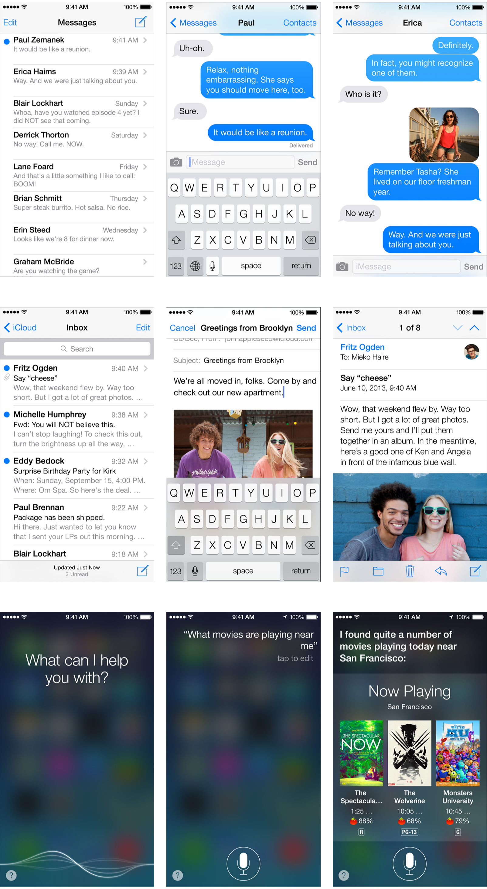

### 实用性放在首位

用过才知道好用。我们不会简单地因为技术上可行而添加功能。只有当功能真正有用时，我们才会添加。而且，我们会以合理的方式添加这些功能。iOS 7 中的新控制中心就是一个很好的例子。它可以让你一键访问你经常想做的事情。

在 iOS 7 中，我们采用了数百万用户已经喜爱的功能，并对其进行了改进，使其更加轻松实用。因此，您需要做的日常事务就是您想要做的日常事务。而且 iOS 7 让您可以立即熟悉工作方式，因此无需重新学习所有内容。例如，您的主屏幕仍然是您的主屏幕。只是现在，它更好地利用了您的 Retina 显示屏以及显示屏下方的空间。但您使用它的方式完全相同。

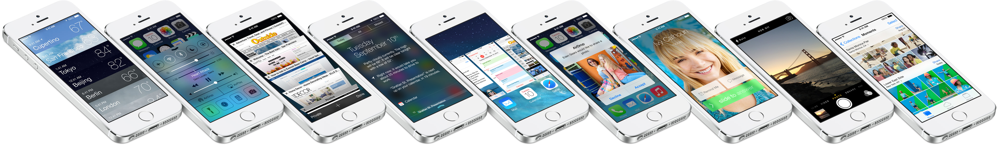

### 技术永远不应妨碍人性

当产品设计合理时——你无需适应技术，因为它已经围绕你设计时——你就会与它建立联系。对你来说，它已不仅仅是一台设备。交互是动态的。动画如电影般生动。在许多意想不到却又完美自然的方式中，体验变得生动活泼。例如，打开天气 app，你就会立刻明白。冰雹从文字上弹起，雾气从文字前飘过。风暴云随着一道闪电出现在眼前。突然间，查看天气就像在看窗外一样。

<video src=".\design_weather.m4a" autoplay loop muted ></video>

## 层次感。

iOS 7 充分利用 iPhone、iPad 和 iPod touch 中的技术，进一步推动 iOS 体验。不同的功能层有助于创造深度并建立层次和秩序。半透明效果的使用提供了上下文和位置感。动画和动作的新方法让最简单的任务也变得更有吸引力。

## 细节

### 细节决定成败

功能性和令人愉悦之间存在着鸿沟。在不引人注意和令人愉快难忘之间。细节可以弥补这一差距。细节是创造愉悦的小东西。其效果有时不易察觉，但却始终存在，并带来始终如一的体验。而这正是 Apple 傲视群雄的原因之一。

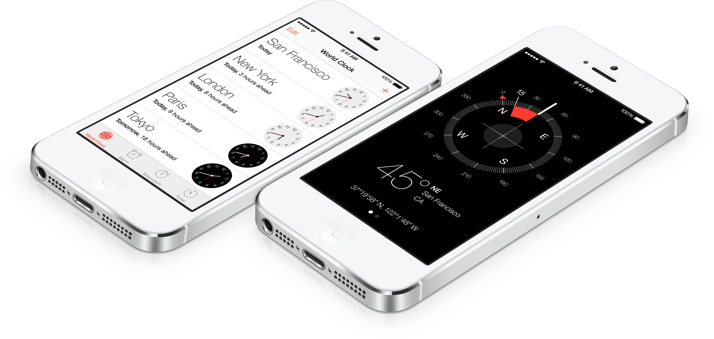

### 一切都经过深思熟虑，并贯穿始终。

在 iOS 7 中，每一个细节都需要同样严谨的设计。比如将排版细化到像素。围绕新的网格系统重新绘制每一个图标。坚持使用精确的调色板。重新制作音频提示，使其更加独特和悦耳。就其本身而言，这些细节可能并不是你有意识地要求或期望的。但它们共同作用，使各个元素之间的关系更加和谐。整体体验会更好、更令人愉悦。

<video src=".\icondraw.mp4" autoplay loop muted ></video>

## 圆角图标的圆角

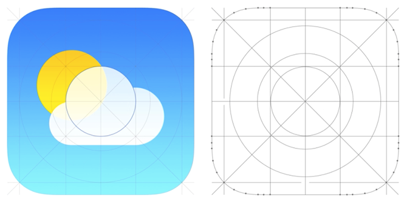

iOS 更新了标志性的圆角图标轮廓，将工业设计中的曲线连续概念应用到了视觉设计之上，iOS 7 之前的圆角图标，也包括通常的平面设计软件中绘制的圆角四边形，圆角部分为一段圆弧，那么在直线和曲线的连接点处曲率从 0 立刻过渡到一个恒定的数值，带来的视觉感觉就是过渡不顺畅，保证顺畅就需要让直线到曲线过渡中形成一个连续的变化，从 0 逐渐地过渡到某个数值，而不是从 0 跳动到某个数值。在实际操作中，并非一件简单的事，曲线的过渡也是一件讲究技艺的事，也要求一定的数学意识。

iOS 7 在介绍新的圆角图标轮廓时，给出了上图右的一张线框示意图，图中在圆角处密密麻麻的点让人感到困惑，并非难以逆向破解，由于最近 Apple 在 UI Design Resources 上给出了 iOS UI 素材的下载，里面包含了这个圆角图标轮廓的矢量图，我们可以通过这个矢量图可以挖掘到一些信息。

### 曲率连续的概念

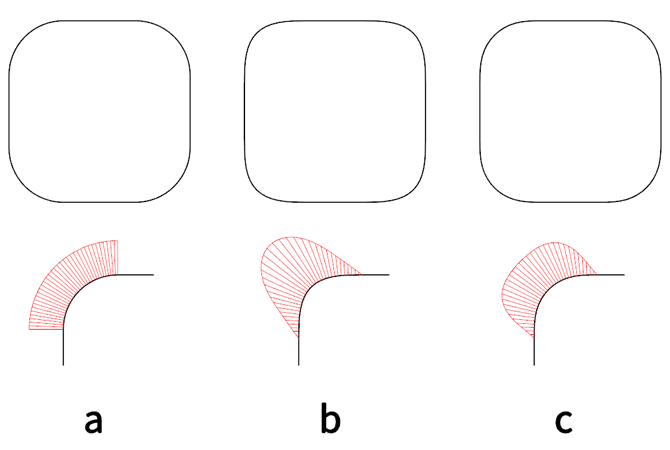

上图 a 为 1/4 圆弧过渡的圆角，iOS 7 之前的圆角图标，通常平面软件绘制的圆角四边形，以及通常我们称作“导圆角”，都为上图 a 所示的方式。因为直线的曲率为 0，而圆弧的曲率为一固定值，所以从直线到圆弧有曲率的突变，虽然是切线连续（G1 连续），但是无法达到曲率连续（G2 连续），这种过渡的不顺畅我们可以通过视觉很明显地感觉到。

上图 b 为用一段曲线替代了 1/4 圆弧作过渡，绘制时要求连接直线的两端达到曲率连续，即这段曲线的曲率是从两端的 0 逐渐连续的增大的，我们能够从图形的四个角上看到过渡顺畅，但是，存在一个问题就是，看上去四个角不够圆了。虽然光滑但不够圆，我们也可以从曲率的示意图中观察到，这条曲线曲率的变化不具备圆的特征，因为圆的曲率处处相等，均质而统一的。

我们需要做的是将上面两种情况进行综合，曲线与直线连接端来保证过渡的顺畅，而尽可能提到曲线的圆度，即让曲线中间段的部分曲率的变化极为缓和，接近圆的均质统一的曲率特征。

上图 C 就是采用这种策略的一种示意，曲线两头连续过渡，中间部分过渡缓慢，接近均等。

但是上图 C 所示仅为一个粗略的示意，在实际的工作中，要求将会比这更高，比如说对圆度的要求到底是要多高，甚至包括曲率过渡是以怎样的速度或加速度来进行也可能需要在考虑之中，另外也将牵涉到数据的传递，比如从设计到生产，如何来保证形状在传递过程中的保真性。

但我们先否定几个通常对 iOS 圆角图标的猜测。

### iOS 圆角图标不是超椭圆

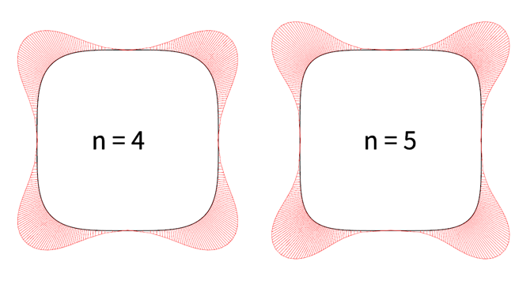

一个有趣的现象是，逆向如果是更多依赖于猜测，会发现结果就是指向自己的假设，而在讨论 iOS 圆角图标是怎样的图标和曲线，或者去拟合产品上的曲线，甲乙丙丁走向不同方向，而且谁都认为自己是正确的，而且一看拟合结果，严丝合缝。

比如 iOS 7 发布不久，有人认为是超椭圆（Superellipse），可能不少人看到超椭圆这个吓人的专业词就认为八九不离十了，而且一看两者相拟合的图，严丝合缝，而且还给出如何在 Photoshop 中使用的指南，但是殊不知平面软件使用的 3 阶贝塞尔曲线，而拟合用到的却是一个 5 次方程式。其实超椭圆从头到尾都是曲线，而没有一条直线段，iOS 7 的圆角图标明显有直线部分，如果连这都能匹配上，可想而知用视觉来判断是否高度拟合是多么不可信。

如 Wikipedia 所述，超椭圆是椭圆函数的一般化，即当曲线阶数为 2 的时候为椭圆，当阶数为 4 的时候，如上图左所示为方圆形（Squircle），介于圆和方之间图形（Nokia 的 MeeGo UI 图标被认为是类似 Squircle ），上图右为阶数为 5 的曲线。

从视觉上就能看出超椭圆是曲线，找不到具有圆度的地方，从曲率分布示意图就可以看出，曲率总是在连续过渡，而且阶数越高加速度就越大，即曲率过渡的光滑程度越高。

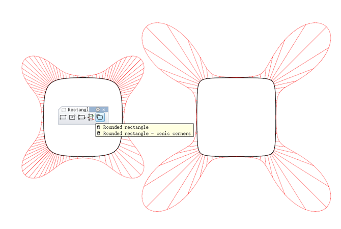

与超椭圆有些类似的是 Rhino 里一个圆角工具（右键点击），圆锥曲线圆角四边形，是用一段圆锥曲线（二次曲线）绘制成 1/4 图形，圆锥曲线圆角四边形的一端极值为圆，而另外一端极值为直角四边形，所以圆锥曲线圆角四边形是不具有圆度的曲线。圆锥曲线因为阶数不高，所以曲线的数学结构较简单，适合绘制一些不圆不方的图形，可以与上面的超椭圆曲线来比较，就会发现圆锥曲线圆角四边形的线条的塑造能力不及高阶的曲线，即一个跨度内曲线的形态塑造能力非常有限，所以除了特殊要求，通常很少用到这一类曲线。另外由于它是二次曲线，所以数据输出的时候需留意。

### iOS 圆角图标不是羊角螺线

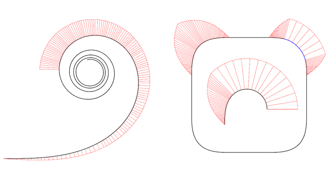

羊角螺线（Euler spiral 或者 Cornu spirals）同上面类似，如果来拟合 iOS 的圆角图标，也可能会达到高度匹配的结果，但实际并不是。

以前羊角螺线常用于公路和铁路工程之上，“以缓和直路线与圆曲路线之间的曲率变化”（Wikipedia 介绍）。而羊角螺线的主要特征是，它的曲率从 0 开始，而且是随着曲线长度（弧长）增大而线性增大，所以当一条羊角螺线的尾部与一个圆形相连时，那么这条曲线肯定是曲率连续的。如上图右所示的两种图形，一条为与圆相连（圆角四边形内部），一条为一段羊角螺线的镜像连接（圆角四边形，左上角），它们都是曲率连续的（G2 连续）。

正因为羊角螺线的这个特性，随着曲线长度的增大曲线呈线性增大，让其具有不少应用之处。在上图右中，虽然我们看到了曲率的变化率曲线（红线）具有尖点和不连续性，但是曲线本身（低一阶次）是光滑连续的。上图右的圆角四边形左上角使用的是一段羊角螺线的镜像连接，它的曲率从 0 线性增大到某个值，然后又降回到 0，按我们上面的基本概念中介绍，这样的曲线是不具有圆度的。

那么羊角螺线既然有这样的特征，我们可以在中间加入一段圆弧，如上图右的圆角四边形的右上角所示，就得到了一个连续的圆角，而且圆度有保证，首尾与直线段也是曲线连续，而且三段曲线形成的圆角的曲率的变化率，虽然不是连续的，但也是非常简单的数学结构，从 0 增大到某一数值，停留，然后再降到 0。而羊角螺线可以用三次曲线来趋近，那么在实际的应用中就有相应的方便之处，比如在平面的矢量绘图软件中使用，来绘制类似 iOS 圆角图标的曲线连续圆角四边形。

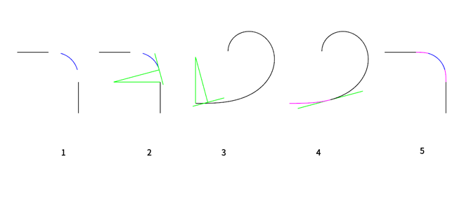

方法是，从 Wikipedia 可以下载到满足使用的羊角螺线矢量图（SVG），然后就是定义圆角曲线中圆弧的大小是多少，然后确定这段圆弧占圆角曲线总长度，也就是画好如上图 1 所示的图形，然后按如图 2 所示画出圆弧一端的切线和法线，并画出直线的垂线，形成一个类三角形，接着将这个类三角形移到羊角螺线之上，定好位置，如图 3 所示，然后移动斜线，找到这条斜线与羊角螺线的相切位置，切断羊角螺线如图 4 所示，得到一段羊角螺线，作放大或缩小动作，装入圆角曲线的圆弧两头，完毕如图 5 所示。

这种绘制方法可以方便地在平面软件内完成，因为目前平面软件没有其他相应的工具来直接或辅助绘制这样的圆角四边形，即保证曲率连续又保证圆度。那么曲线推敲的关键在于确定圆弧段的大小以及占整体曲线长度的比率。

用羊角螺线以这种方式（两端羊角螺线中间圆弧）绘制的圆角四边形的缺点有两个，一个就是形成的整条曲线它的曲率连续但曲率的变化率不连续，第二个就是羊角螺线段的曲率增大是线性的，所以虽然曲率具有加速度但曲率的变化率是恒定的。当对曲线的品质有更高要求时，或者是在三维产品上实现时，不仅对产品的形态还对产品的高光等光学表现有要求时，就可能需要用到更加光滑和连续的曲线了，因为重要的是，这一切的区别都有可能被眼睛看到。

### iOS 圆角图标

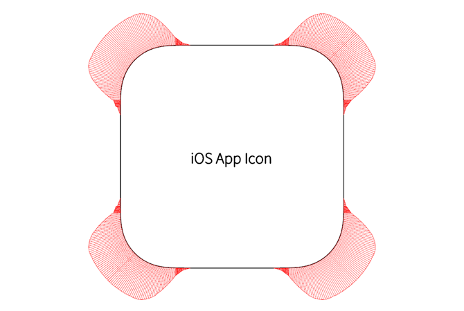

Apple 的 UI Design Resources 网页上，提供了 iOS 的 UI 素材下载，在素材里面提供了 iOS 圆角图标的矢量图，可以导入各种绘图软件中使用，而且提供的矢量的布点方式和 iOS 7 发布时对圆角图标描述的布点一样，所以这个矢量图的原真性就可以得到确认。

iOS 的圆角图标从宏观上看由 4 条直边和 4 条曲线形成的圆角组成，从圆角曲线的曲率变化示意图中可以看到它符合我们上面说的要求，即首先是曲率连续的曲线，然后能够保证曲线的圆度，让它看起来就像圆弧一样，另外我们也可以看到曲率变化具有加速度，曲率变化的状态大致可以分成五个阶段，第一阶段，也就是接近直线处，以缓慢的速度增加曲率，到达某一值进入第二阶段，也就是快速增长阶段，达到一定程度后，就连续光滑地过渡到第三阶段，以极其平缓的速度变化几乎匀速一般，也就是圆弧阶段，之后的变化过程就是反方向，第四阶段是快速降低，第五阶段是缓慢降低到 0。

在圆角处“缓慢—加速—平缓—加速—缓慢”的变化轨迹是典型的，但具体到应用上亦要看具体情况，并不是做到同 iOS 圆角图标的曲率变化曲线就能符合各种要求的。

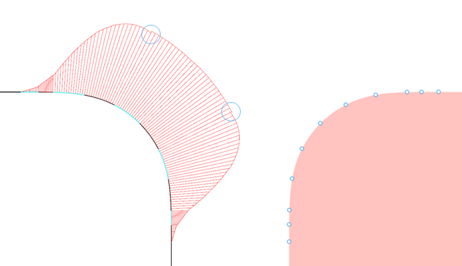

iOS 的圆角图标在圆角处的曲线有 11 个分割点分成了 10 段曲线，它们都为 3 阶贝塞尔曲线，如果仔细看这 10 段曲线，会发现它们前后相连并非是严格的曲率连续（G2 连续），看曲率示意图在相邻的两端曲线见，曲率的数值有略微的跳动。并不是形成了尖点，而是有台阶段差，如上图蓝色圆圈处所示，这些台阶段差在每两段前后相连的曲线交点处都能找到，只不过太小在上图无法看出。

虽然再严格的数学意义上来说，这样的曲线连接只能达到切线连续（G1 连续），但是我们谈论是否达到一种标准，还要看公差范围，如果在公差范围内，那么它就是曲率连续。而更为重要的是，我们要从宏观上从视觉上从实际应用中去判断，所以有这样的台阶段差在这对曲线的光滑没有影响。

那么这些线段和段差是如何生成的呢？我们先来分下一下圆角处的曲线。

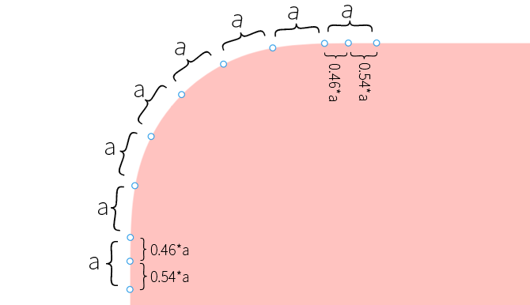

如上图所示，我们对分段的曲线进行测量，测量它的曲线长度（弧长），会发现上图所标的这些线段的长度都是完全一样的，除了靠近直线端的两条曲线段，它是作了再次的分割。

而这个再次的分割，将一段曲线长度为 a 的曲线分成两段曲线，曲线长度分别是 0.46*a 和 0.54*a，这个切割方式看上去很随机，推断有三种可能性：一种为作者留下的签名，可用来追踪（万一被他人侵权使用）或其他作用；第二种可能是留下的干扰因素，来干扰逆向；第三种可能是为了保证数据在传输过程中的安全和保真性。

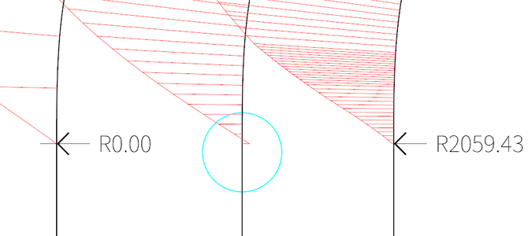

上图是保证数据传递中的安全和保真性的一个例子，第一条曲线为 5 阶曲线与直线曲率连续，所以交点位置的曲率为 0，如果这条曲率连续的曲线不作处理，传递给最高只有 3 阶曲线的软件，那么曲线转化过程中很有可能变成中间这样，如蓝色所示位置曲线弯曲方向发生了变化，为了避免这种转化过程中不必要的错误发生，在一些极值处，比如从 0 开始的变化，将其设置到一个与 0 接近的数值，比如上图所示，可以给其一个非常微弱的曲率。（注：此为个人经验，并未经过理论上的验证）

我们可以不必去追究 0.46*a 和 0.54*a 的由来，因为我们能确定的是 iOS 的这写曲线段的曲线长度（弧长）是均等的，而且都是 3 阶曲线。那么，首先能否定的，这个图形肯定不是设计师一条接一条画出来的，也不是由程序自动生成的，因为这 10 段曲线是太多可能性里面的一种，所以合理的解释就是通过其他曲线，更高阶的曲线，转换为多段的 3 阶曲线，而这个转换过程是以均等曲线长度为依据的，也就达到上述的多段曲线长度为 a 的曲线组成的圆角。

那么为什么不用 3 阶多段的曲线来直接绘制呢？因为 3 阶曲线内部最多只满足 G2 连续，所以无法用它来有效的绘制顺畅的曲线，如果要使用多段的曲线就需要用到高阶曲线，比如 5 阶或 7 阶。

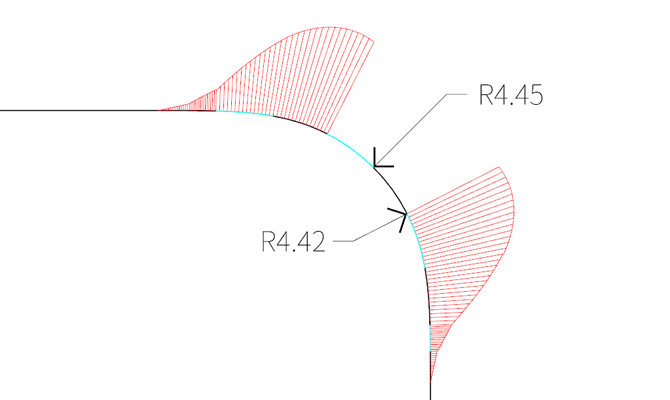

iOS 圆角图标是如何来保证圆度的呢，我们可以看一下圆角部分最中间的两段曲线，按照上面长度的关系，中间两段曲线占总曲线长度的 1/4。我们能看到一段曲线两侧的 R 值有微弱的差别，可以说明这两段设计师就是以圆弧来要求的，但是为什么会不一样，因为是用 3 次曲线来逼近圆弧，如果使用 2 次曲线就可以画出曲率完全均等的圆弧，但是 2 次曲线的引入，将为后续图形的追加以及数据传递带来不可预见的复杂性，在 3D 相关的设计中，绝大多数的场景中，都需用 3 次曲线来绘制圆弧，基本上的软件都提供 3 次曲线绘制圆形的工具。

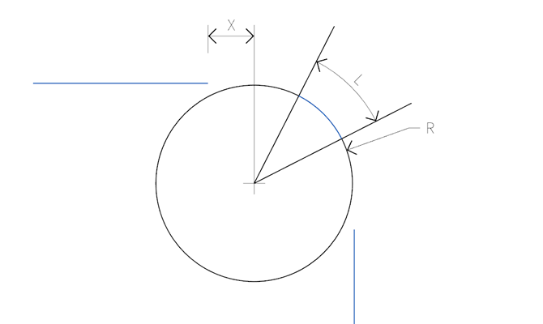

因此，绘制问题就如上图所示，需要事先确定的就是 X、R 和 L 的值，这些数值的确定就是这个圆角的设计工作。X 就是直线一端与圆弧圆心的距离，X 肯定为正值数字，用圆弧来形成的圆角，就是此前提到的 G1 连续圆角，X 值为 0。R 代表的圆角的大小，但因为我们要作的是曲率连续的圆角，使用到的一端圆弧小于 1/4，即上图的 L 值，所以在设计 R 的大小时并不能完全依赖于 G1 连续圆角的感觉。X、R 和 L 值的确定是需要反复推敲，不断画草稿来寻找的过程。

一旦 X、R 和 L 值确定，我们就是怎么来绘制图形的问题了。

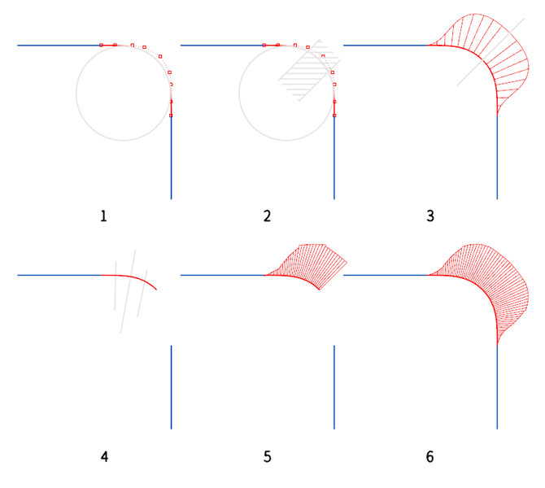

上图是达到 iOS 圆角图标最直接快速的方法。图 1 是在两个直线段之间作一条 7 阶 2 Span 的曲线，即总共控制点有 9 个控制点，7 阶曲线具有很高的塑造性，而且在此处为对称性图形，所以只需要操作 4 个控制点就能完成任务，第 2 和第 3 个控制点受制于曲率连续将与直线共线。图 2 是去拟合圆形，尤其是斜线区域内要做到高度拟合，来回操作控制点。图 3 是当曲线调整到满意后，从中间断开。图 4 是再向下断，将圆角曲线的一半断成均等的 4 等份，得到的 4 段曲线长度相同的 7 阶曲线。图 5 是将这 4 段 7 阶曲线转换为 3 阶曲线（4 个控制点），并且作微调，保证两两相接的曲线切线连续，并且将曲率的段差控制到尽可能小。图 6 就是镜像后的结果。

这个绘制方法的关键点在于拟合圆部分，需要靠操作控制点，亦可借助一些分析工具（比如分析最大最小曲率的差值），让曲线尽可能接近圆形。另外一个要点就是曲线要先分段再降阶，这样可以很好的控制好因降阶带来的形变，如果在第三步直接将完整的 7 阶曲线转为 3 阶 8 段曲线，不仅形状误差会超出允许公差，更糟糕的曲率变化曲线将很难达到光滑。

而这个方法有一个缺点就是圆的拟合部分，需要耗费操作的时间，而且圆角曲线的中点并不在事先给出的确切位置上，改进方法如下。

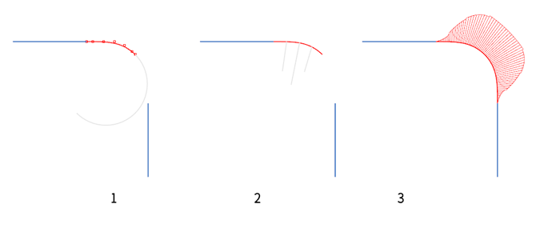

让一段 5 阶 2 Span 的曲线一端与直线曲率连续，另外一头与中间的圆弧去作曲率连续，其余操作手法类似上一方法，均分曲线段，降至三阶曲线，微调曲率，镜像完成。

以上方法都是指来完成类似 iOS 图标圆角处 10 段曲线的绘制，而实际中有时候并不需要这么复杂，那么可考虑用以下方法。

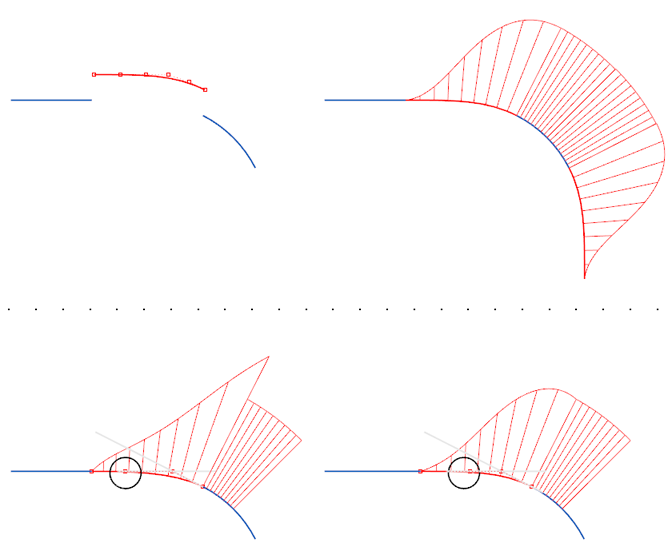

我们已知了三段曲线，那么直接用一条 5 阶的曲线完成直线和圆弧之间的连接，只要调整好曲线的曲率变化即可。

另外也可以用一条 3 阶曲线来完成，当使用 3 阶曲线时，只有一个控制点可供操作，因为另外一个控制点要满足与圆弧连续，又要与直线连续，就必然位于直线的延长线和圆弧端点处切线的交点上，所以可以拖动这个可供操作的控制点，来达到曲率连续，曲率连续的位置点存在并且只有一个，虽然用手拖动操作只能尽可能逼近，但正因为这样的特点，即如果用 3 阶曲线来完成直线和圆弧之间的曲率连续，这条 3 阶曲线是确定的，所以可以用算法来完成求解，前提是前面说到的 X、R 和 L 值确定。在但 X、R 和 L 值确定的情况下，用此方法来形成三段曲线的连接，有时效果未必很好，比如上图右下所示的 3 阶曲线段，曲率的最大值出现在内部而不是尾部，这将影响到曲线的质量，如果此情况下 X 值可以变动，即这条 3 阶曲线与直线连接位置可以微调，可能会带来较好的效果。

尽管用 3 阶曲线来完成圆角曲线的绘制相对简单，只需要动一个控制点，但在平面软件中来绘制，因为缺少曲率分析和呈现的模块，所以还是难以实现操作。

前 Apple 出色的交互设计师 Bas Ording（就像 iOS 时代的 Bill Atkinson 一样）在 2013 年申请了一项专利（2016 年获准）[US9396565](https://patents.google.com/patent/US9396565)，专利名称是“用户图形界面元素中边界的渲染”，专利内容就是用 3 阶曲线来绘制圆角四边形，而基础正是基于这条 3 阶曲线的 4 个控制点具有约束性。

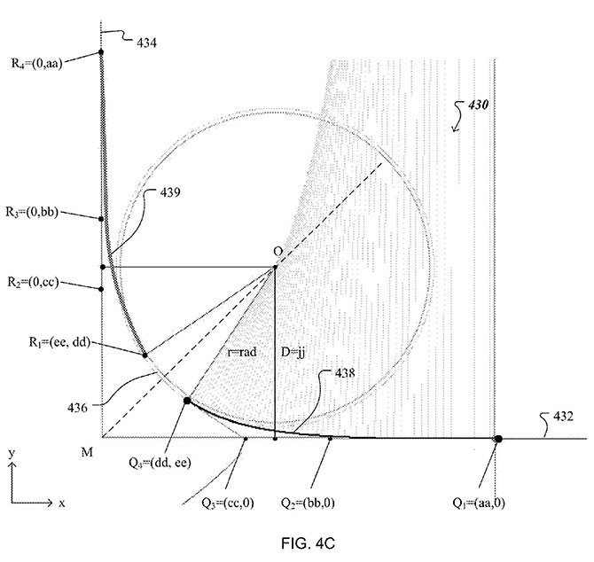

Bas Ording 采用算法来完成，基于 3 阶曲线与两段的直线和圆弧形成曲率连续后，这条 3 阶曲线的控制点位置的特征。他的圆角生成需要先输入圆弧段的半径，以及圆弧两边两条非圆弧曲线占圆角曲线整体弧长的比率，以这两项参数输入就可以生成圆角曲线，如果在输入四边形的长和宽，就可以生成圆角四边形。他的算法我并没全看明白，而他给出的结果是上图中的 Q2Q1 间的距离是 Q3Q2 的两倍，就可以看出这个算法并不能一般化（开始就设定了一个固定比率），只是涵盖了某一个子集的曲线，可能他在计算过程中加入了其它限定因素。

## 配色方案

### 软硬件一体

从简洁、精心重新设计的图标，到似乎贯穿整个主屏幕的色彩匹配的壁纸，iOS 7 中到处都是色彩。而且这一切都是有意为之。iOS 7 的设计考虑到了 iPhone 5c 的颜色。

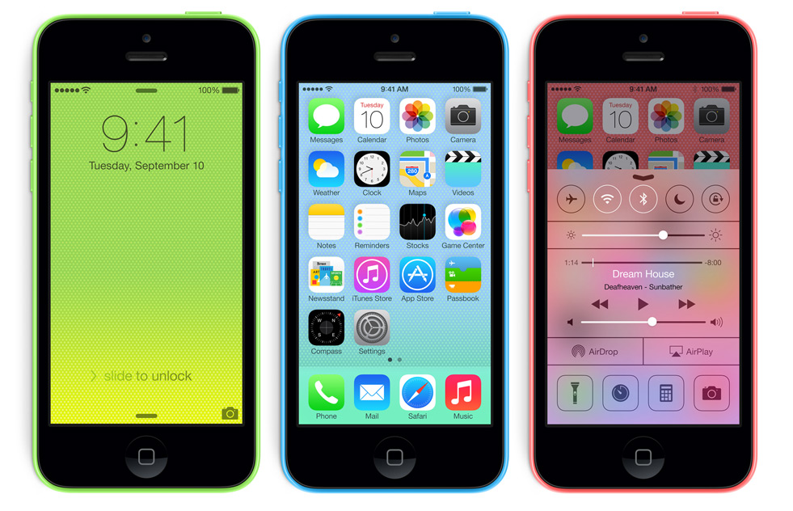

<video src=".\iphone5c-designed-together-cc-us-20131011_848x480.mp4" controls="controls"></video>

### 强调色

在备忘录中，你会看到这种黄色

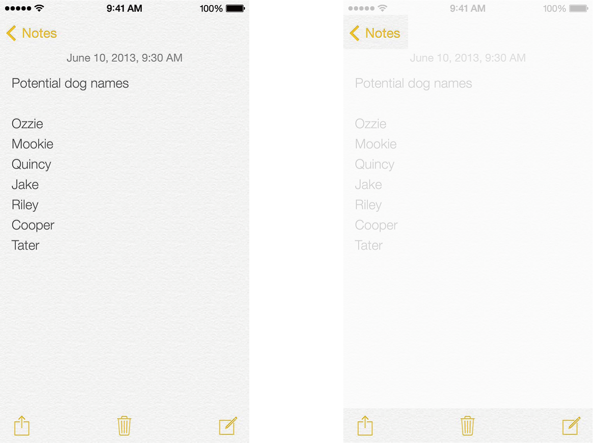

这就是应用程序的强调色。这种颜色有两个作用。其一，它可以显示交互式的内容；其二，它可以帮助你塑造应用程序的外观风格。

现在，你要为你的 iOS 7 应用程序选择一种颜色，你可能会选择与你的品牌或应用图标搭配得当的颜色。因此，如果你的徽标是绿色，那就用绿色吧。任何颜色都可以。你可以使用紫色、红色、黄色、橙色、绿色、蓝色等一切颜色，除了白色。

### 系统色

指南针中有一种红色，这种红色很特别。

这种红色与我们在日历中看到的红色相同。

在股票中也能看到同样的红色。

在秒表中也能看到同样的红色。

在很多地方你都能看到同样的红色。

## 告别现实主义（拟物化设计）

### 应用图标

正如我们所看到的，主屏幕在结构上与以前一样，为什么不呢？这是一个非常棒的界面。因此，所有关于删除应用程序图标、在主屏幕之间轻扫、重新排序等交互方式都是一样的，但图标发生了变化，所以我们要花点时间来谈谈这些图标。

最厚重的纹理、条纹、光线、光泽叠加和照片真实感都不见了。

例如 Safari 图标，已大大简化。

Safari 的代表是指南针，不需要太多。你只需要一个红白相间的指针、圆形表盘和一些刻度线就够了。如果开始添加其他东西，就会变得繁杂而沉重。因此，你不需要北、东、南、西的基本方向，不需要地球仪背景，不需要光泽覆盖，不需要镜面高光和阴影等所有东西。我们提供这样的建议已经有一段时间了，现在我们有点听进去了。

简洁的形状和单一的颜色能让应用程序图标脱颖而出。当然，选择的颜色也要与应用程序的色调相匹配。

### 备忘录

这是 iOS 6 和直至第一部 iPhone 上的备忘录。

它有一个非常清晰的记事本主题，看起来就像一张法律用纸。制作团队做得非常好，他们非常注重细节、纹理、撕裂的纸张边缘、线条向左微微移动以传达深度感的方式、清晰易读的字体、手写字体、为匹配记事本风格而定制的图标，以及当你从下一个笔记翻到上一个笔记或翻阅笔记时页面卷曲的方式，这些都让人觉得这是一个法律记事本。

要解释这样做的原因，我们必须回到 2007 年。那时还没有 iPhone，你不知道多点触控是什么意思，你从未使用过这样的设备，你没听说过轻扫，没听说过捏合，没听说过旋转，你的词典里没有这些词，你的词汇里没有这些词，你不会使用这些词。 因此，在设计这些应用程序时，最重要的是要让用户能够轻松地拿起其中的一个，并成功地使用它，完成自己想要完成的任务。因此，在我们看到的许多应用程序中，应用程序的用户界面都是以现实世界中的物体为基础的。法律便笺是如此普通，每个人都知道它的用途，每个人都知道如何使用它。

但有时，当你使用现实世界中的隐喻作为用户界面的基础时，它并不能真正扩展。例如，你不能搜索记事本，所以当你添加这个隐喻时，它开始破坏错觉。这与应用程序的风格无关，也不是为了向你展示你可以如何出色地表现法律纸张。

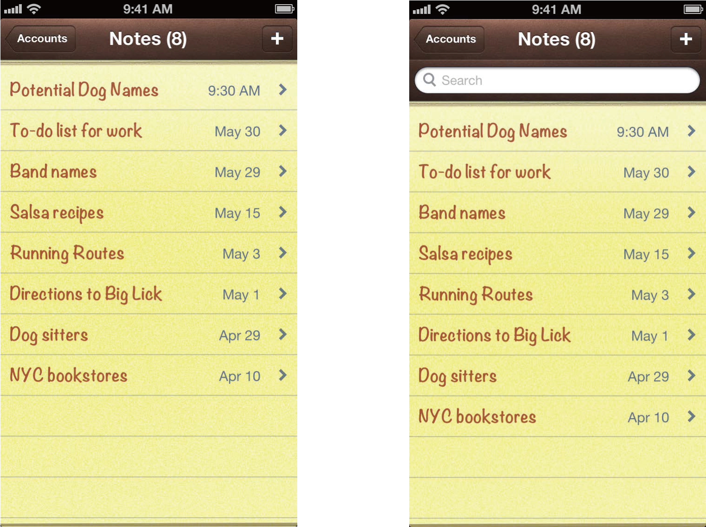

备忘录的内容才是最重要的。这与应用程序的风格无关，也不是为了向你展示你可以如何出色地表现法律纸张。

重要的是备忘录。

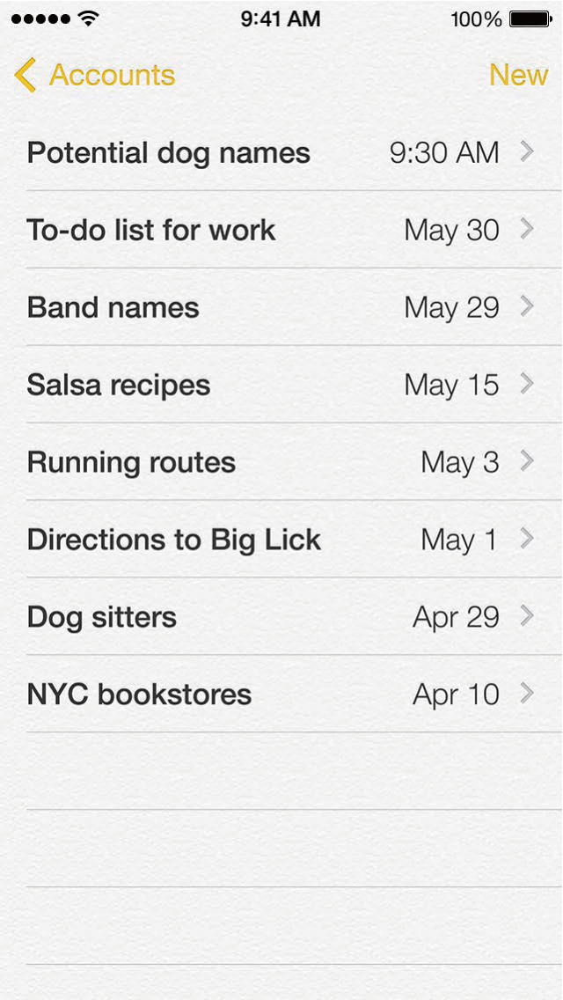

但你仍然可以看到它的风格，它有一个主题，但这个主题现在有一个非常不同的目的。它旨在传递温暖、个性和特色。我们有这种凸版印刷文字效果，纸张纹理非常逼真。放大后就能看到。

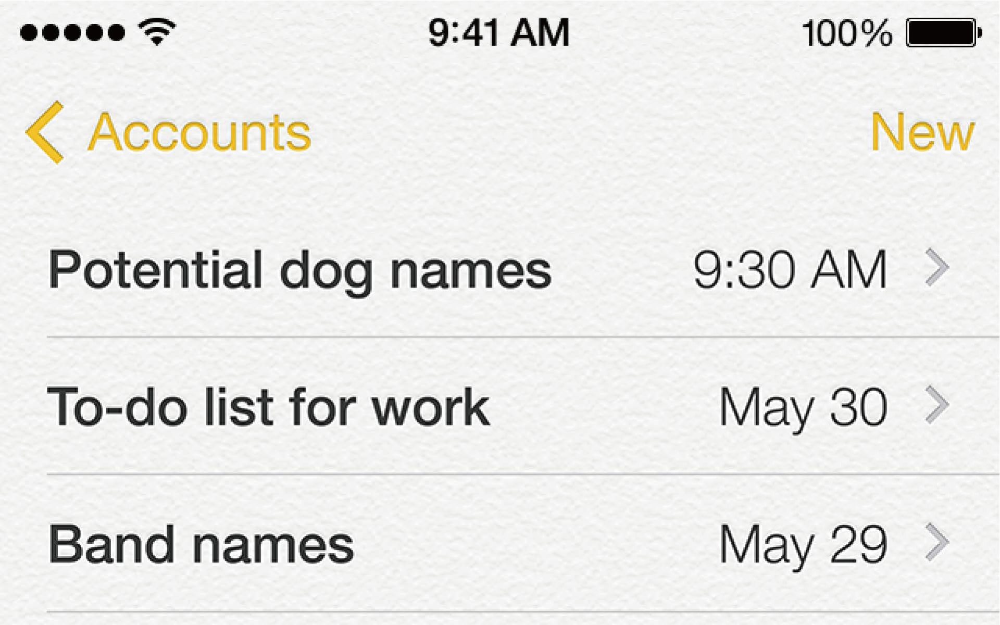

现在让我们来谈谈 “杂乱”。

iOS7 的备忘录中缺少了一些东西，那就是标题。我们一直建议为你的屏幕设置一个标题，这非常重要，而且 99% 的情况下都非常重要，所以不要随意删除标题。标题会告诉你在哪里，在看什么

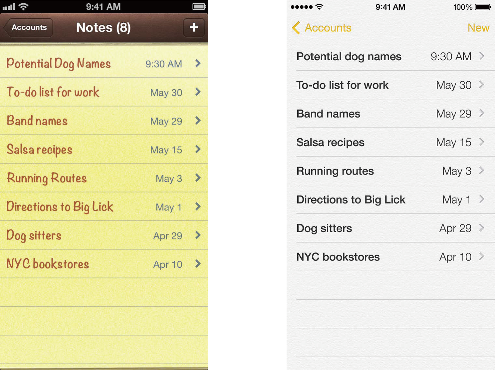
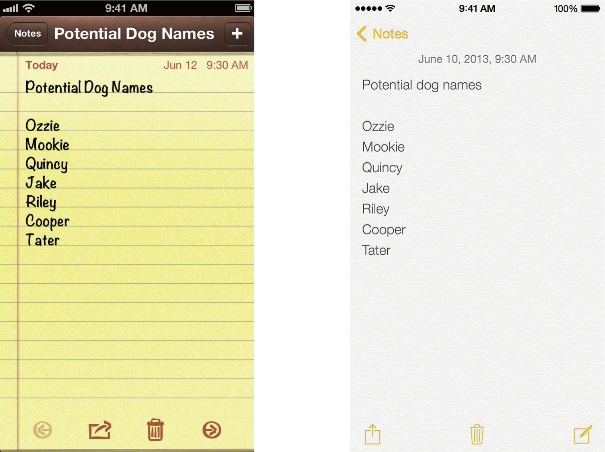

但它在这里重要吗？——笔记是一个非常简单的应用程序，应用程序的名称就是它的标题，它告诉你你要看的是什么，没有任何歧义，你不知道，这些不是电子邮件或其他东西，这些是笔记，所以没有必要显示标题，所以我们没有这样做。当你查看单个笔记时也是如此，以前它只是由第一行文本生成的，所以它总是完全多余的，这样做有什么意义呢？没有意义，所以标题被去掉了。

### 指南针。

以前版本的指南针看起来就像游艇上的那种漂亮东西。我不知道，我没坐过游艇，但它真的是精心制作的，真的很吸引人，很漂亮，但有必要把它做成这样吗，这样我们就能理解如何使用指南针了？

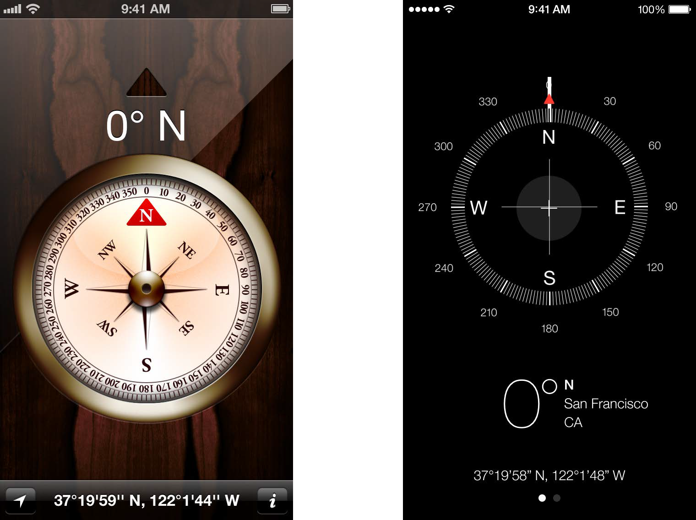

有必要设计成这样，从而让你明白它的用途吗？这是否限制了使用指南针的可能性？——是的。让我们来看看为什么。

在表盘中央有一个四点装饰和这个顶石占了不少空间，把它去掉后，我们就可以在中间放一个水平仪。这使得指南针更加实用。这是在希望有这些装饰和希望有更多的功能之间的直接权衡。因此，我们的决定非常明确。让它更有用是最重要的。

因此，指南针简洁、优雅。它体现了指南针在这款设备上的功能，而不是指南针在船上的功能和外观。

另外，当你转向不同的方向时，字母会保持直立，这样就更清晰了。同样，如果我们在以前的指南针上这样做（引入水平仪），就会完全破坏错觉。这两点是相互矛盾的。

### 图标集合

让我们进入 Safari。

关于 Safari，我想谈谈图标设计。
正如你所看到的，我们重新设计了所有图标。

所以这五个图标在视觉上看起来是不同的，这是因为它们是一大套图标中的五个
这是因为它们是为 iOS 7 重新设计的一大批图标中的五个。

它们直观、正面、线条细腻、形状的弧度非常一致。

我们花了很多心思，让这个 系统的协调性。