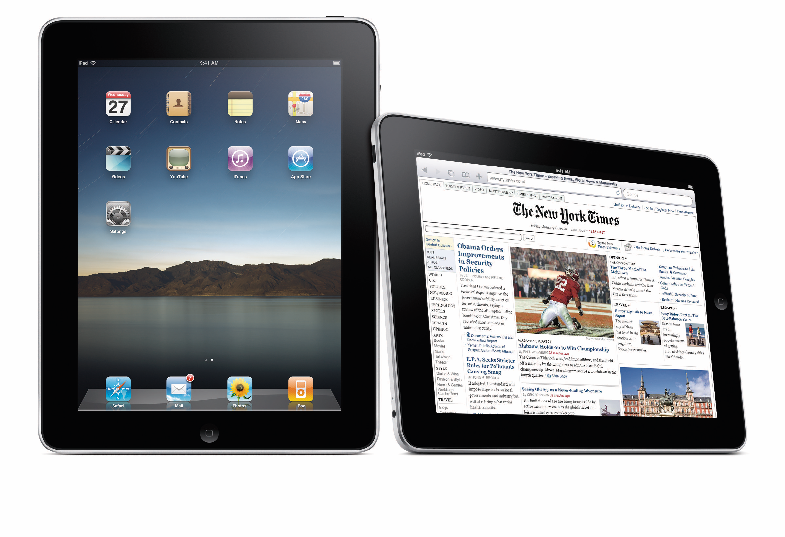

# iPad Pro,2018

“我认为新款 iPad Pro 特别之处在于它没有方向感。它的四周都有扬声器。通过取消 Home 键和开发 Face ID，这款平板电脑可以在所有这些不同的方向上工作。

“新发布的 iPad Pro 还有一个变化，那就是屏幕四角的一个细节。这种变化你可能不会注意到，但它会从根本上改变你对产品的体验。

“不过，如果你仔细观察 iPad Pro，就会发现显示屏边角的半径和弧度是如何与实际机身同心和协调的。你会感觉它是真实的，你会感觉它不是由一整袋不同组件组装而成：它是一个单一、清晰的产品。

我们中的许多人都不会有意识地说'这就是我喜欢它的原因'，但我确实认为，作为一个物种，我们的感知能力远远超过我们的表达能力。我认为，新款 iPad Pro 是如此独特和综合的产品，以至于它看起来与 99% 的其他复杂技术产品不同。”

关于 iPad Pro，Ive 说他正在考虑平板电脑的边缘，以前 iPad 的边缘是弯曲的，而现在是平的。“我们设法改变了外形，使边缘部分不再是弧形边缘，而是一个简单的垂直面。我们之所以能做到这一点，是因为我们的产品已经达到了这样的程度：出色的工程团队已经能够把它做得非常薄，这意味着我们可以有一个非常简单直接的边缘细节。以前的产品还没有这么薄的时候，我们无法做到这一点。”
（https://www.patentlyapple.com/2018/11/jony-ive-talks-about-one-of-his-latest-creations-the-pad-pro.html）