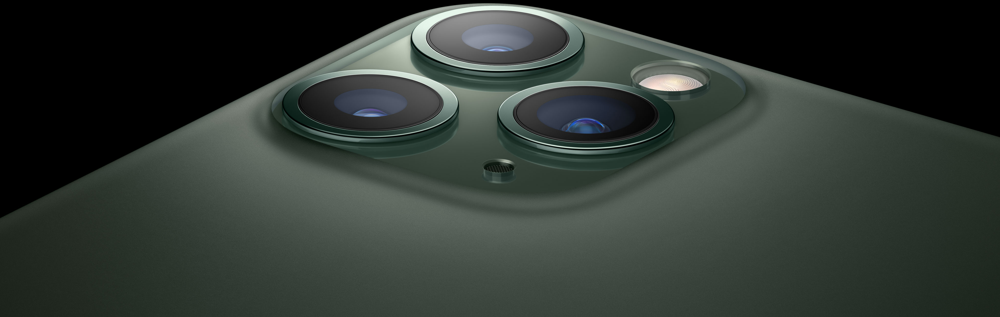

# iPhone 11 Pro, 2019

An injection—molded polycarbonate shell conceals a stainless steel structural frame. The logo was pad printed on the back of the enclosure prior to applying a hardcoat, while the text graphics were laser marked through the hardcoat into the polycarbonate resin.

## 视频

## 图库

