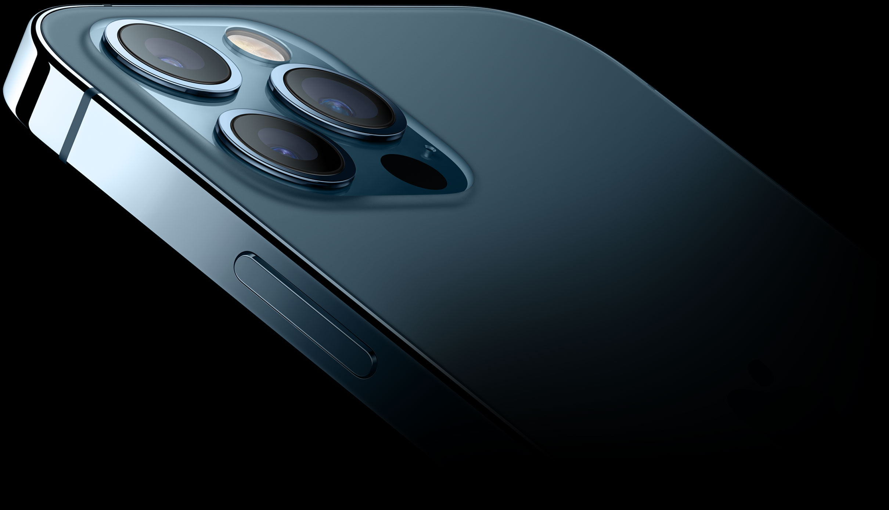

# iPhone 12 Pro, 2020

An injection—molded polycarbonate shell conceals a stainless steel structural frame. The logo was pad printed on the back of the enclosure prior to applying a hardcoat, while the text graphics were laser marked through the hardcoat into the polycarbonate resin.

## 视频

## 造型

这是自 iPhone 6 以来首次使用垂直立面。

## 图库

