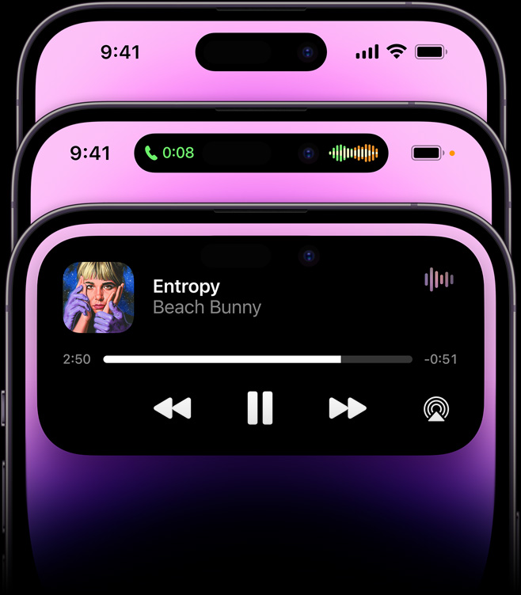

# iPhone 14 Pro, 2022

Dynamic Island 令人印象深刻，可显示通知、警报和活动。带来了浑然一体的硬件和软件结合以及由四种优雅颜色。

## 视频

## 灵动岛

### 硬件

原深感摄像头系统缩小 31%，腾出更多屏幕空间。重新打造的距离感应器，藏身于屏下感应光线，进一步节省了空间。灵动岛虽然不是显示屏但依然响应触摸，手指无论在哪处轻点、轻扫还是按住，灵动岛都能快速响应

### 设计

灵动岛既是硬件又是软件，将两者融为一体，尽显 Apple 创新本色。它会以醒目的方式弹出音乐、赛事比分、FaceTime 通话等各种消息，让你不必放下手头的事情，就能轻松与 iPhone 交互。

<video src=".\large.mp4" autoplay loop muted ></video>

灵动岛功能独辟蹊径，将通知、提醒和实时活动整合在一处，方便人机交互，实用之余又充满趣味。它全面融入 iOS 16 之中，并支持各种 app，能随时应你所需，无缝呈现重要信息。

它可以流畅地放大成醒目的通知，提醒你喜欢的球队刚刚进球了，之后又悄然恢复原状。你可以看到地图 app 里的下一个拐弯，还可通过触控和长按来操控音乐，或者一边盯着计时器，一边发着信息，两不耽误。总的来说，好玩又好用。

<video src=".\Alan Dye.mp4" Controls="Controls"></video>

