# iPhone 3G，2008

## 加工

304 不锈钢边框和聚碳酸酯后壳粘合在一起，形成一个连续的形状。显示模块被连接到后壳的一端，与内部组件进行电气连接。只需用两颗螺钉固定两部分外壳的另一端。后盖采用半透明聚碳酸酯注塑成型，并经过加工以容纳内部组件，然后进行背面喷漆，以获得平滑、光亮、深邃的外观。之后，在后壳表面溅射一层薄薄的铝，并用激光烧蚀掉多余的材料，只留下徽标和图案。

## 图库

 
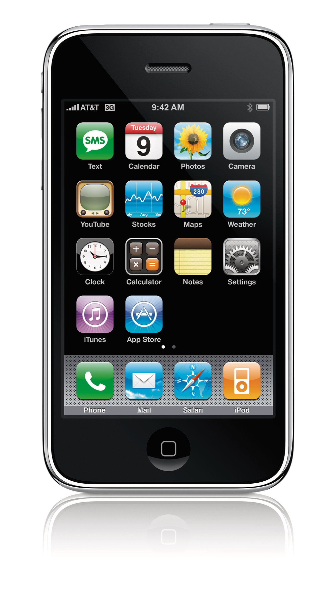 
 
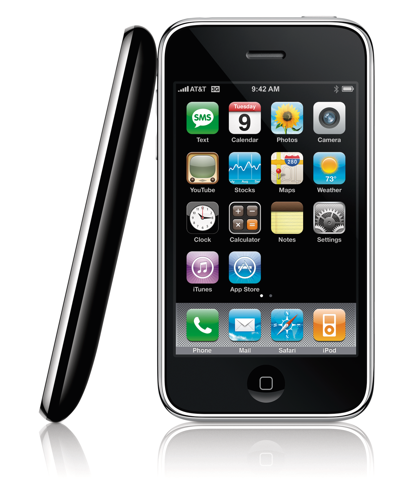 
 
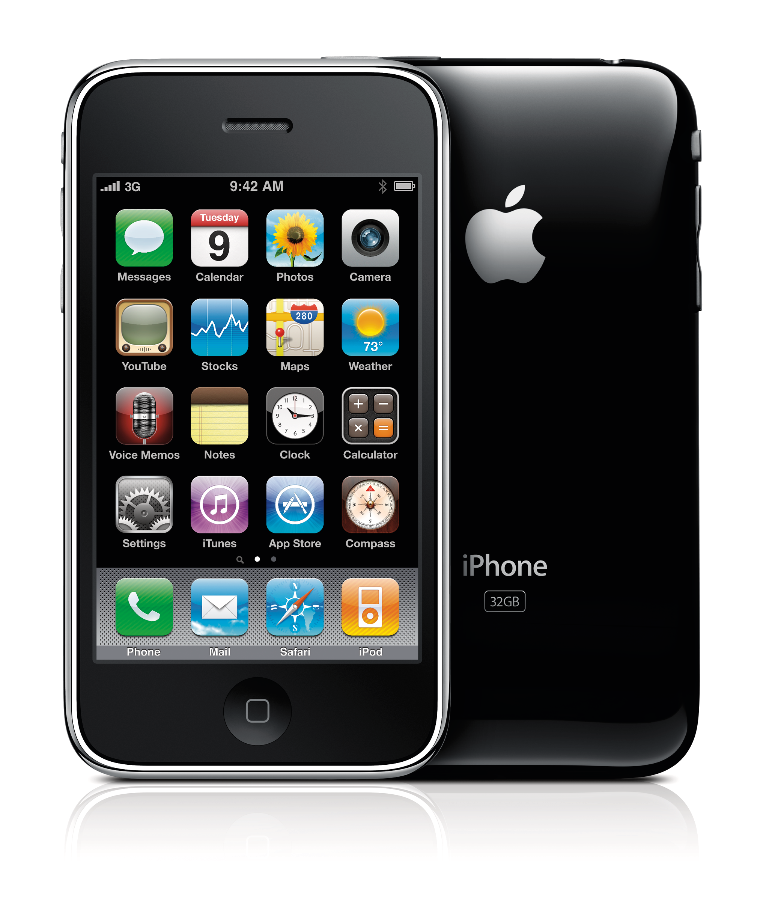 
 
 
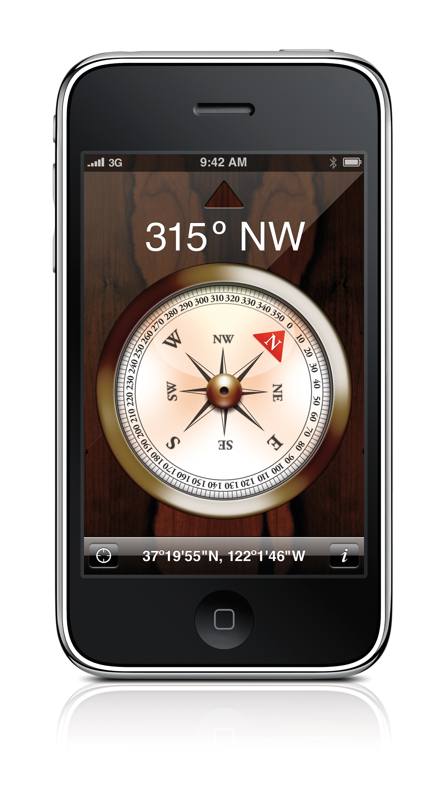 
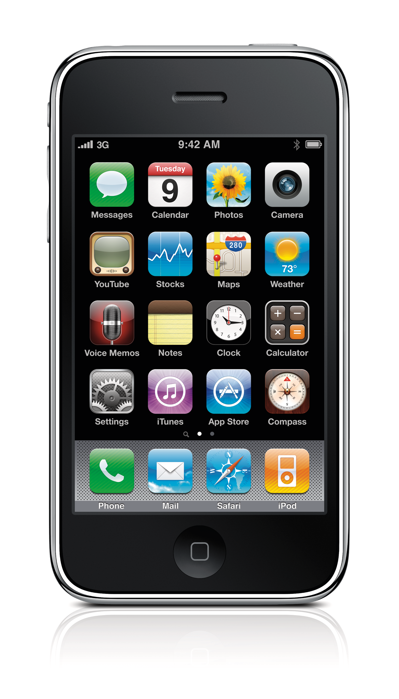 
 
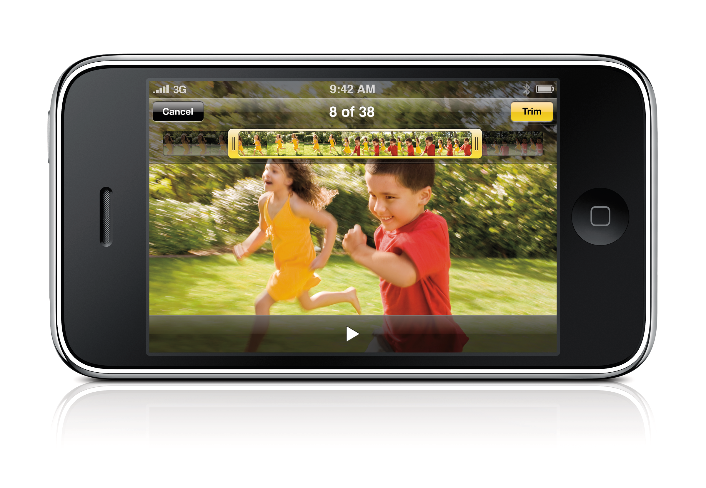 
 
 
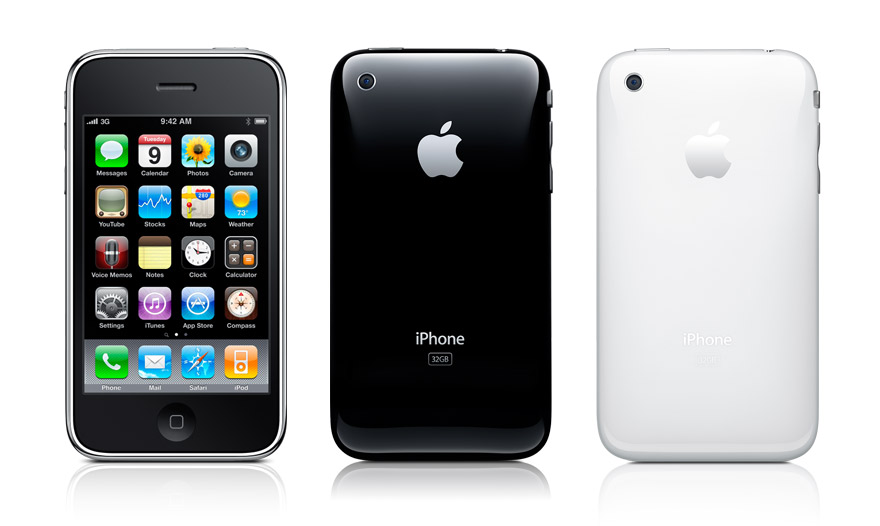 
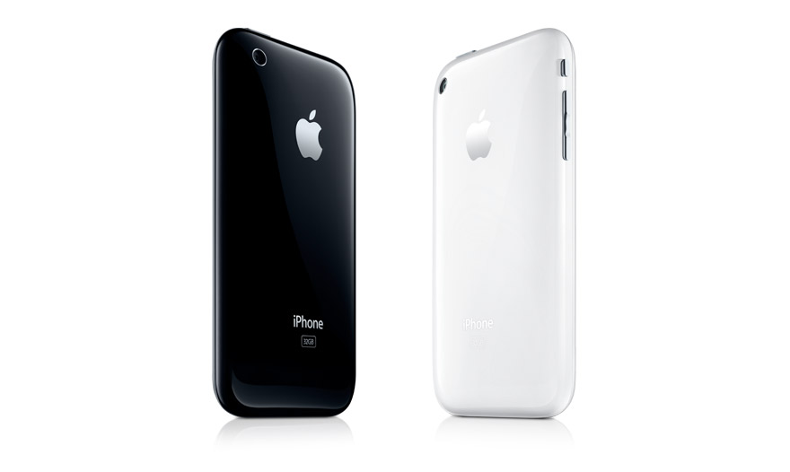 
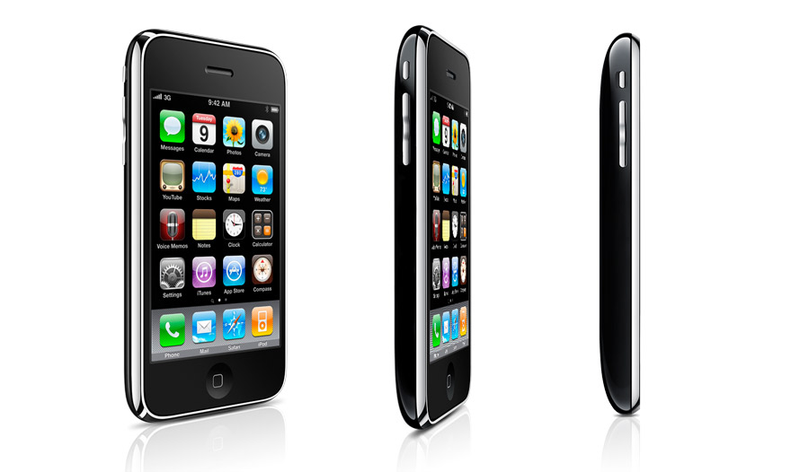 
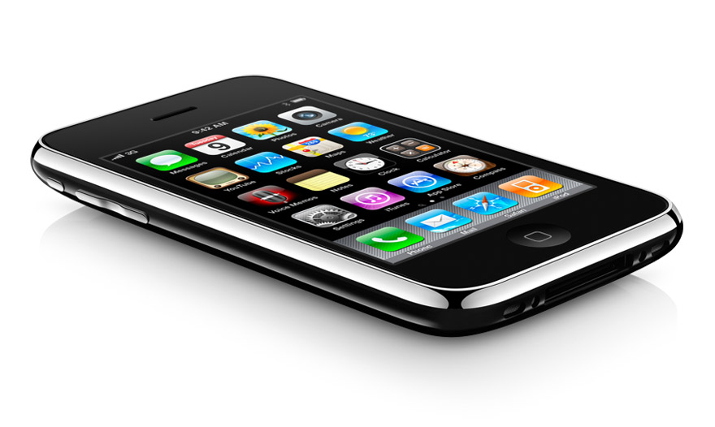

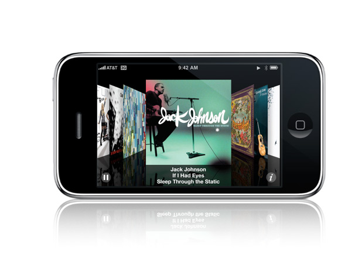 
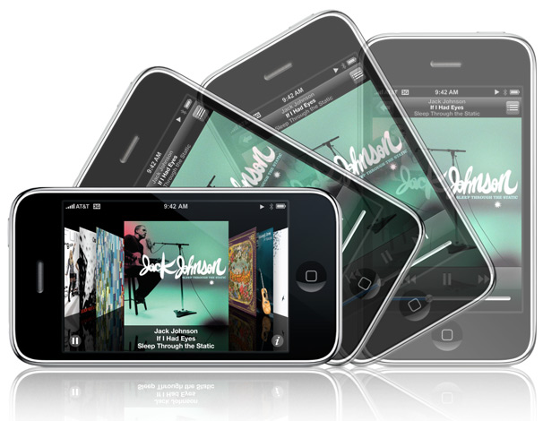 
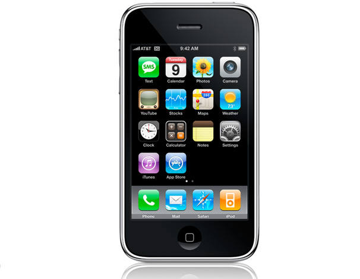 
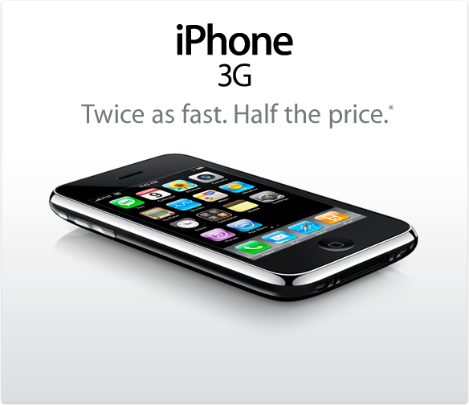 
