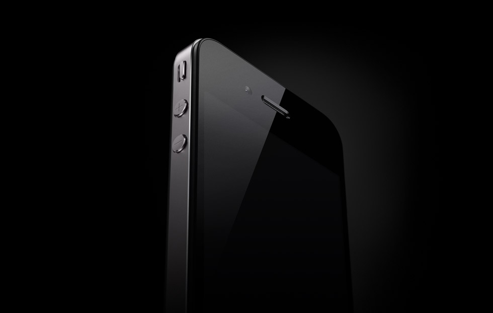

## 新管理团队

乔纳森正如往常一样，开始书写专属于iPhone的传奇。他后来描述，自己当时考虑的都是用户对设备的感受。“这些设计在初期阶段，试图制定一些基本目标的时候--我们经常会一起讨论这种和产品有关的故事--我们所讨论的是对产品的感性认识，是用户对产品的感觉这种感觉不是指身体的感受，而是指用户在认知层面对产品的看法。”

乔纳森相信，iPhone的设计重点是它的屏幕。在早期的讨论中，设计师们也一致认为，没有什么东西可以转移用户对屏幕的关注。乔纳森将他们要设计的屏幕比作一个“无边际泳池”(the infnitypool)，这里的“无边际是指看起来好像没有尽头，是高端泳池所具备的一个特征。

“这么比喻就是让大家在心里完全明白屏幕的重要性，我们想要开发一款以屏幕为特色的产品，以屏幕为重中之重。”他说道，“我们早期讨论iPhone的时候主要关注这种理念……也就是一个无边际的泳池，在这个泳池里会神奇地出现我们要的显示器。”这个团队注重探索设计理念，以避免采取任何削弱显示器重要性的方式

乔纳森说，设计师们希望显示器是“不可思议”和“出其不意”的。这是他对任何一款设计方案抱有的高端目标。“在这项设计的最初阶段，一切都是全新的。而且你能感觉到，真正的机会来了，我们可以根据人们对它的高度关注构思出一个设计故事来。”乔纳森后来这样解释。

2004年秋末，乔纳森的设计团队开始朝着两个截然不同的设计方向进发。其中一个被称为Extrudo，由克里斯托弗·斯特林格带领，类似于iPodmini。制作材料是挤压成型的扁平铝管。经过阳极氧化处理，铝管可以镀上多种不同的颜色。苹果早已拥有庞大的生产线，能够大量生产iPod并进行阳极氧化处理。另外，乔纳森和团队成员都很喜欢挤压这种方法。这是该设计方向具有的一个优势。

另一个设计是“三明治”，领导者是理查德·豪沃斯。该设计大部分用塑料制成，屏幕也不例外。三明治设计的形状为长方形，四个角都是均匀平滑的圆角。机体的正中心环绕着一根金属条，显示器处于正面居中位置，屏幕下方的中央位置留给了菜单按钮，上方的中心是扬声器。

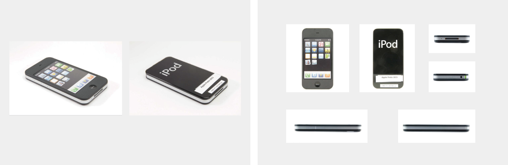

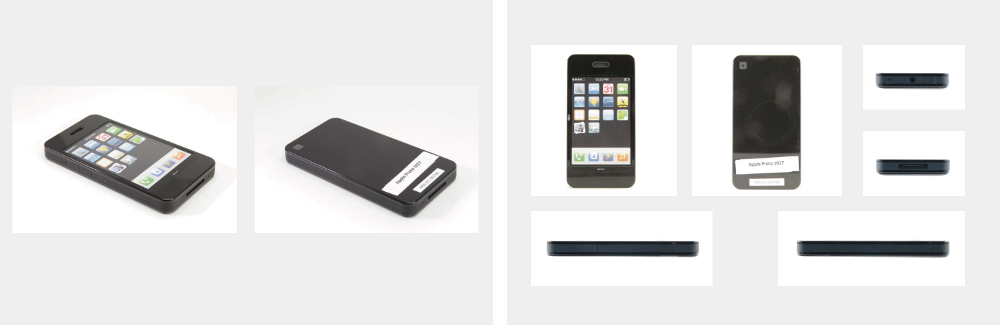

乔纳森和团队成员们更看重Extrudo的外观，对此给予了最大关注。他们试着沿x轴横向挤压一些设计样品，还有一些则沿y轴纵向挤压。然而问题很快就出现了。Extrudo的边缘太硬，设计师们把它贴在耳旁之后脸就被戳疼了。这点让乔布斯尤其痛恨。

为了使边缘变得柔和，他们给边角裹上了塑料，这恰好也为无线电天线提供了便利。iPhone有3个无线接收装置:Wi-Fi、蓝牙和无线电。但无线电波不能穿透金属的外壳，因此盖顶很有必要选择塑料材质。

设计团队想方设法地解决Extrudo的问题，但工程学测试却清楚地表明除非把顶端的塑料盖子设计得大一些，否则这个特别的设计方向就无法进行而塑料盖子加大又会破坏Extrudo简洁的外观。“我们画了大量的设计图纸试图找到很多问题的解决方法，例如怎样在设置天线时不破坏原来的设计，怎样不让耳机的设计太坚硬、太锋利，等等。”萨茨格说,“可是，所有增加舒适度的方案，看来都会影响整体设计。”

设计Extrudo还有一个问题让乔布斯烦恼:金属边框使屏幕看起来不那么美观。这一设计没有“服从”屏幕，违背了乔纳森的初衷。乔纳森后来回忆起乔布斯向他指出这一点时，自己尴尬得满脸通红。

苹果只好放弃 Extrudo。这意味着只剩下“三明治”一个选择。

和Extrudo相比,“三明治”设计的确有诸多优势，至少它圆滑的边缘不会弄伤设计师的耳朵。但问题是制作的原型机又大又笨重，因此乔纳森的团队要努力为它瘦身。设计师们试图在“三明治”里塞进大量的技术，因为他们设想的手机很复杂，可大部分技术还无法大幅缩小设备，这又不符合大家希望设备既小巧又精密的要求。

## 乔纳森手机

到了2006年2月，重新设计的多部样机也都被抛弃，乔纳森对这样的进展很是不满。因此，在一次头脑风暴讨论会上，他让设计师希恩·尼斯波利借鉴索尼的风格制造一款手机，用这个带有索尼式风格的版本探路。后来，乔纳森辩解说自己绝不是要专门抄袭索尼，而是为改进设计的过程注入一些新鲜“有趣”的观点。

来苹果工作之前，著名的年轻设计师尼斯波利就已名扬日本多年。2001年以来，在尼斯波利为苹果设计的产品中就一直能发现索尼等日本风格的蛛丝马迹。他的日本极简抽象派美学风格常常得到乔布斯、乔纳森和其他苹果设计师的欣赏和赞美。

2006年2月和3月，尼斯波利设计和制作的几款手机都借鉴了当时索尼产品的元素，包括缓动轮。缓动轮是一种控制轮与开关结合的装置，它也用在索尼CLI系列PDA上。尼斯波利甚至把索尼的商标贴到了自己设计的苹果产品的背面--有一次是例外，那次他恶作剧似地在一部设备上贴了乔纳森的标签。

多年以后，在苹果与三星的“世纪审判”中，三星拿出一部尼斯波利仿制索尼的手机，用这个证据证明乔纳森的设计团队并非如他们自己所说的独立开发iPhone，而是复制了其他公司的设计。但是，苹果已经成功地论证设备是他们早已设计好的，出现索尼式的乔纳森设计只是因为后来给设备选用了索尼的装饰风格。苹果的律师指出了差异:尼斯波利的设计作品是不对称的，而且苹果发布的iPhone没有采用任何索尼风格的按钮和开关。

2006年3月初，理查德·豪沃斯对P2的研发状况流露出了他的失望情绪。他对比了P2和尼斯波利设计的索尼风格手机，然后抱怨P2身躯庞大又羡慕尼斯波利能让机身保持苗条。“看看希恩那些索尼风格的小东西。他能让产品看起来小得多，外形也美得多。放在耳边或是放入口袋都很适合。豪沃斯在给乔纳森的邮件里这样写道。

豪沃斯还在邮件中说:“我也担心，如果我们去掉侧面的音量调节键就等于让挤压成型的设计理念打了折扣，产品的外形也不再符合这项工作的要求。在它形成特定的风格或形象之前，我们只能增加这么多，否则它只会变成最有效的构建方法，而这不是我们想要的。

乔纳森的团队曾试图采用曲线型的设计，从某个方面来说，这个设计方向看起来似乎很有希望。因为增加了曲线之后，就可能在曲线中间的空隙塞进更多的技术元素。这个巧妙的设计被苹果运用到很多新产品中，从iPad到iMac都可看到。

萨茨格回忆，团队开始的时候对一个设计方案“情有独钟”，那个设计使用了两片有特定形状的玻璃。他们做的那些原型机中就有一个分裂式屏幕屏幕在上方，下方则是软件驱动的触控板。触控板视功能不同而变化，有时可以是键盘，有时又是拨号盘。但事实证明，将玻璃做成凸面太难了。

在后期的开发过程中，豪沃斯依然用Extrudo设计作比照对象。但工程学测试结果确切表明，三明治风格的设计方向才是大势所趋。而三明治设计的原型机却没有收到乐观的汇报，报告说它们外形肥大。设计师们意识到不可能把所有的技术都挤在一起，同时还能保持产品外形美观，因此他们决定把三明治计划也毙掉。

“对于天线和声学，我们都还不太了解，也不太了解如何把所有需要的技术放置在一起。”一位前苹果主管说，“它倒能正常运作，就是外观不够吸引人。”

在时机成熟之时，乔纳森又重新启用三明治设计，制作了iPhone 4。这是又一个实例，设计团队也是重新评估了早期的设计，探寻之前忽略的产品特质。iPhone4的主要结构元素--两块玻璃板之间的钢架也将增加一根用作手机的天线。遗憾的是，这也带来了问题，因为如果用户的手通过缝隙接触了天线，会直接导致两根天线短路，电话就会自动挂断。有报道称，如果给天线穿上透明外套，可能就很容易避免这个问题，但乔纳森不想破坏金属的完整性。

## 三明治结构

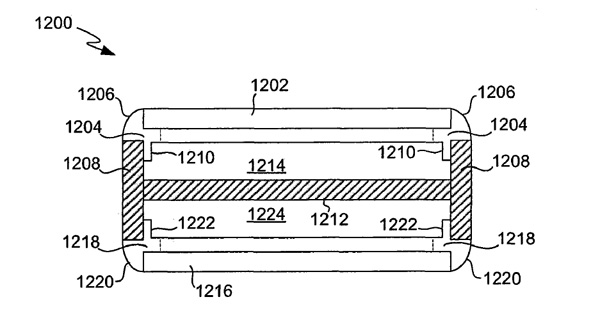

iPhone 4 的简要结构示意图，图片同样来自 Apple 在中国申请的 201010608849 号专利。这张示意图只反应了 iPhone 4 最基本和原始的结构图，我们说的最原始是从最终产品来回溯，而设计师最初是不是如此并不影响分析。可能有人觉得这样的结构太简单了，不就是上中下三块叠加而成的，但是如果你须看看其他手机，包括 iPhone 3GS，就会发现这些手机的结构基本是一样，就是桶形（Bucket），一个可以容纳元件的空间，然后加一个盖子，虽然不少从外观上看到的也会有上中下三层，但是实际都逃离不了那个原型。如果没有结构或造物的概念，就很容易被最常见的结构范式给框住了，比如设计师一上来就画草图，那么只可能落入窠臼，否则没有依赖如何安身。如果事后再去思考结构的创新，不是从头再来的话，还是无法逃出已有的框架，最多是对这个框架有所修正而已，所以你可以看各种热门手机的拆解，可能外表上看着相差挺大，但一拆开都差不多，事实上他们的外表也是差不多，自从大家都成了触摸屏手机之后，简直就是亲兄弟一样了，而 iPhone 4 如此的不同正是因为它的制造逻辑在一开始就是不同的。

iPhone 4 的结构有3层，中间为基础层，基础层提供支撑、定位等功能，由一圈有厚度的金属围成牢靠的墙体，中间有平台板，成为元件和内部构件的安装起始平面，元件和构件安装在中间平台板与上下盖体形成的空腔内，上下盖体固定在围墙内侧，盖体表面为玻璃。这也是一种结构原型，所以此时它并未发展出多少设计含量。

接下来的上下盖体的具体化可以很快确定，比如上盖体是触摸屏组件，下盖体为后盖，中间的基础件的材料确定，那么它的性能也为结构具体化指出大方向，比如金属可以方便为其他元件和组件提供承载和安装位置，那么接下来的问题就是屏幕组件是如何安装到中间基础件的，卡扣是最常见的方式，比如 iPhone 3GS 就是如此，但是做卡扣的话，需要将这些特征组件比如弹簧卡子等焊接到基础件上，而中间基础件原先就是一圈金属件，这样做就不符合建构的逻辑了。

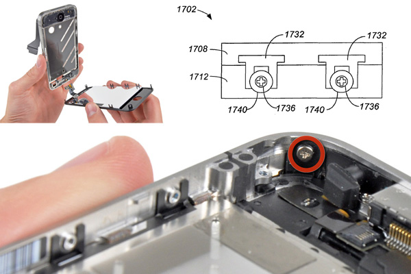

iPhone 4 选择螺丝固定，但是螺丝固定带来一个装配问题，因为卡扣的话可直接安装摁上就是，而螺丝连接则要在盖上前操作，这就自相矛盾了，但是 iPhone 4 的原始结构不是桶形的，而是三明治式，它是两头可开口的，这样只要改变装配顺序就可以实现螺丝的固定，中间基础件有平台板，那么屏幕组件的爪子就要贯穿平台板，这样的结果是带来更牢靠的结构，接触面积大，可以用大头螺丝等等。屏幕组件有10个爪子，这样的连接可以保证非常高的结构强度和精度。（从11楼摔下都不散架，新浪微博链接）

上盖板可以如此安装，那么下盖板即后盖只能通过外部安装了。

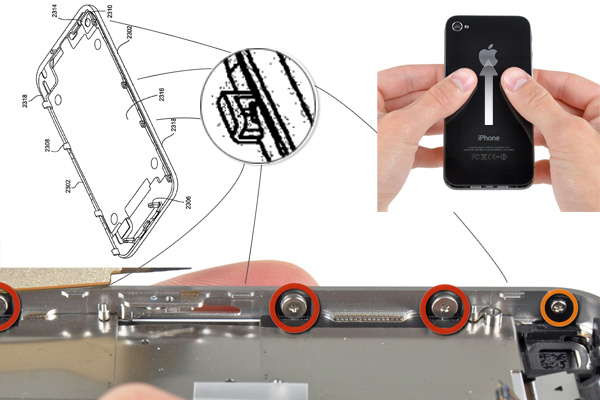

iPhone 4 的背壳和 3GS 的屏幕组件一样，采用了两颗在外壳固定的螺丝，另外在配了8个卡钩。

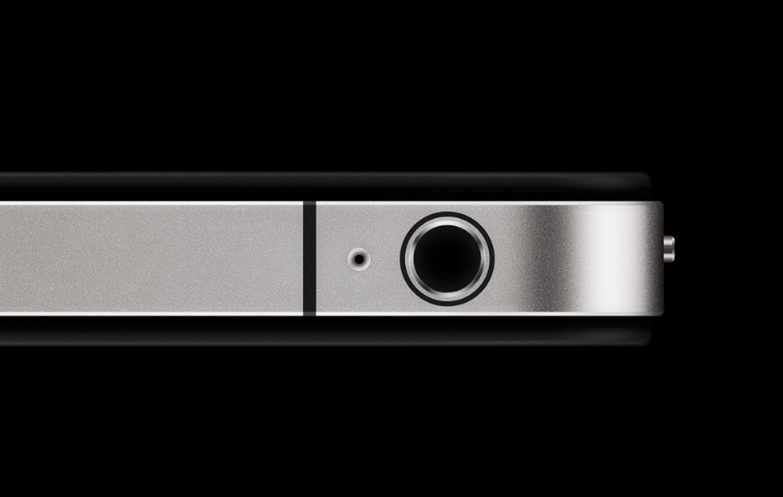

为避免撞击对屏幕等的破坏，将上下盖体退后 0.6 mm，让强度高厚度大的金属圈去接受撞击，同时它同齐平的设计相比，一下就生动起来，并且可以给人带来比较强意识的握着感，加上统一的 0.2 mm × 45度的外边缘倒角，用光影勾勒了一下整个形体。另外出彩的设计就是在金属件上直接注塑 overmolding，它不仅使用于上下盖体的框架上，玻璃护圈是塑料，但是衬板结构以及各种爪角为金属，需要将两者结合在一起，使用的就是将金属件放入注塑模具内，然后在其上注塑覆盖；最具表现力的就是天线分割条，先在缝隙内注入过量的塑料，然后再加工成统一的表面，将两种材料一体化。

从 iPhone 4 的大致结构即可体会到建造，什么能体现人类制作物品的精神，在石器时代以及到后来的手工艺时代，看着别人制作然后学着做可以体现这种精神，但是到了工业时代，制作物品的具体工作已经由机器来完成了，那么如果还是依照别人的范式去制作东西的话，那么已经没有了这种精神了，因为此时制作物品的精神已经转移到了设计之上了，而设计需要的是明确的意图。在 iPhone 4 身上可以感受到那种“Built from scratch（从头开始建造）”，这是制作物品的精神的最好体现。

## 图库

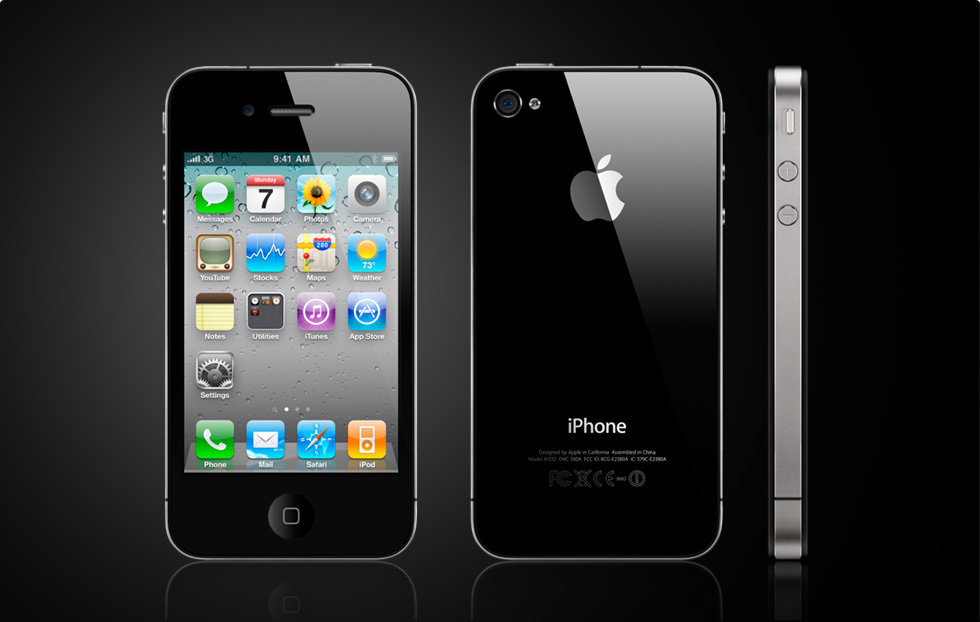
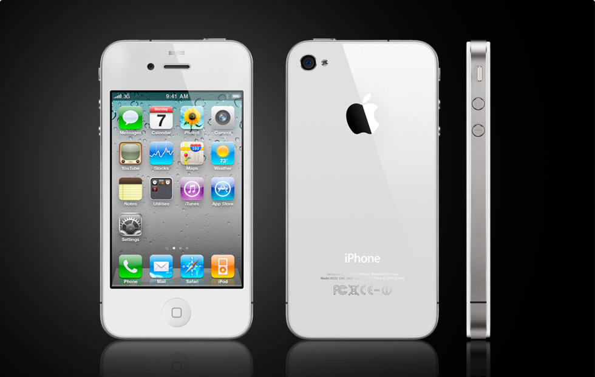
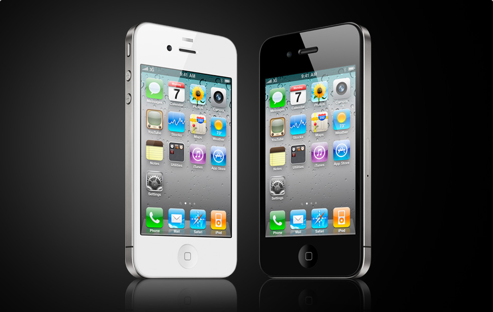
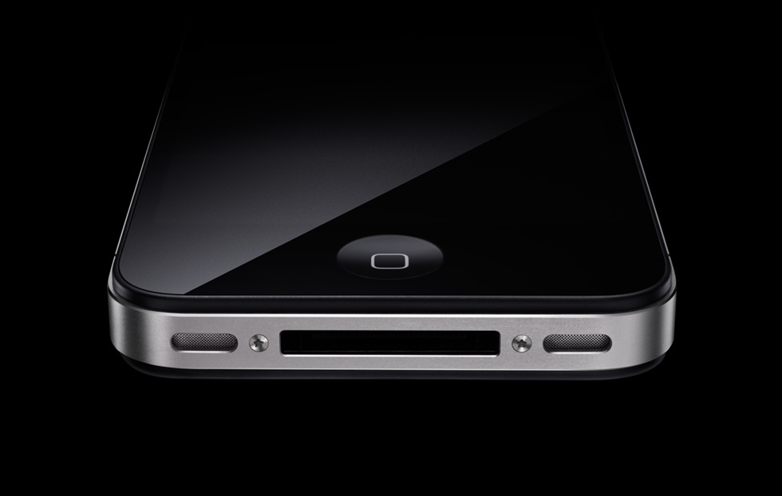
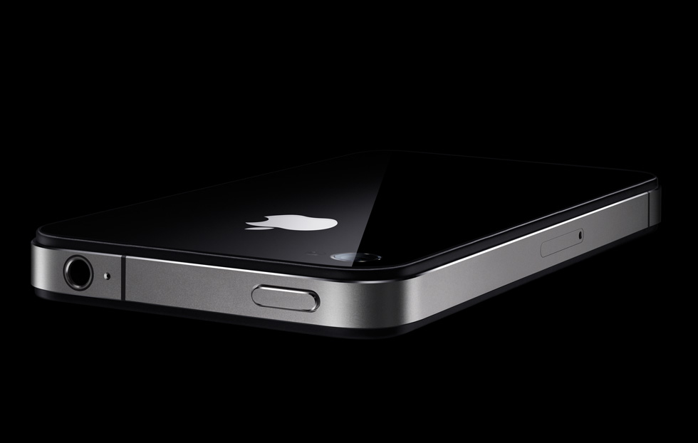
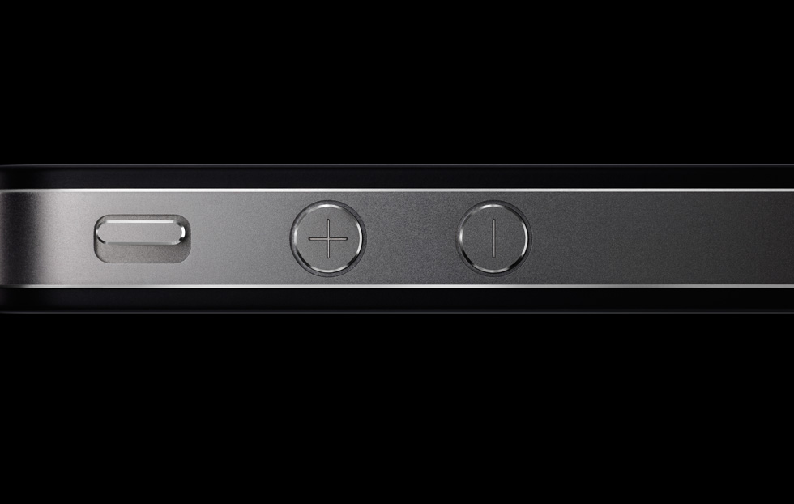
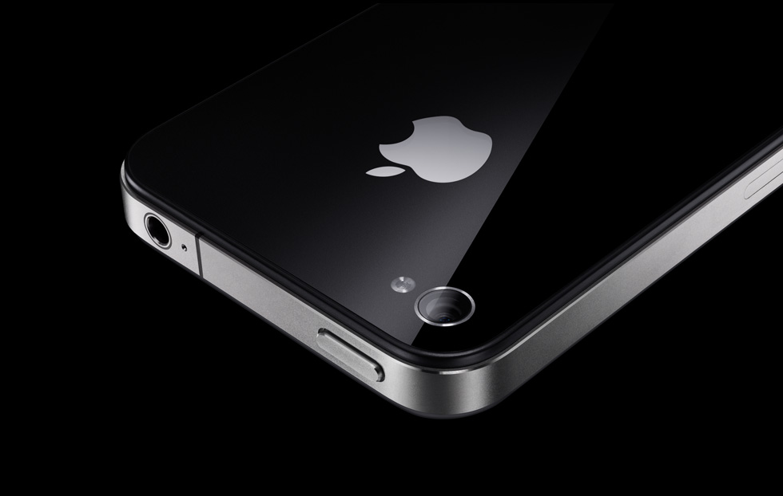
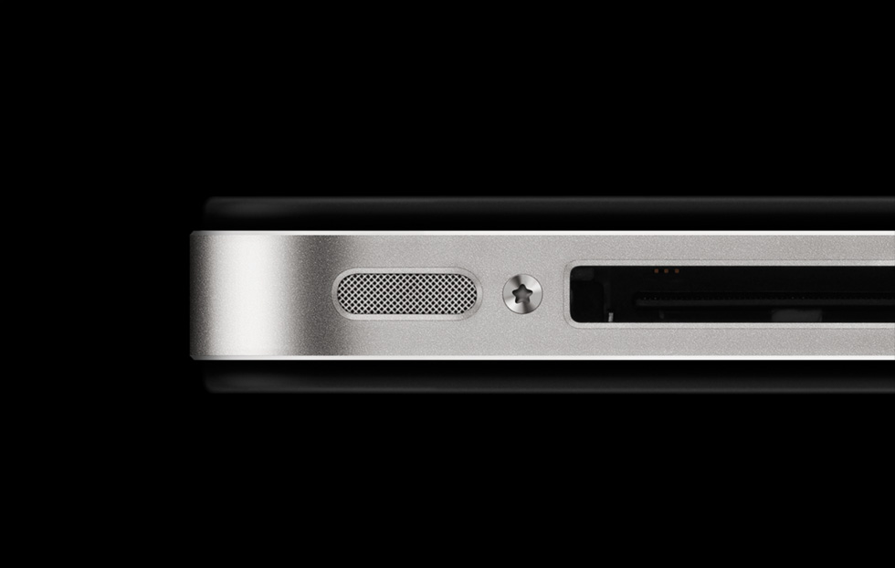
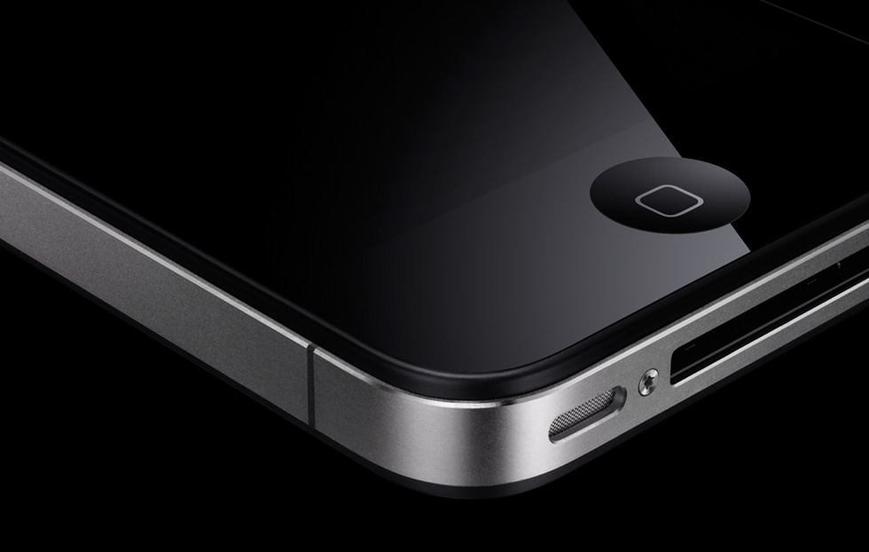

