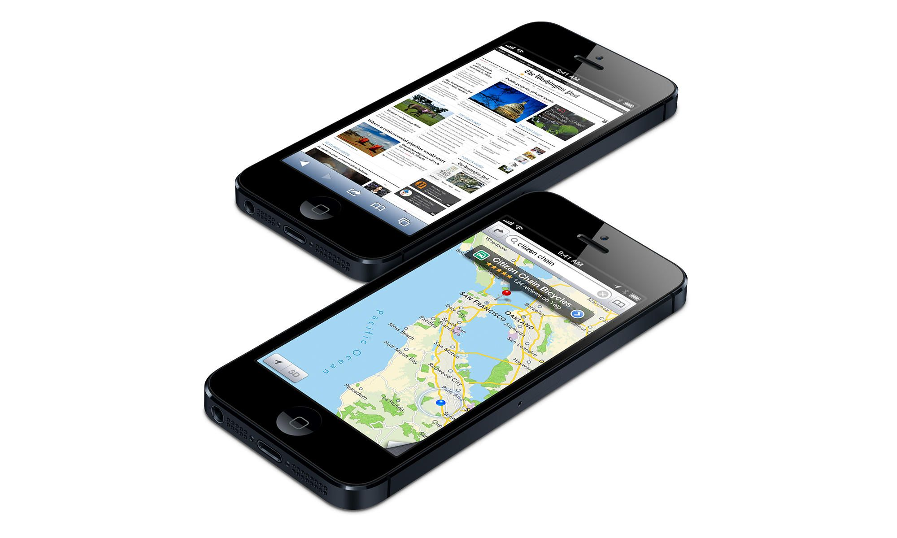

# iPhone 5,2012

## 概述

在此之前，从未有如此精美的制作工艺应用在手机上。以iPhone5 背面的玻璃镶饰为例，在制造过程中，我们使用两架 2-00 万像素的高功率相机对每台iPhone 5 的铝金属外壳进行拍照。然后，通过设备检查所有照片，并与 725 个独特的镶饰细致对比，找出与该台 iPhone 精度高度匹配的镶饰。

面对 iPhone 5，你会情不自禁留意到围绕显示屏四周精致的倒角设计。这条斜切边缘是由金刚石刀具削切而成，正是它，赋予了iPhone 5 鲜明突出的线条与手机宛若天成的配合，令其看起来愈发耀眼夺目。

## 工艺

### 精密匹配的镶饰

在组装过程中，我们使用两架 2-00 万像素的高功率相机对每台 iPhone 5 的铝金属外壳进行拍照。然后，通过专门机器将这些照片与 725 个独特的切割镶饰对比，从而找出精密匹配的组合。

### 金刚石削切的精致边缘

iPhone 5 的倒角设计采用金刚石刀具精工削切而成，该工艺让斜切边缘散发出绚丽动人的光彩。

## 材料

### 阳极氧化铝和玻璃

iPhone5 背面由经过阳极氧化处理的6000 系列铝金属制成(与 Apple 笔记本电脑所用材料相同)，并沿顶边和底边镶嵌陶瓷玻璃(白配银白色机型)或着色玻璃(黑配碳黑色机型)。

### 蓝宝石水晶

虽然 iSiqht 摄像头的表面如玻璃般通透，但却不是由玻璃制成。实际上，我们采用的是蓝宝石水晶，其硬度在透明材料的硬度表上仅仅次于钻石。这就意味着，镜头表面被刮伤的可能性大大降低。

## Lighting 接口

## 图库

## 耳机

打造一款不仅让耳朵感觉舒适，并且佩戴牢固的耳塞式耳机绝非易事，因为每个人的耳部结构各不相同。Apple 的设计师通过光学扫描结合硅模成型技术，制作出各种耳型的 3D 模型，以确定适合各种不同人群的通用形状，基于这样的形状，形成了全新 Apple EarPods 的独特外观。与传统的圆形耳塞式耳机不同，Apple EarPods 的设计取决于人耳的几何结构。因此，更多人佩戴这款耳机时会觉得它更舒适。

另外，Apple EarPods 也变得更为牢固耐用。Apple 的工程师邀请 600 多人对 Apple EarPods 进行了 100 多次迭代测试。测试者在极端炎热和寒冷的条件下在跑步机上跑步，他们进行了各种有氧锻炼，甚至被要求上下左右晃动头部。测试结果显示：Apple EarPods 具有更强的防水防汗性，而且佩戴起来非常牢固。即使你在运动过程中，它也不会从耳朵中脱落。

Apple 的工业设计团队邀请 600 多人测试了 124 种不同的 EarPods 原型。

<video src=".\iphone5-design-ear_pods-cn-20120912_848x480.mp4" Controls="Controls"></video>

在 Apple 的设计师努力确定理想耳塞形状的同时，Apple 的音响工程师，一群充满热情的音响专家，则专注于改进耳机的音质。首先，他们一起为 Apple EarPods 设定了一个目标，希望达到坐在室内聆听高品质扬声器时的音质水准。

扬声器振膜的运动可以说是确保任何扬声器音质的关键所在。振膜向内和向外运动就会产生声音，但耳塞式扬声器的振膜通常由单一材质制成，这会限制声音的输出。

因此，Apple 的音响专家重新设计了一种同时采用刚性和柔性材料的耳塞式扬声器振膜，以最大限度减少声音损失和增大声音输出。另外，位置精心安排的声学气孔也为原本一流的音质增色不少。位于每个 EarPod 的耳机管上的气孔极为显眼，它能让作为音腔的耳机管中的气体可以流散出来。这样，你就会听到更深沉和厚重的低音效果。Apple EarPods 的整体音质十分惊人，完全可以媲美上千元的高端耳机。