# iPhone 5C

An injection—molded polycarbonate shell conceals a stainless steel structural frame. The logo was pad printed on the back of the enclosure prior to applying a hardcoat, while the text graphics were laser marked through the hardcoat into the polycarbonate resin.

## 视频

<video src="./iphone5c-designed-together-cc-us-20131011_848x480.mp4" controls="controls"></video>

<video src="./iphone5c-feature-cc-us-20131003_848x480.mp4" controls="controls"></video>

<video src="./iphone5c-plastic-perfected-cc-us-20131011_1920x1080h.mp4" controls="controls"></video>

## 造型

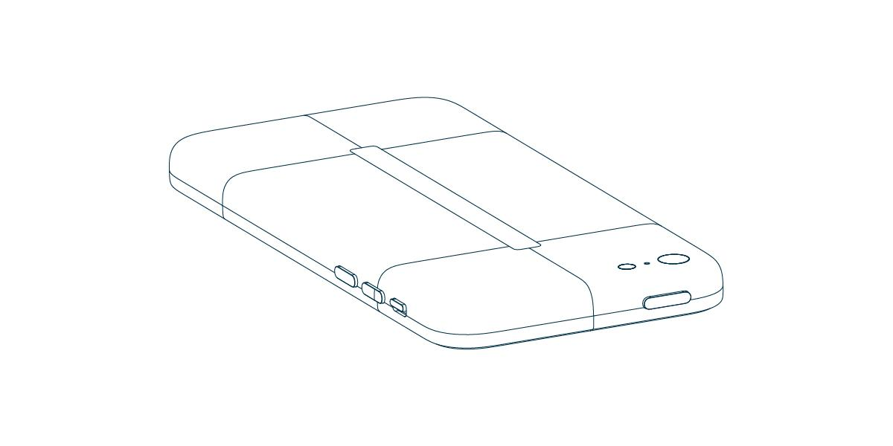

Apple 的这些图纸都是通过 NX 生成的。如图所示的背壳的曲面分割，与通常曲面建模的面片组成并不完全一样，图中所示的分割线能够表示一些形态的特征和逻辑，比如贯穿按钮的那一圈就是分模线所在处，背部的区分可以看作是几个对称关系。但它不能完全反映曲面建模的面的分割，我认为是经过合并之后的（要么是线合并要么是面合并），这里面如何分拆和组成需要使用 NX 的人来介绍了。不过，通过这个图依然能看出这个简单形状的不简单，那就是高阶连续，在视频中也提到了“连续曲面”这个词。

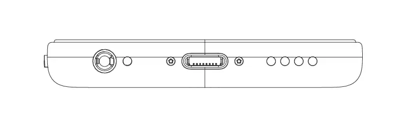

这个形态看上去很简单，但每一处都经过精心考虑，并与最终的设计保持一致。比如这个塑料背壳在正面的外边缘是很厚的一条，加上圆弧过渡，就显得边框很厚，似乎与平常感觉中的精致相左，但它在这却非常合适，不仅适合塑料的工艺（试想如果和 iPhone 5 一样作一个硬的切角，与塑料显然不相称），而且与这个偏活泼生动的产品能对应起来（粗线条）。这些具体的设计是需要付出努力追求到的，也就是官方介绍中用到的一个词，“through and through”。在这最重要的是圆弧与底面的过渡，底面可看作是一个平面，通过曲线拟合的方法去探究这条曲线，会发现它并不是简单的 G2 过渡，从（侧面）曲线过渡到（底面）直线，而是至少是 G4 过渡。

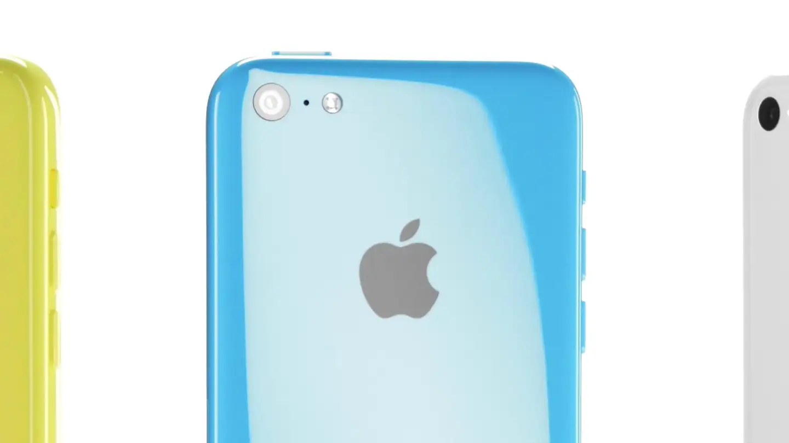
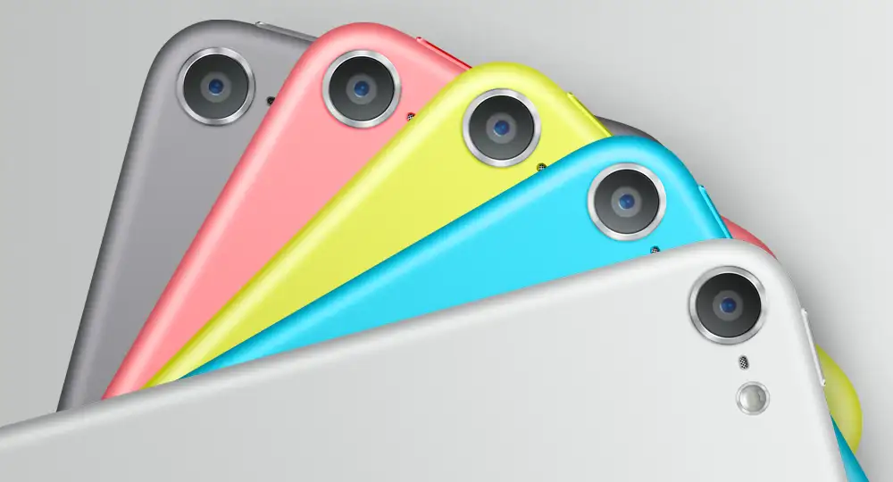

最终就通过高光很好的体现出了，这也是为什么 iPhone 5c 与 iPod touch 5 代在背部设计不一样的一个原因，除了厚度不同，材质对光的不同表现，要求 iPhone 5c 对曲面的连续有更高的要求。

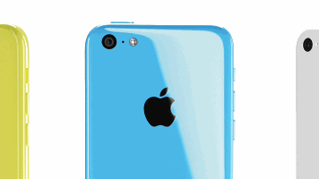

注意变化的光滑性，前后的速度，以及到达和离开曲面时的粘滞。形态的光滑过渡除了会影响静态的高光边缘的光滑过渡外，在动态变化上表现会更加突出，而它们都在日常使用场景中直接影响用户的观感的。在看到的一刻，就能识别出形态的特殊之处，他未必关注高光的光滑之类，而是总体之感，总体性在设计中也一样体现，比如曲面与底部平面的光滑过渡决定了曲面的形态和轮廓线，它并不是一条随手画就的曲线。

## 图库

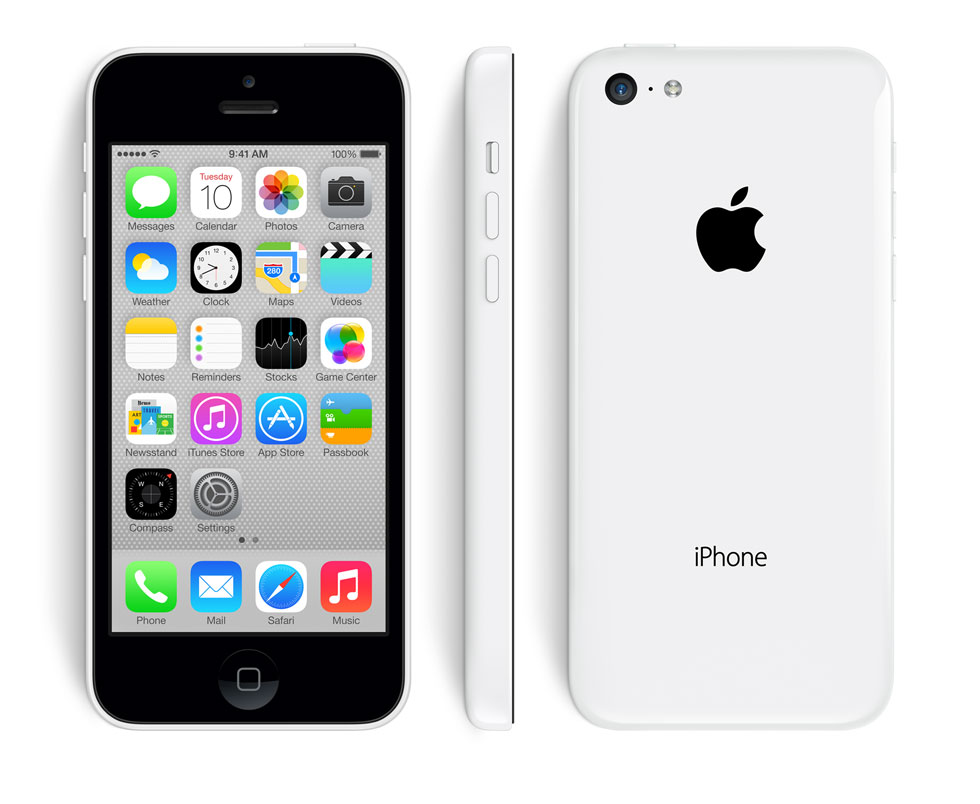

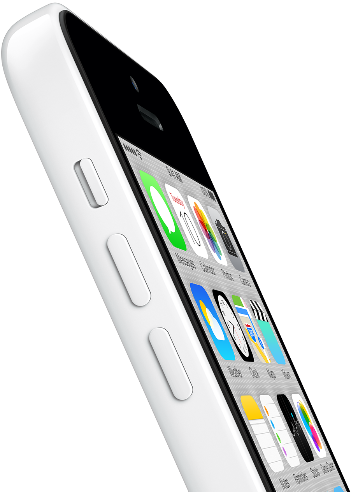
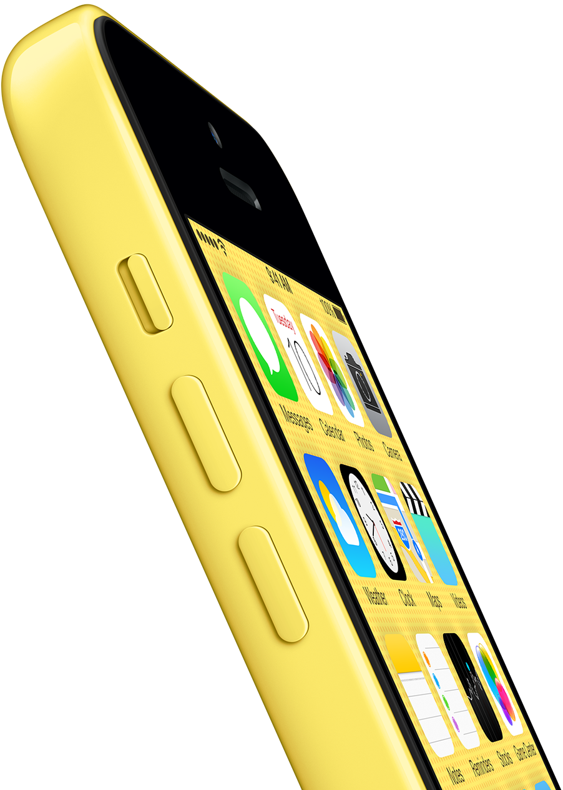

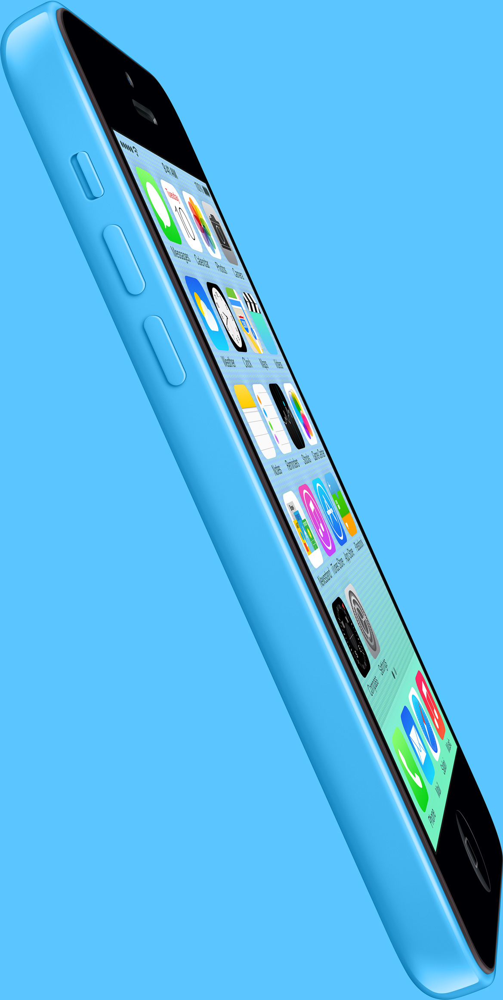

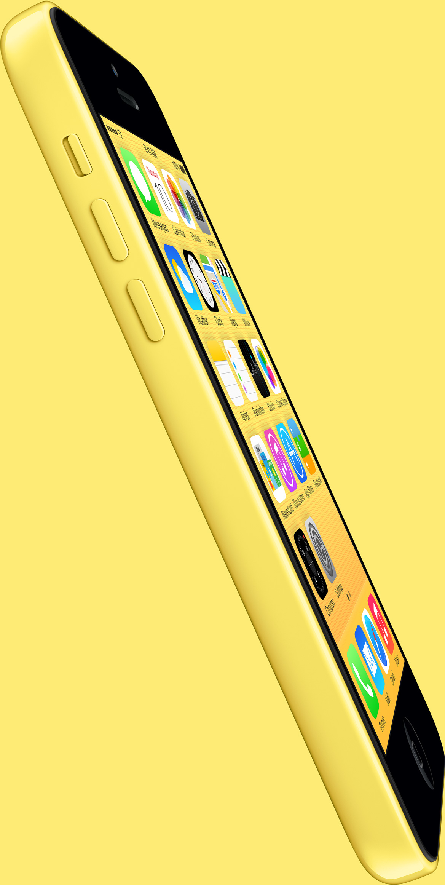

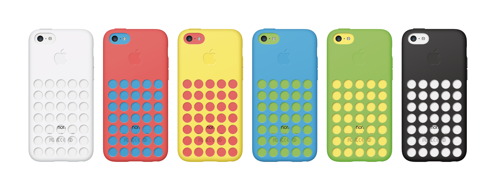

## 保护套

### 洞洞鞋之争

保护套设计广受批评，被认为看起来像洞洞鞋。有些批评者指责它看起来像 马克纽森设计的一双Zvezdochka跑鞋

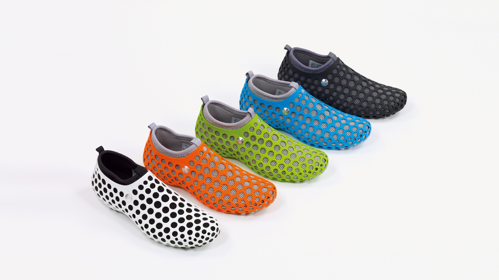
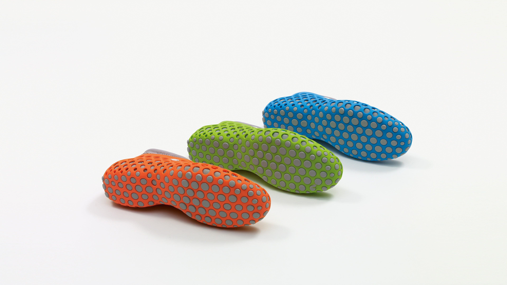
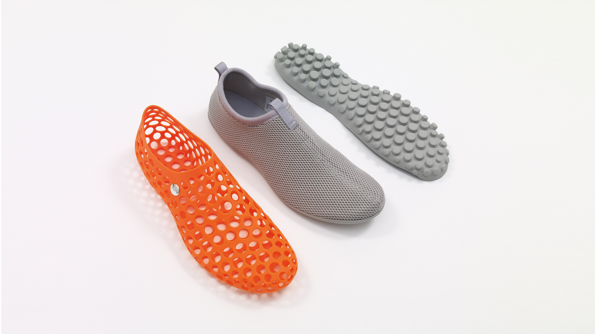

https://marc-newson.com/zvezdochka-sneaker/

Zvezdochka 的设计灵感源自早期太空时代，是具有里程碑意义的工程学成果。这款鞋完全以计算机为模型，这在当时还是一种新奇事物，采用模块化设计；鞋身由四个互锁、可互换的部件构成：外笼、互锁外底、内套和内垫。这些部件可以多种组合佩戴，可以一起佩戴，也可以单独佩戴，适合各种功能和环境。

透气的穿孔笼子构成了互锁部件的基础。内套像第二层皮肤一样贴合脚部，采用柔韧耐用的材料制成，可覆盖脚部并帮助保护脚部免受恶劣天气的影响。内部袜子衬里在脚跟处配有 Nike Zoom Air 装置，以增加缓冲效果，互锁外底与穿孔笼子扣合在一起，形成鞋子的基础。Zvezdochka 于 2014 年重新发布，共有五种原始配色，以纪念其 10 周年。

Zvezdochka 的名字取自 1961 年随 Sputnik 10 号发射进入轨道的俄罗斯太空狗。

### 孔洞盖住了 iPhone 字样是大意吗？

另一些批评者指责上方盖住了苹果logo，而下方则半遮挡了iPhone字样。

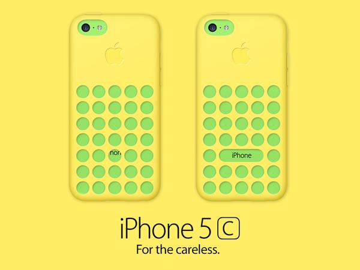

反驳者则认为，纰漏这个词说得好像 Apple 的设计师只花了半天时间就设计了这个外壳，而且只是在电脑上设计的，然后就分发出去制作了，没想到装上去一看，操，忘了还有一个标志了。

评论是很容易的是，这个评论不是指个人喜好表达喜欢还是不喜欢，而是对作品作出评价，评价暗含着是对制作者的赞善或质疑。同上我们可以花上不到一分钟时间就完成对一个新出产品和作品的评价，这里面绝大多数，会将这个一分钟不到形成的认识坚持到很长时间。那么问题来了，当你用一分钟能发现的问题，而制作者花了几个月甚至更长的时间在琢磨这个作品的时候，你觉得他会没有考虑到吗？没有考虑到也是可能的，但放到通常情况来说，制作者不是那么低智商以及不小心，它会有很多这样的“一分钟下评论”的时间，（见苹果三星庭审中苹果描述设计经过的对话。）即使是制作者不那么认真，工作的流程有时间的保证。更不用说 Apple 了。

所以，不会是纰漏。

上面所展示的设计修改图，并不是很难想到的，手法就和一些 iOS 7 icon 再设计一样，使用一些现成的设计手法在样式上进行一些修正（tweak），以满足自己形成的“习惯美”。这两个对比，恰好能说明设计不是关于外表修饰，设计也不是关于遵循“习惯美”，设计是关于 how it works，works 当然是关于逻辑，设计的逻辑并不等同于数理的逻辑，关于遵循一些准则等。例如：如果是圆孔的重复，为什么要去打破一个重复，为了能看到 iPhone 字样，为什么要看到，那么 iPhone 5s 的皮革外套也要挖个孔，因为部分被看到就需要全部被看到，这样会让人们觉得不整齐，为什么要整齐，Apple 在 iPhone 5c 外套的几个通孔达到了高精度（声音通空），那是因为有通空的需要，而为什么要为显示 iPhone 而挖空，干脆用其他形状的镂空形式，等等。外套有外套自己的存在逻辑，比如可以不挖空，直接做成镀膜。圆孔的均衡排列能够形成自成一体的逻辑，而要看全 iPhone 字样在这是否干扰了这种逻辑，当然。其实，用一分钟作出评论之后，再花上几分钟去思考制作者是否真脑残了，对其理解就会前进一大步。"Progress is a beautiful thing."

为什么在调整外壳 Logo 时候没发现呢。甚至可以试试更多的圆孔看看效果，或许是巧合，但对于强调要露出 iPhone 字样的“乔布斯时代苹果式的细节”的话，也是当前最适合，或许是最后的 6 个孔的最合适？那 6 个孔是不是有点多？有没有还是 5 个孔？

更进一步的地，为什么不用其他形式的镂空，而露出完整或者更美的 iPhone，这是另外的问题，而不是关于“纰漏”了。

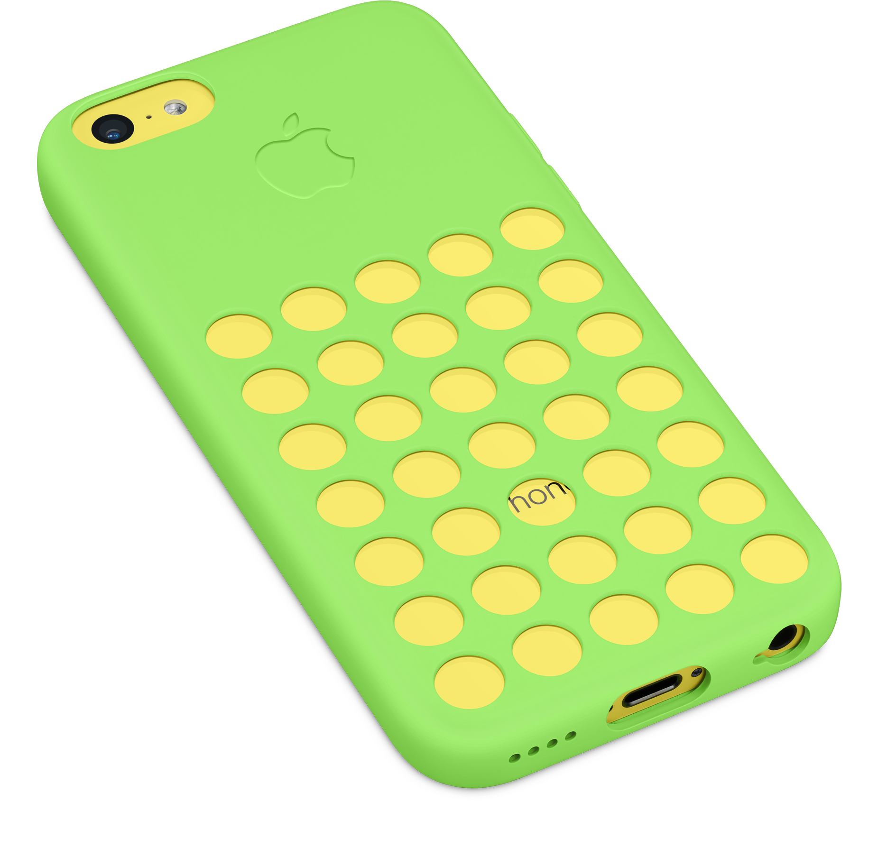
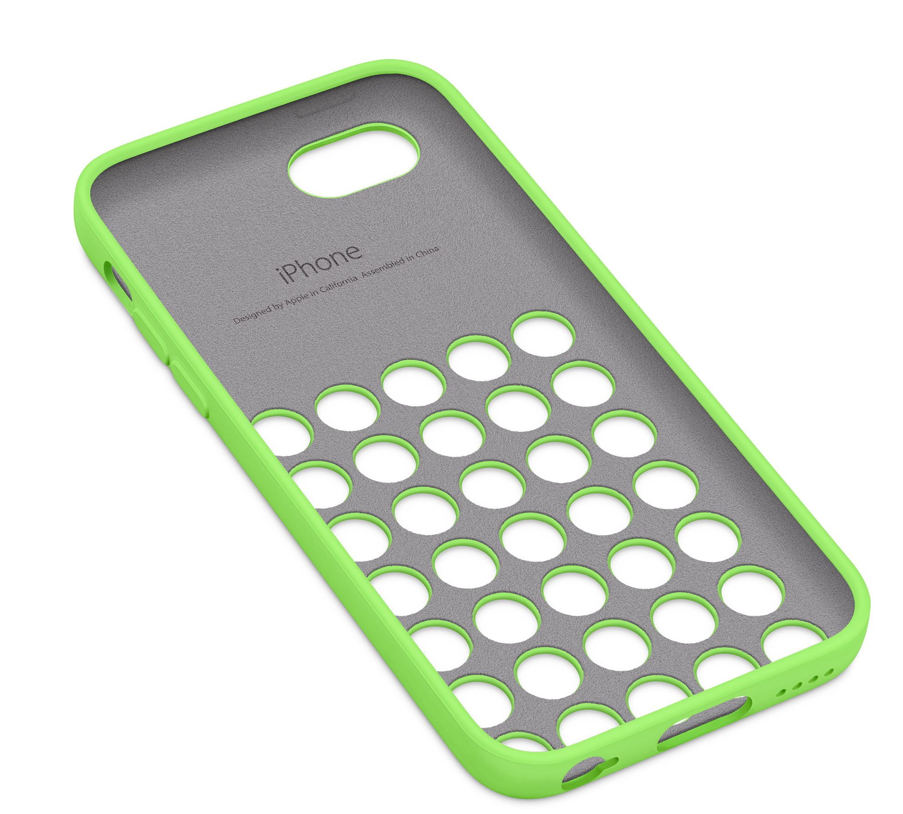
