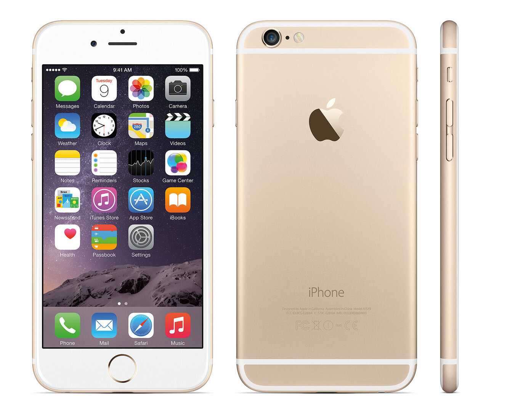
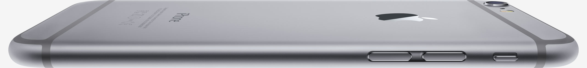
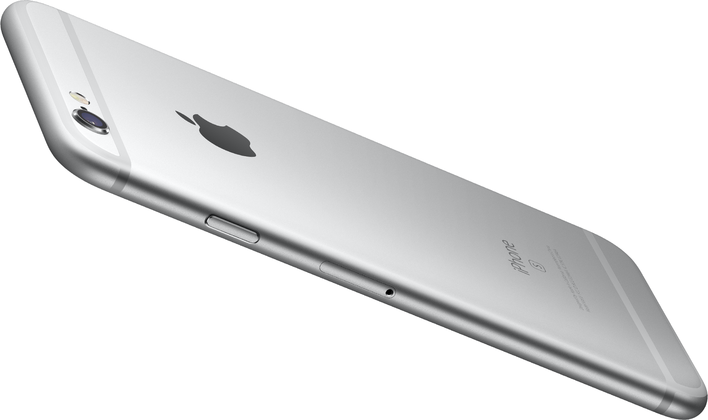

# iPhone6

## Logo 和加工

经过机加工和研磨的不锈钢标识与后壳齐平嵌入，并涂覆了氮化钛，以增强颜色、光泽和硬度。

## CMF

铝的阳极氧化颜色对金色又有独特的表象力，通过表面砂粒和反光属性让其在使用过程中有着丰富的表现，在硬直的 iPhone 5s 上表现更出色（可以与金色的 iPhone 6 等作比较）。iPhone 5S 上磨砂表面和钻石切割的倒角边缘让金色看起来像珠宝一样熠熠生辉，而 iPhone6 看起来像廉价的大金链子。但这并不是因为 iPhone5S 是平面，例如后来的 MacBook 也采用了磨砂金色阳极氧化铝，但由于它使用了高级曲面，仍然看起来像一个非常高贵的时尚单品。

## 天线条

Dieter Rams 在设计十诫中提出，“好设计是诚实的（Good design is honest）”，苹果一直在遵循这一点，例如第一代的iPhone下方的黑色塑料区域。尽管苹果可以将其喷上金属漆，但苹果没有这么做。——金属漆和铝金属放在一起，这样的设计就是拙劣的。它看起来是一个“虚伪的谎言”

诚实的真相：在第一代iPhone的底部的塑料区域就是诚实的真相，它宣告由于技术原因，这里必须使用塑料。

直白的宣告——残酷的真相。苹果在 iPhone6/6S/7 除银色、黑色和深空灰色外所有颜色都使用了白色，他直白无误，毫不掩饰，甚至带有不屑地向消费者宣告这里是天线条。这是一个好选择吗？在很多时候是，但在这里不是。在第一代iPhone的底部的塑料区域，这个选择毫无问题，但在 iPhone 6/6S/7 上，它看起来非常糟糕，这种糟糕是因为多个方面造成的：
- iPhone 6/6S/7 的侧面是简单的 1/2 圆（这是推测），从光影表现看似乎没有使用高级曲面，而是直接使用了直线与1/2圆衔接，这导致了曲率的陡变，在光影上会看到一个割裂。由于塑料天线在 6/6S 直接切在圆弧处，这导致该处的高光看起来更为糟糕。 

- 无论是 iPhone 的设计趋势还是从各类对苹果设计团队或个人的访谈，还是从直白的逻辑进行推断，毫无疑问的，iPhone 6/6S/7 希望提供一个完整的金属后盖，只不过由于法拉第笼限制，必须使用塑料切开。而塑料使用与后盖不一样的颜色破坏了这种愿景。从像深空灰色或黑色iPhone一样使用同色塑料会好得多这一点完全可以论证以上观点。

设计在于制造真实的假象。以 iPhone 5C 为例，尽管各种按键，sim 卡托是分开加工的，但是由于极小的公差，一致的CMF，一致的造型，我们会在感知上认为他们是一体的。这是“真实”的假象。他与“虚伪的谎言”不同，他的不同在于它的真实。