# iPhone 7

全新的镜面黑色饰面表面无可挑剔，经过九道精炼工序，实现了从铝制外壳到 Retina HD 显示屏的无缝过渡。首次采用固态 Home 键，源头上避免了机械疲劳问题。

## 视频

## CMF

新款光泽闪耀的亮黑色外观，则通过包含九道精密工序的阳极氧化与抛光工艺实现，堪称设计工业一次大胆的新尝试。最终呈现眼前的，是纯粹、浑然一体的黑色，铝金属与玻璃的边界已难以分辨。黑色，原来可以如此深邃。两种机型均采用坚固的 7000 系列铝金属，从而解决 iPhone 6/6S 时期的易弯折，强度差的问题。

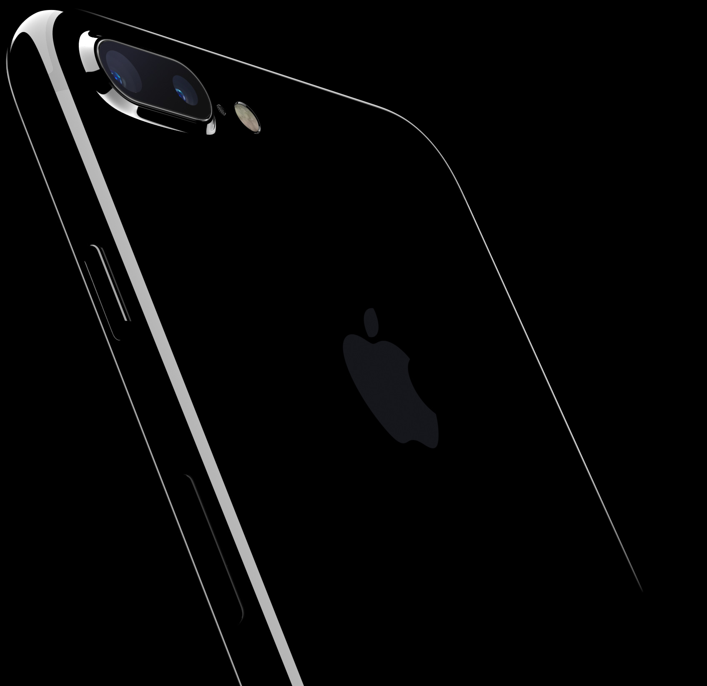

## 造型 

沿用了 iPhone 6/6S 的触感圆润无缝的新款一体成型机身设计。需要注意的是背部的塑料天线条减少为了两条。

## 防水

外壳具备了防溅抗水的特性。

## 首次引入固态按钮

iPhone 7 的主屏幕按钮采用先进的固态按钮式设计，不仅坚固耐用、响应灵敏，而且支持力度感应。它可以配合新的 Taptic Engine，在你按压时提供精准的触觉反馈。

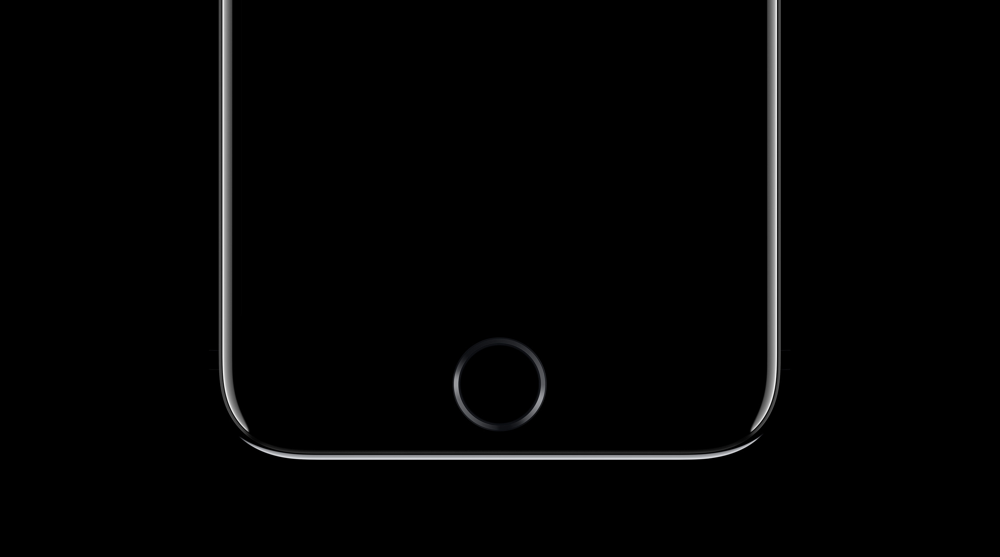
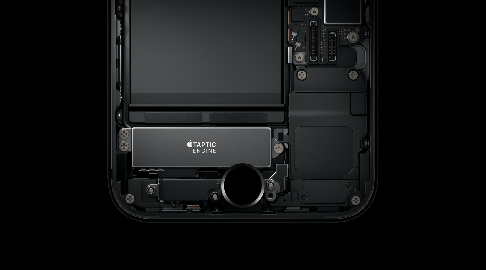

## 图库

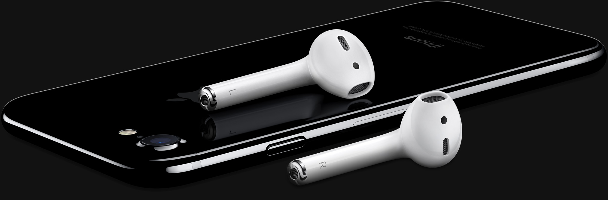
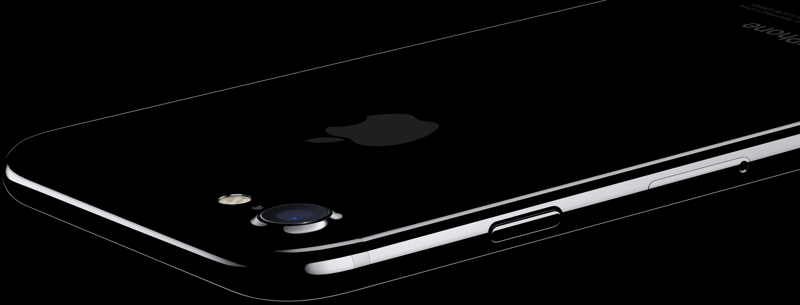
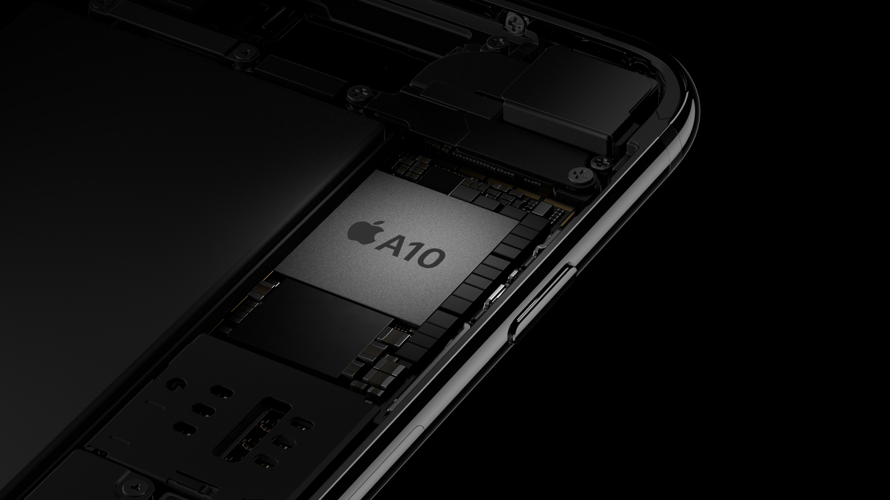
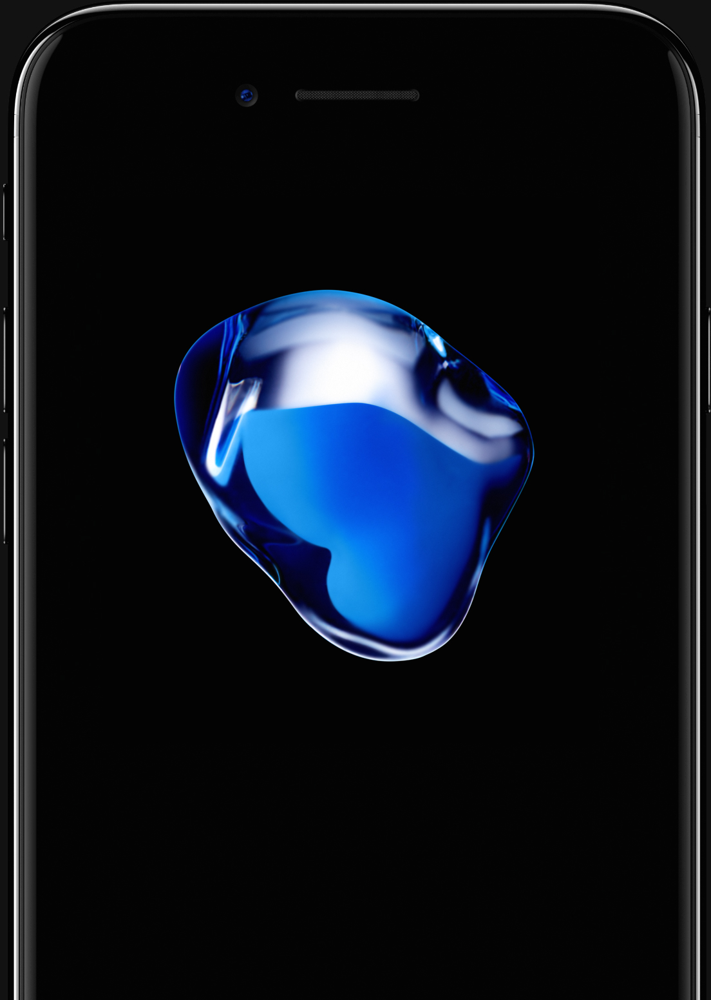
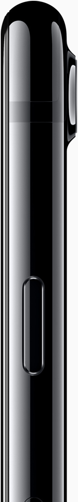
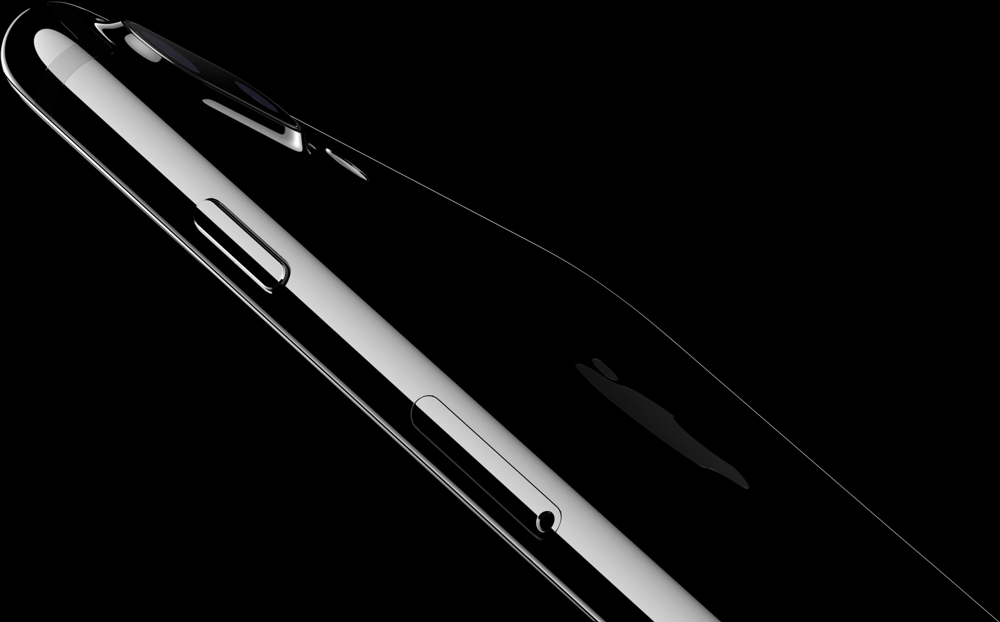
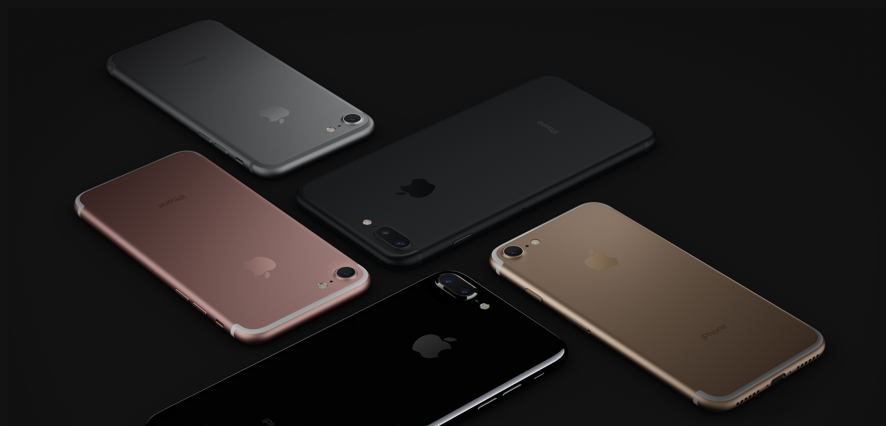
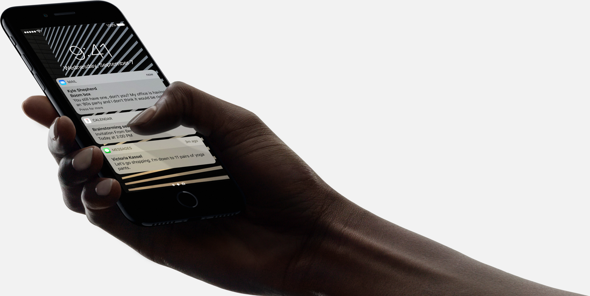
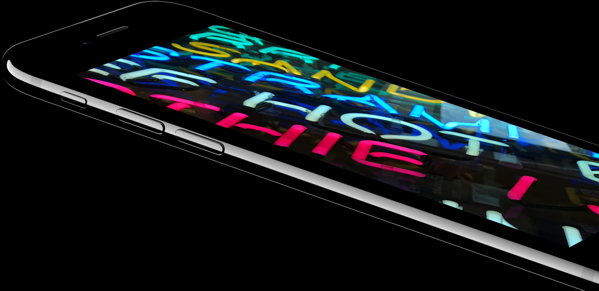
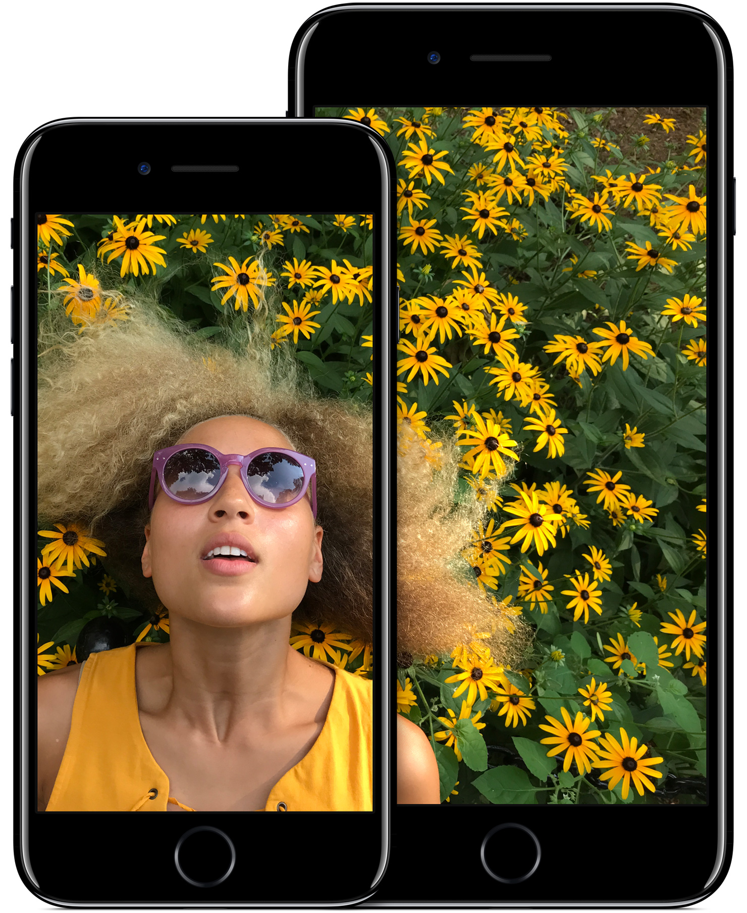
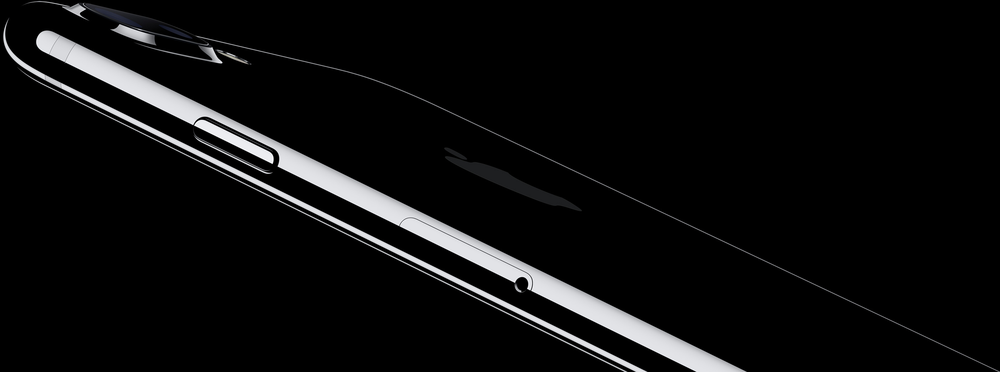