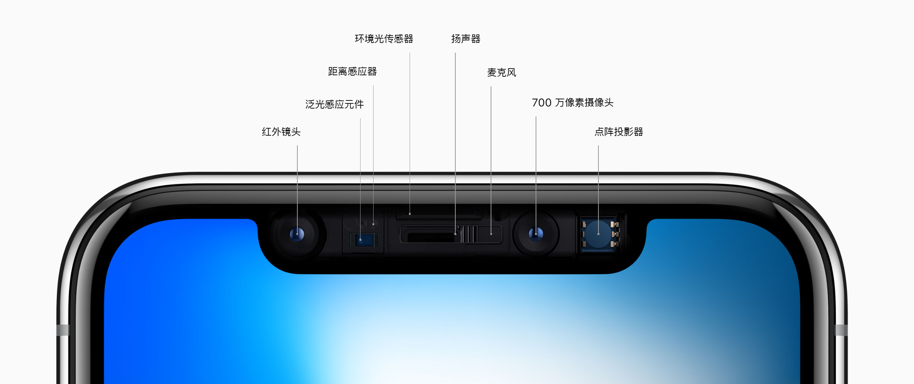
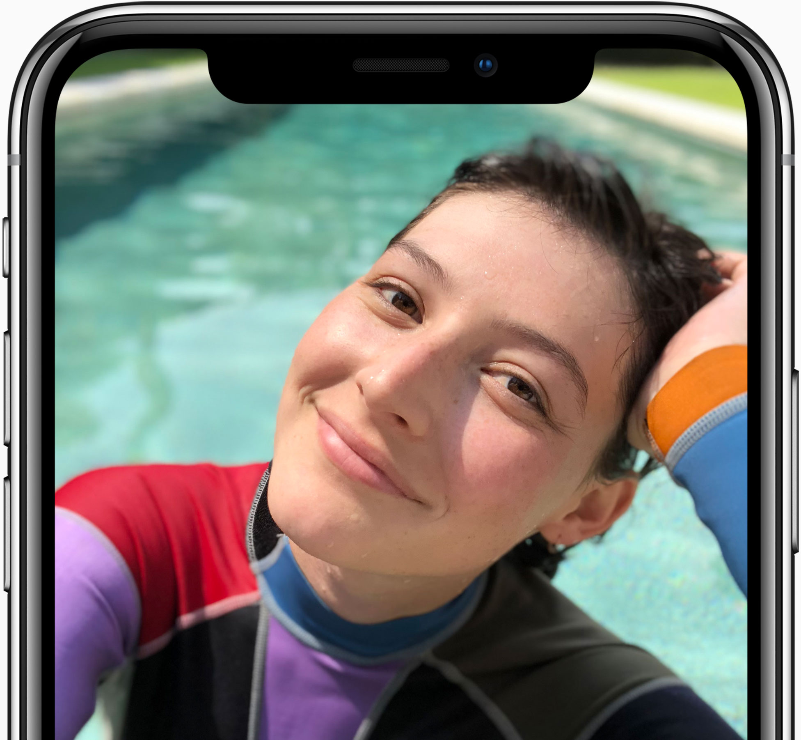

# iPhone X, 2017

一直以来，我们都心存一个设想，期待着能够打造出这样一部 iPhone：它有整面的屏幕，能让你在使用时完全沉浸其中，仿佛忘记了它的存在

整部 iPhone X，看起来就是一块几乎整面的屏幕。

## 全面屏

显示屏采用新的工艺和技术，精准贴合机身的曲线，一直延伸至优雅圆润的边角。

<video controls src="./large_2x.mp4" title="Title"></video>

## OLED 屏幕

能呈现出真实深邃的黑色，并拥有出色的亮度和 1,000,000:1 的对比度。

## 原深感摄像头的创新

### 面容ID

包括可实现面容 ID 功能的各种镜头和感应器。

面谱绘制。面容 ID 功能通过原深感摄像头来实现，设置起来也非常简单。它会投射超过 30,000 个肉眼不可见的光点，并对它们进行分析，为你的脸部绘制精确细致的深度图。

<video controls src="./large_2x (1).mp4" title="Title"></video>

iPhone X 的身份验证系统，是基于原深感摄像头采集的数据运作的。感应器会读取你的脸部几何结构图，并将它与被保护在 A11 内的数据进行对比，如果两者一致，iPhone 便会解锁。

<video controls src="./large_2x (2).mp4" title="Title"></video>

### 虚化效果

拍摄具有景深效果的自拍照，以艺术感十足的虚化背景为衬托，突显你清晰对焦的脸。还支持人像光效。

### 动话表情

<video controls src="./large_2x (3).mp4" title="Title"></video>

## 材质

采用不锈钢，同时抗水防尘设计

[三明治1015.png](./design_all_new_large_2x.jpg)

## 视频

## 图库

!
