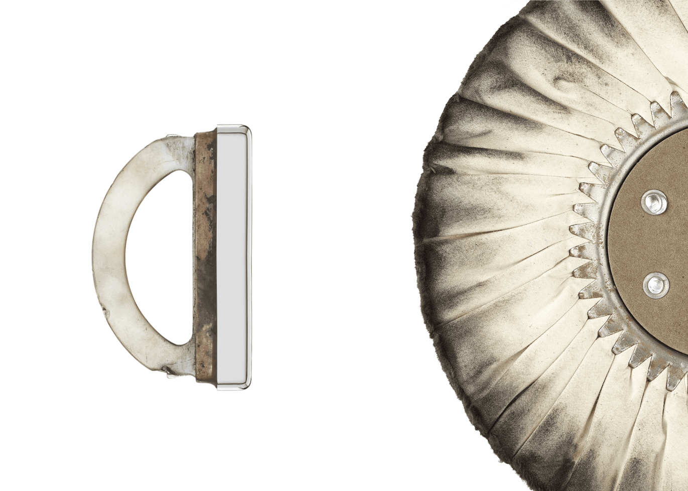

# iPod

后壳由一块成型和抛光的 304 不锈钢制成，并带有激光蚀刻图形。

在透明聚碳酸酯下模制双层白色 PC/ABS 可实现视觉深度，并为显示屏提供保护，而无需额外的零件。自由旋转的机械滚轮被四个传输控制按钮包围。

使用 Delrin 手柄对不锈钢 iPod 外壳进行手工抛光，抛光轮以 3300 rpm 的速度旋转。此过程可实现平均粗糙度仅为 60 纳米的镜面效果。

## 图库

