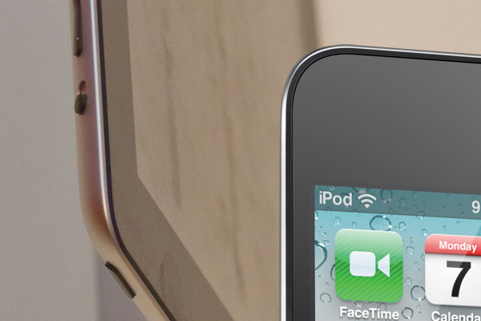
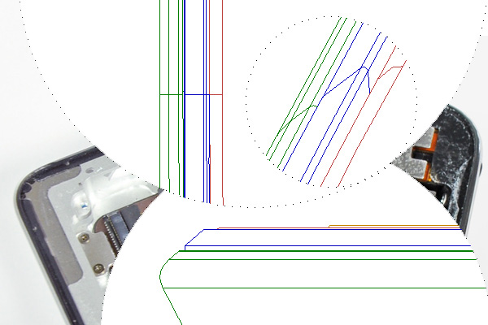
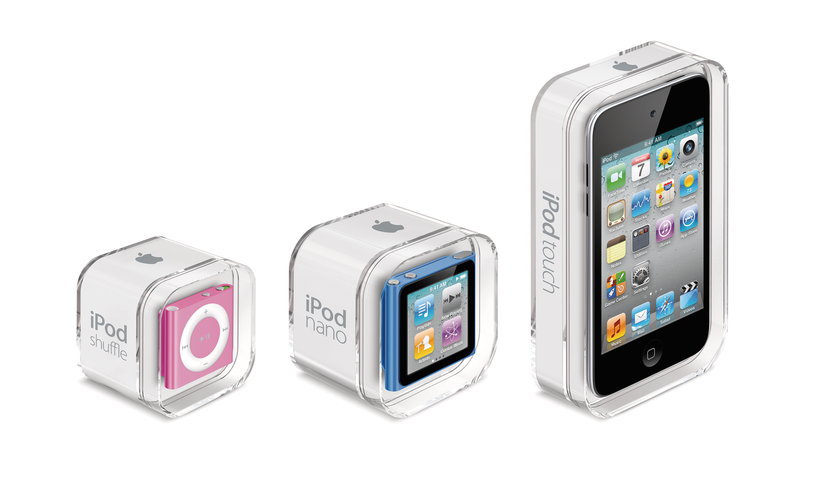
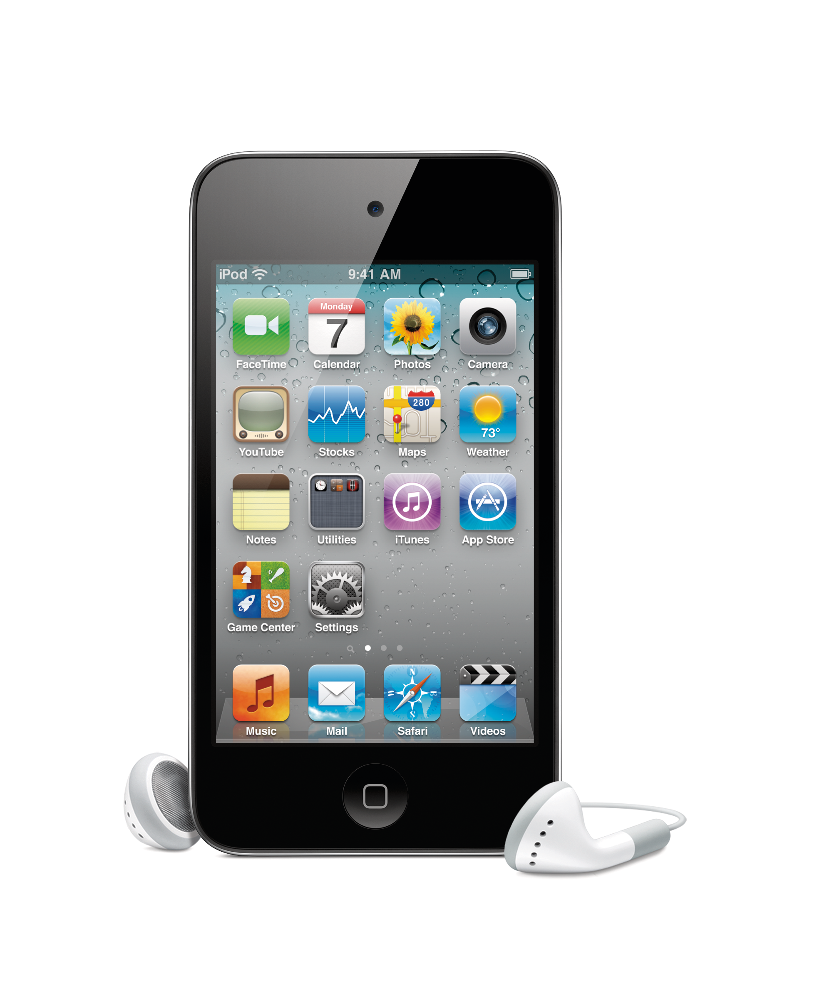
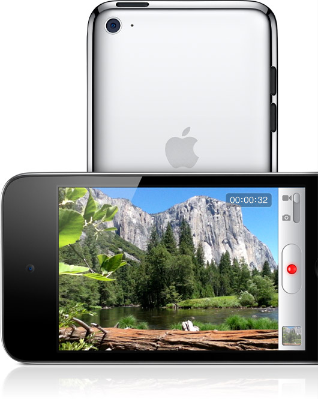
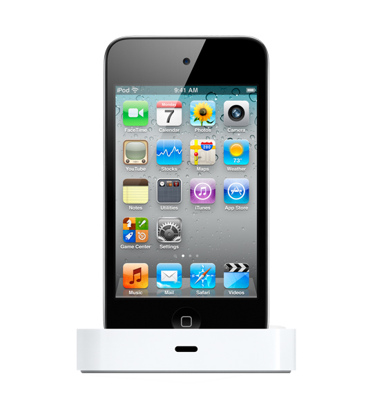
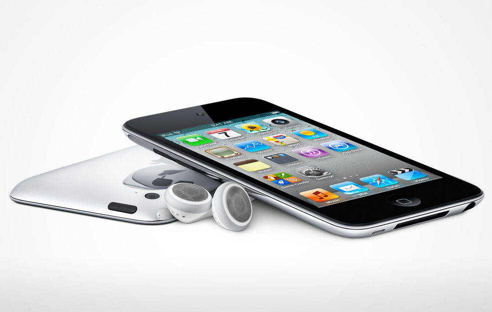

# iPod Touch 2010

## 造型和结构

第三代 iPod touch 和第一代 iPad 类似 iPhone 3G，在玻璃与金属之间都有一圈衬垫。

可你看 iPod touch 4 代，尤其是 iPad 2 时候，你会惊讶，接缝在哪？即使你仔细看都很难找到。从上图看，右侧的 iPod touch 还是可以见到接缝，但是左侧的 iPad 2 能看到两种材料的交接（这张图片来自这），但是没有缝隙，就像完全贴合在一起一样，完全不同于 iPhone 3G 那种形式，Apple 在这做了不少工作。

线框图是截取了 iPod touch 4代的官方图纸，不同的元件做了颜色分割，这样你可以清晰的分辨，图上有一些间距在实际尺寸中肉眼是分辨不出的，图上红色所示的是 iPod touch 的玻璃面板，蓝色是围绕着玻璃面板那一圈很细小的塑料条，绿色为不锈钢背壳。塑料条是和背壳粘在一起的，也就是说拆解的位置是在塑料条和玻璃之间，这样塑料条与不锈钢背壳的接缝就可以消除了。但玻璃和塑料条之间的间距为什么隐藏的这么好？因为交接线就处在形状的轮廓线处，也就是在视觉上用轮廓线掩盖了接缝，加上颜色的处理，人眼第一次寻找边界是被塑料条和金属背壳的交界线给吸引了，而那处几乎是完全贴合。另外还有一个很重要的是，在 iPod touch 4代及 iPad 2 上，玻璃面板都是通过胶水粘接到塑料条内侧的台阶面上的，没有其他机械的卡扣，这样装配精度得到了很好的保证（可以中和累计的公差），所以你很难分辨出接缝来。详细结构可以参考 iFixit 的拆解（iPod touch 4代和 iPad 2），上图两幅实物图片来自 iFixit。

## 图库

